# Животные

У нас стоит два мода на животных: Naturalist и Alex's Mobs. Между ними иногда возникали конфликты (например, оба мода
добавляют медведя). Из-за этого много мобов было вырезано. Так же были вырезаны просто бесполезные или уебищные мобы.

Список ниже это все животные присутствующие на нашем сервере (не включая тех что из ванильного майнкрафта).

### Акула молот

### Аллигатор

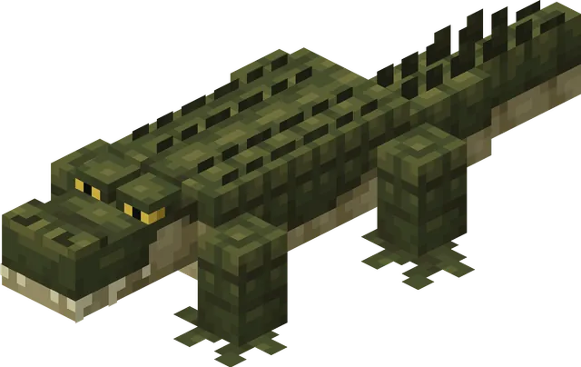

Аллигатор — нейтральный обитатель болот и похожих на них биомов. Хищник, который питается другими болотными животными.

**Где встречается:**

Появляется группами по 1–2 особи на траве, иле, корнях мангров и их грязевых вариантах.

**Поведение:**

- Детёныши полностью безобидны.
- Взрослые особи становятся агрессивными, если вы находитесь рядом с их яйцами или спровоцируете их атакой. Если убить
  аллигатора с одного удара, он не успеет озлобиться.
- Иногда охотятся на свиней, коров, овец, оленей, сомов и других животных поблизости.

### Анаконда

### Бабочки

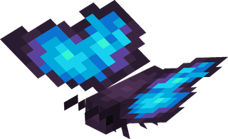

Бабочки — летающие мирные мобы, встречающиеся в лесах, на равнинах и в болотах. Подобно пчёлам, они опыляют цветы и сельхозкультуры, но не дают побочных продуктов вроде сот.

**Где встречается:**

Появляются группами по 1–3 особи над травой при уровне освещения 9 и выше.  
Существует 5 случайных вариантов окраса: монарх, махаон, желтушка, капустница и морфо.

**Поведение:**

- Считаются членистоногими, поэтому получают дополнительный урон от чар «Погибель членистоногих».
- Опыляют растения аналогично пчёлам, но не имеют ульев и не производят мёд.
- Следуют за игроком с цветами, цветущей азалией, её листьями или проростком мангров.
- При кормлении цветами размножаются и дают гусеницу.
- Гусеница ищет ближайшее бревно над землёй, забирается на него и образует куколку. Из куколки появляется случайный вариант бабочки.
- Куколку можно снять ножницами, иначе она будет разрушена.
- Бабочек можно поймать сачком.

### Басс

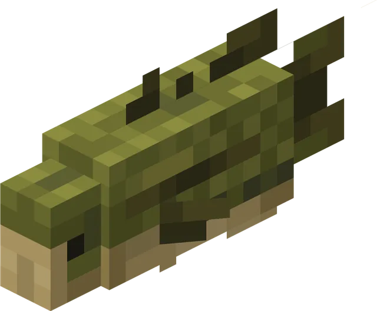

Бас — мирная водная рыба, обитающая в болотах, болотоподобных биомах и реках. Является источником сырого баса.

**Где встречается:**

Появляется группами по 4 особи, часто плавает стаями до 5 рыб.

**Дроп:**

- 1 сырой бас (или 1 жареный, если погиб в огне).

**Поведение:**

- Можно поймать ведром с водой, получив ведро с басом. Выпущенные из ведра рыбы не исчезают.
- Не выживает вне воды: через 10 секунд на суше начинает задыхаться.
- Не может жить в котле с водой или в залитых водой блоках (например, в ступенях и плитах).
- Уязвим для чар «Пронзатель».

### Бегемот

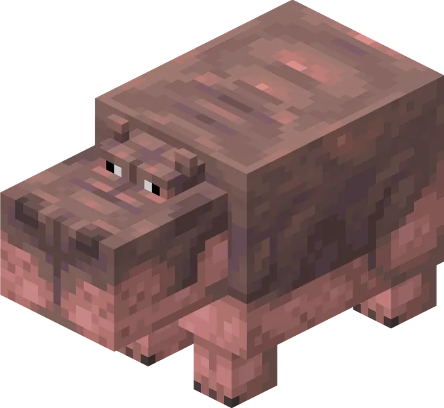

Бегемоты — массивные обитатели саванн, которых можно встретить у источников воды или прямо в них.

**Где встречается:**

Появляются группами по 3–4 особи на траве при уровне освещения 9 и выше, рядом с водой в саванне.

**Поведение:**

- Бесцельно бродят по саванне и периодически заходят в воду, где плавают.
- Нападают на лодки и игроков, если те находятся в воде. На суше ведут себя спокойно, пока вы не тронете их или их детёнышей.
- Их можно приманить и накормить блоками арбуза. Для размножения бегемоты должны находиться в воде.
- При кормлении арбузом анимационно держат его во рту и с хрустом съедают, сопровождая процесс звуком и частицами.

### Бизон

Бизоны — нейтральные мобы, обитающие на снежных равнинах.

**Поведение:**

- Атакуют в ответ на удар, нанося сильный отталкивающий урон рывком.
- Иногда дерутся между собой, но это редко приводит к смерти.
- Способны расчищать снежные слои на своём пути.
- Часто поедают травяные блоки.

**Стрижка:**

- С бизона можно получить шерсть, постригши его ножницами.
- После стрижки шерсть отрастает снова только после того, как бизон съест траву.

**Снежный покров:**

- В снежных биомах или во время снегопада шкура бизона покрывается снегом.
- Это можно сделать вручную, применив к нему слой снега.
- Снег снимается лопатой, водой, дождём или в жарком биоме.

**Размножение:**

- Размножаются пшеницей.
- После кормления двух бизонов появляется детёныш.

### Ворона

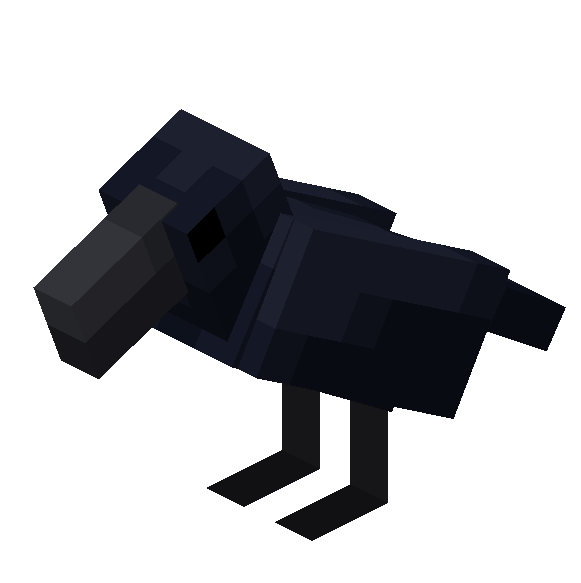

Вороны — летающие мобы, которых часто можно увидеть в небе. Они охотно подбирают упавшую еду и портят урожай, ворую растения с грядок.

**Особенности:**

- Вороны крадут еду и растущие культуры.
- Чтобы отпугнуть их от грядок, можно поставить рядом вырезанную тыкву (или боевой манекен).

**Приручение:**

- Приручаются семенами тыквы: ворона должна их подобрать и съесть.
- Прирученная ворона имеет 4 режима:
    - **Следовать** — летает за хозяином.
    - **Ждать** — остаётся на месте.
    - **Бродить** — двигается случайным образом.
    - **Собирать предметы** — приносит найденные предметы в контейнеры.

**Поведение приручённых ворон:**

- Помогают хозяину в бою, в том числе наносят дополнительный урон нежити.
- Лечатся, если сидят на тюке сена.
- Могут садиться на плечи игрока (до двух одновременно). Спрыгивают, если игрок крадётся, получает урон, погружается в воду/лаву или ложится спать.

**Сбор предметов:**

- В режиме сбора ищут предметы и относят их в контейнер, если на нём в рамке указан такой же предмет.
- Вокруг ближайшего тюка сена создают себе "базу", куда возвращаются при отлёте.

**Размножение:**

- Размножаются семенами тыквы.
- После кормления двух ворон появляется птенец.

### Газель

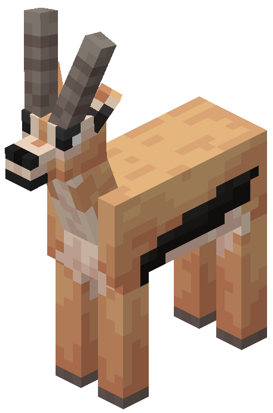

Газели — мирные животные, которых можно встретить в больших стадах.

**Поведение:**

- Спокойно бродят по равнинам.
- Если на одну газель нападают, всё стадо в панике убегает вместе с ней. Иногда одна из газелей может отстать.

**Размножение:**

- Размножаются пшеницей или цветами акации.
- После кормления двух газелей появляется детёныш.

### Гигантский кальмар

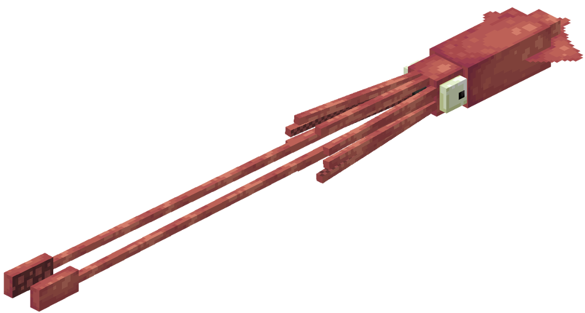

Гигантский кальмар — опасный морской моб, обитающий только в воде. На суше быстро начинает умирать.

**Поведение:**

- Атакует в ответ на удары игрока.
- Может выпускать облако чернил при получении урона.
- Нападает щупальцами на стражей, рыб и прочие угрозы.
- Избегает поверхности воды: чем ближе поднимается, тем бледнее становится его текстура.
- Зрачок кальмара расширяется, если поблизости находится сущность.

**Особые варианты:**

- Если молния ударит в обычного кальмара, появится синий гигантский кальмар вместо красного.

**Взаимодействие с кашалотом:**

- Если кашалот с помощью эхолокации замечает гигантского кальмара, начинается битва.
- Кальмар цепляется за пасть кашалота и атакует щупальцами, а кашалот пытается его проглотить.
- Если кашалот побеждает, выпадает предмет «Потерянные щупальца».

### Горилла

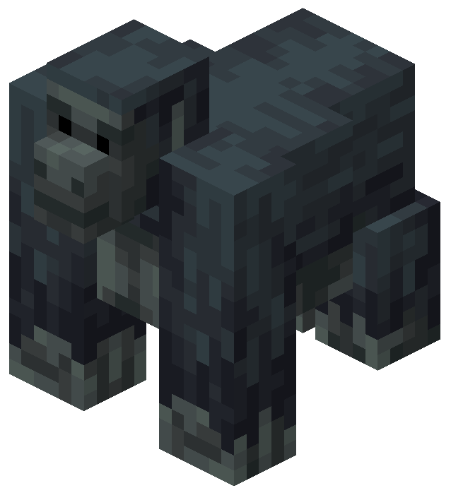

Гориллы — крупные обезьяны, обитающие группами. Каждое стадо возглавляет серебристоспинный самец.

**Поведение:**

- Серебристоспинные гориллы иногда бьют себя в грудь.
- При атаке игрока отвечают мощными ударами кулаков; вожак наносит больше урона, чем обычные особи.
- Детёныши могут кататься на спинах взрослых.
- Часто обдирают листву с джунглевых деревьев, чтобы питаться ею.

**Приручение:**

- Приручаются бананами.
- Имеют два режима поведения:
  - **Ждать** — остаётся на месте.
  - **Бродить** — двигается случайным образом.
- В бою защищают хозяина.

**Размножение:**

- Для размножения нужны приручённые обычная горилла и серебристоспинная.
- После кормления бананами у них появляется детёныш.
  
У горилл есть несколько пасхалок, связанных с бирками для имен:

- Если назвать гориллу **Harambe**, над её головой появится нимб — отсылка к реальной горилле по имени Харамбе.
- Если назвать гориллу **DK** или **Donkey Kong**, она сменит текстуру на образ знаменитого персонажа видеоигр.
- Если назвать гориллу **Funky Kong**, она также поменяет внешний вид на одноимённого героя. Имя **FK** при этом не сработает.

**Забавный факт:** серебристоспинные гориллы в игре выше игрока примерно на полголовы, хотя в реальности люди обычно выше.

### Гребневик

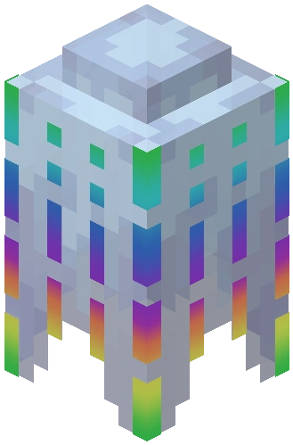

Гребневики — морские существа, которые могут жить только в воде. На суше начинают постепенно умирать.

**Особенности:**

- Их можно поймать ведром с водой, получив ведро с гребневиком. Выпущенные из ведра особи не исчезают.

**Факт:**

- В реальности гребневики встречаются не только в замёрзших океанах, а повсеместно — во всех морях и океанах мира, чаще всего на большой глубине.
- Несмотря на сходство с медузами и схожее название, гребневики относятся к отдельному типу животных — **ктенофорам**, и не являются медузами.

### Гремучая змея

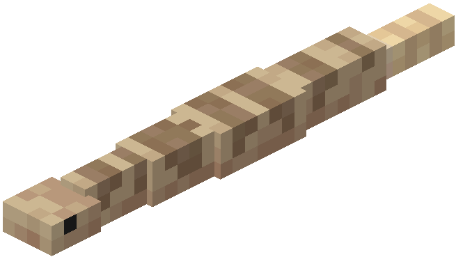

Гремучие змеи — оборонительные мобы, которые нападают только при слишком близком приближении.

**Поведение:**

- При угрозе издают характерный трескучий звук хвостом, предупреждая о своей близости.
- Если предупреждение проигнорировать, кусают цель и накладывают эффект яда.
- Детёныши ведут себя агрессивнее взрослых: они будут преследовать врага и кусать его несколько раз.
- Являются добычей для птиц-бегунов (роудраннеров).
- Также нападают на тушканчиков, если заметят их.

**Размножение:**

- Размножаются любым видом мяса.
- После кормления двух змей появляется детёныш.

### Енот

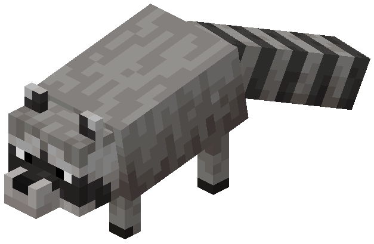

Еноты — хитрые и игривые мобы, которые умеют красть предметы и даже мыть еду в воде.

**Поведение:**

- Нападают в ответ на удар, кусая противника.
- Ночью их глаза светятся.
- Если держать еду в руках, енот будет выпрашивать угощение.
- Получив еду, енот несёт её к источнику воды, чтобы вымыть, и только потом съедает. Если воды рядом нет — ест сразу.
- Открывают сундуки и воруют еду, могут красть предметы у жителей.

**Сотрудничество с синими сойками:**

- Если накормить сойку светящимися ягодами, а затем накормить ими же енота, то со́йка сядет ему на спину.
- В бою со́йка помогает еноту.
- Убрать со́йку можно, снова покормив её светящимися ягодами.

**Приручение:**

- Приручаются яйцом, которое енот должен вымыть в воде.
- Приручённый енот имеет три режима:
    - **Следовать** — идёт за хозяином.
    - **Ждать** — остаётся на месте.
    - **Бродить** — двигается случайным образом.
- В бою защищают хозяина, но делают это слабо.

**Украшения:**

- На приручённого енота можно надеть ковёр любого цвета — он станет как бандана.
- Снимается ножницами. Чтобы сменить цвет, нужно надеть новый ковёр.

**Размножение:**

- Размножаются хлебом (его нужно дать напрямую, а не через «мытьё»).
- После кормления двух енотов появляется детёныш. Детёныши дикие и не приручены.

**Секреты:**

- Имя **Rigby** меняет скин енота на образ из мультсериала *Обычный мультик*.
- Если енот попытается вымыть сахар, он растворится — отсылка к ролику, где енот «моет» сахарную вату.
- Сотрудничество с синими сойками — тоже отсылка к дуэту Мордекай и Ригби из *Обычного мультика*.
- Енот, призванный командой */summon*, появляется сразу с белым ковром на шее.

### Жираф

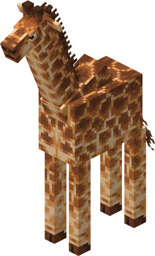

Жирафы — высокие обитатели саванн, встречающиеся группами по 2–4 особи.

**Поведение:**

- Спокойно бродят по саванне.
- При атаке ненадолго убегают от игрока.
- Детёныши следуют за родителями.

**Взаимодействие с игроком:**

- Если накормить жирафа яблоком или золотым яблоком, можно оседлать его на 30 секунд.
- Во время езды радиус обзора карты увеличивается в 1.5 раза, что позволяет быстрее открывать карту и находить структуры.

**Размножение:**

- Размножаются тюками сена.
- Не могут размножаться, пока на них сидит игрок.

### Зебра

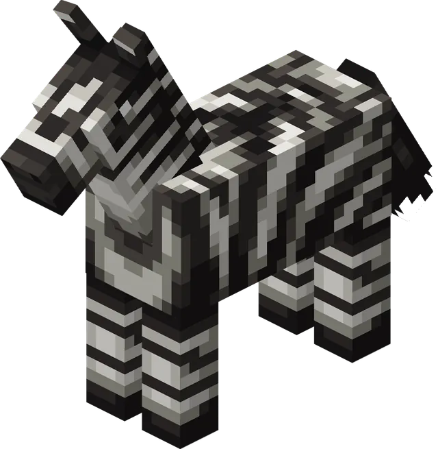

Зебры — обитатели саванн, встречающиеся группами по 2–4 особи.

**Поведение:**

- Ведут себя похоже на лошадей.
- В отличие от них, зебры убегают от игрока при приближении.
- Передвигаются чуть быстрее обычных лошадей в воде.

**Приручение и размножение:**

- Приручаются так же, как лошади, но сделать это сложнее, так как за зеброй нужно погоняться.
- Размножаются аналогично лошадям.

### Змея

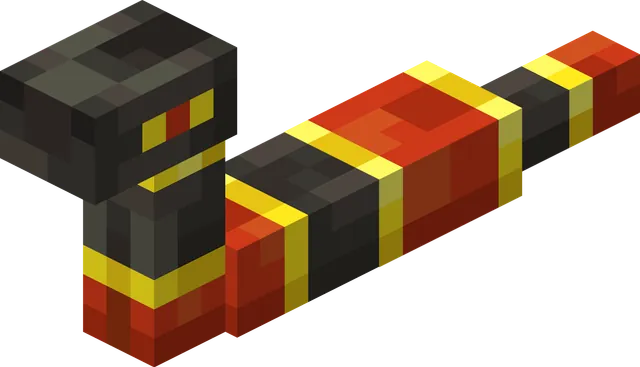

Змеи встречаются в одиночку в разных биомах — лесах, равнинах и болотах. Их внешний вид зависит от места обитания.

**Особенности:**

- При появлении у змеи есть 20% шанс иметь предмет в желудке:
  - 5% — кроличья лапка
  - 10% — слизевой шар
  - 15% — перо
  - 30% — сырое мясо кролика
  - во всех остальных случаях — сырая курятина
- Если у змеи пустой желудок, она ищет и поедает упавшие предметы. Через 5 минут «переваривания» желудок снова пуст.
- Если змею ударить, она может «выплюнуть» предмет. Его можно подобрать только через 4 секунды. В этот момент змея становится агрессивной и атакует обидчика.
- Спят в определённые промежутки дня и ночи. Разбуженные атакой становятся злыми и не засыпают ещё некоторое время.
- У гремучих змей есть дополнительное поведение — они издают предупреждающий треск хвостом при приближении игрока.

!!! warning "Конфликт с Alex's Mobs"
    Эти змеи и змеи из Alex's Mobs (гремучая змея и анаконда) - это разные мобы. 

### Кабан

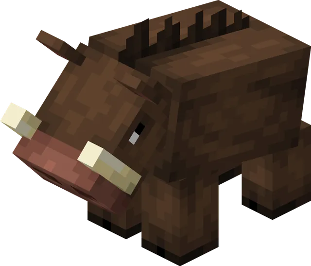

Кабаны — пассивные мобы, обитающие в саваннах и лесах. В отличие от свиней, на них нельзя оседлать седло. Являются источником свинины и кожи.

**Где встречается:**

Появляются группами по 4 особи на траве при уровне освещения 9 и выше.

**Дроп:**

- 1–3 сырой свинины (или жареной, если погиб в огне).
- 0–1 кожи.

**Поведение:**

- Избегают игроков, но если их атаковать, становятся агрессивными.
- В бою преследуют врага до его смерти, либо до того момента, пока их здоровье не упадёт до половины — тогда убегают.
- При ударе молнии превращаются в зоглинов.

**Размножение:**

- Следуют за игроком с морковью, картошкой или свёклой.
- Размножаются теми же предметами.
- После спаривания у родителей есть откат 5 минут.
- Детёныши взрослеют за 20 минут, процесс можно ускорить кормлением.

### Кайман

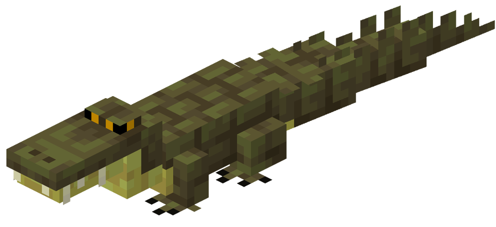

Кайманы — полуводные хищники, которые могут жить как в воде, так и на суше. При атаке они отвечают мощным укусом.

**Поведение:**

- Атакуют врагов, хватая их челюстями.
- Иногда выныривают из воды и начинают вибрировать телом.
- Несмотря на сходство с крокодилами, кайманы всё же подвергаются их нападениям — в основном ради пищи или конкуренции.

**Приручение:**

- Если находиться рядом с яйцом в момент вылупления, детёныш «привяжется» к ближайшей сущности и будет приручён. Такой кайман никогда не нападёт на того, к кому привязался.
- Приручённый кайман имеет три режима:
    - **Следовать** — идёт за хозяином.
    - **Ждать** — остаётся на месте.
    - **Бродить** — двигается случайным образом.
- В бою помогает хозяину: хватает врага челюстями, замедляя его и облегчая убийство или побег.

**Размножение:**

- Размножаются сырой рыбой-сомом.
- После кормления двух кайманов один из них откладывает яйца.

### Кашалот Кит

### Кенгуру

### Китоглав

### Колибри

### Косатка

### Komodo Dragon

### Космав

### Космическая треска

### Костяной серпент

Есть Обитает в аду в лавовых озерах. Страшная хуйня. Под вопросом.

### Лавиафан

### Лев

### Лобстер

### Лось

### Медведь

### Мимикрирующий осьминог

### Муравьед

### Носорог

### Олень

### Орёл

### Пингвин

### Птицы

### Рыба летяга

### Сахарная летяга

### Скунс

### Слон

### Снежный леопард

### Сова

### Сом

### Спектр

### Стервятник

### Тасманский дьявол

### Тигр

### Террапин (черепаха)

### Тукан

### Тушканчик

### Тюлень

### Утка

### Утконос

### Чайка

### Черепаха

### Эму

### Ящерка

### Devil's Hole Pupfish

### Endergrade

### Roadrunner

### Stradpoles / Straddlers

### Capuchin Monkeys

### Frilled Shark

### Gelada Monkey

### Warped Toad

### Dropbear

Есть Адский медведь. Под вопросом.

### Mimicube

Есть Спавнится только в энде. Можно оставить.