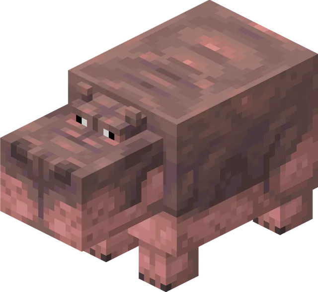
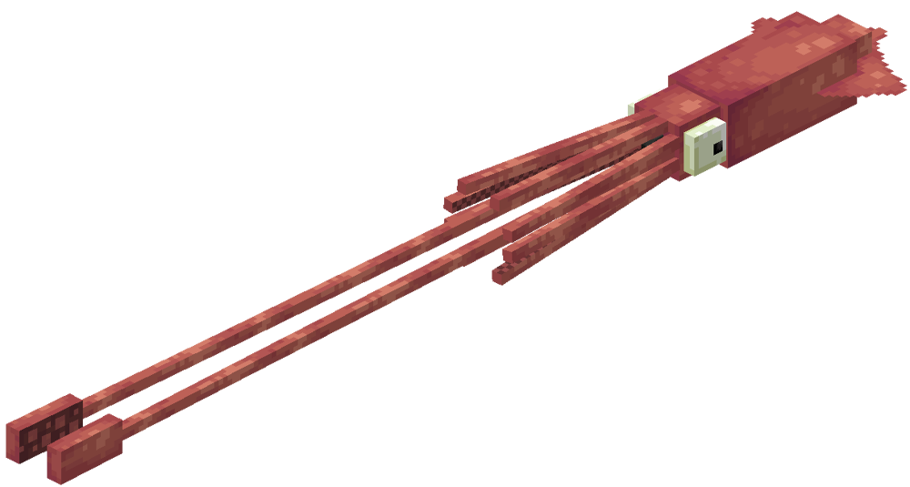
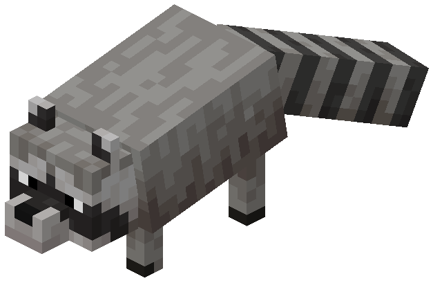
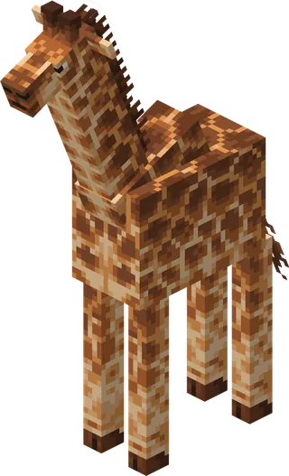
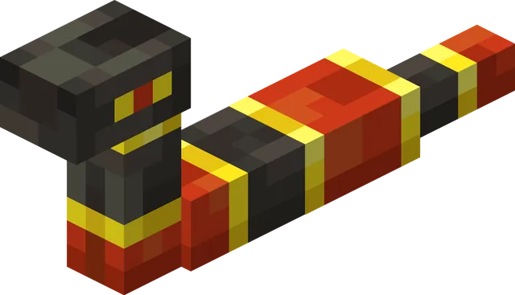
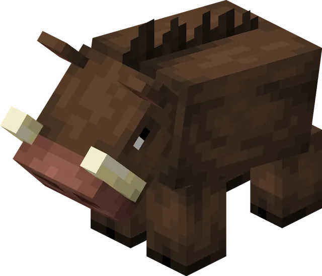
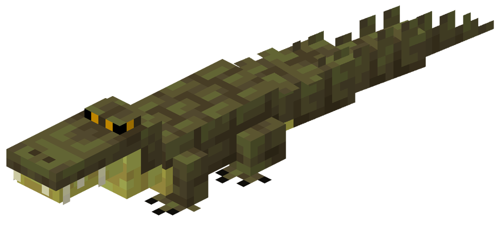
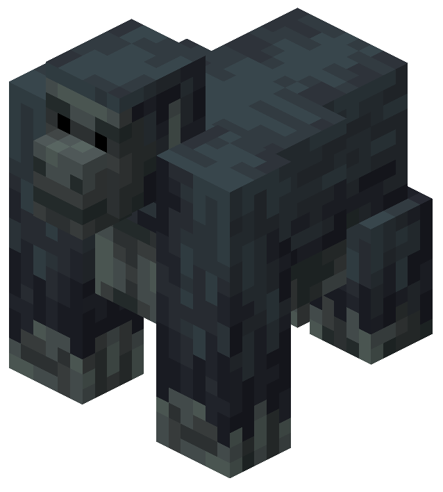

# Животные

У нас стоит два мода на животных: Naturalist и Alex's Mobs. Между ними иногда возникали конфликты (например, оба мода
добавляют медведя). Из-за этого много мобов было вырезано. Так же были вырезаны просто бесполезные или уебищные мобы.

Список ниже это все животные присутствующие на нашем сервере (не включая тех что из ванильного майнкрафта).

Перевод статей из англоязычных вики выполнен с помощью ИИ могут быть неточности.

### Акула молот

### Аллигатор

Аллигатор — нейтральный обитатель болот и похожих на них биомов. Хищник, который питается другими болотными животными.

**Где встречается:**

Появляется группами по 1–2 особи на траве, иле, корнях мангров и их грязевых вариантах.

**Поведение:**

- Детёныши полностью безобидны.
- Взрослые особи становятся агрессивными, если вы находитесь рядом с их яйцами или спровоцируете их атакой. Если убить
  аллигатора с одного удара, он не успеет озлобиться.
- Иногда охотятся на свиней, коров, овец, оленей, сомов и других животных поблизости.

### Анаконда

### Бабочки

Бабочки — летающие мирные мобы, встречающиеся в лесах, на равнинах и в болотах. Подобно пчёлам, они опыляют цветы и сельхозкультуры, но не дают побочных продуктов вроде сот.

**Где встречается:**

Появляются группами по 1–3 особи над травой при уровне освещения 9 и выше.  
Существует 5 случайных вариантов окраса: монарх, махаон, желтушка, капустница и морфо.

**Поведение:**

- Считаются членистоногими, поэтому получают дополнительный урон от чар «Погибель членистоногих».
- Опыляют растения аналогично пчёлам, но не имеют ульев и не производят мёд.
- Следуют за игроком с цветами, цветущей азалией, её листьями или проростком мангров.
- При кормлении цветами размножаются и дают гусеницу.
- Гусеница ищет ближайшее бревно над землёй, забирается на него и образует куколку. Из куколки появляется случайный вариант бабочки.
- Куколку можно снять ножницами, иначе она будет разрушена.
- Бабочек можно поймать сачком.

### Басс

Бас — мирная водная рыба, обитающая в болотах, болотоподобных биомах и реках. Является источником сырого баса.

**Где встречается:**

Появляется группами по 4 особи, часто плавает стаями до 5 рыб.

**Дроп:**

- 1 сырой бас (или 1 жареный, если погиб в огне).

**Поведение:**

- Можно поймать ведром с водой, получив ведро с басом. Выпущенные из ведра рыбы не исчезают.
- Не выживает вне воды: через 10 секунд на суше начинает задыхаться.
- Не может жить в котле с водой или в залитых водой блоках (например, в ступенях и плитах).
- Уязвим для чар «Пронзатель».

### Бегемот

Бегемоты — массивные обитатели саванн, которых можно встретить у источников воды или прямо в них.

**Где встречается:**

Появляются группами по 3–4 особи на траве при уровне освещения 9 и выше, рядом с водой в саванне.

**Поведение:**

- Бесцельно бродят по саванне и периодически заходят в воду, где плавают.
- Нападают на лодки и игроков, если те находятся в воде. На суше ведут себя спокойно, пока вы не тронете их или их детёнышей.
- Их можно приманить и накормить блоками арбуза. Для размножения бегемоты должны находиться в воде.
- При кормлении арбузом анимационно держат его во рту и с хрустом съедают, сопровождая процесс звуком и частицами.

### Бизон

Бизоны — нейтральные мобы, обитающие на снежных равнинах.

**Поведение:**

- Атакуют в ответ на удар, нанося сильный отталкивающий урон рывком.
- Иногда дерутся между собой, но это редко приводит к смерти.
- Способны расчищать снежные слои на своём пути.
- Часто поедают травяные блоки.

**Стрижка:**

- С бизона можно получить шерсть, постригши его ножницами.
- После стрижки шерсть отрастает снова только после того, как бизон съест траву.

**Снежный покров:**

- В снежных биомах или во время снегопада шкура бизона покрывается снегом.
- Это можно сделать вручную, применив к нему слой снега.
- Снег снимается лопатой, водой, дождём или в жарком биоме.

**Размножение:**

- Размножаются пшеницей.
- После кормления двух бизонов появляется детёныш.

### Ворона

Вороны — летающие мобы, которых часто можно увидеть в небе. Они охотно подбирают упавшую еду и портят урожай, ворую растения с грядок.

**Особенности:**

- Вороны крадут еду и растущие культуры.
- Чтобы отпугнуть их от грядок, можно поставить рядом вырезанную тыкву (или боевой манекен).

**Приручение:**

- Приручаются семенами тыквы: ворона должна их подобрать и съесть.
- Прирученная ворона имеет 4 режима:
    - **Следовать** — летает за хозяином.
    - **Ждать** — остаётся на месте.
    - **Бродить** — двигается случайным образом.
    - **Собирать предметы** — приносит найденные предметы в контейнеры.

**Поведение приручённых ворон:**

- Помогают хозяину в бою, в том числе наносят дополнительный урон нежити.
- Лечатся, если сидят на тюке сена.
- Могут садиться на плечи игрока (до двух одновременно). Спрыгивают, если игрок крадётся, получает урон, погружается в воду/лаву или ложится спать.

**Сбор предметов:**

- В режиме сбора ищут предметы и относят их в контейнер, если на нём в рамке указан такой же предмет.
- Вокруг ближайшего тюка сена создают себе "базу", куда возвращаются при отлёте.

**Размножение:**

- Размножаются семенами тыквы.
- После кормления двух ворон появляется птенец.

### Газель

Газели — мирные животные, которых можно встретить в больших стадах.

**Поведение:**

- Спокойно бродят по равнинам.
- Если на одну газель нападают, всё стадо в панике убегает вместе с ней. Иногда одна из газелей может отстать.

**Размножение:**

- Размножаются пшеницей или цветами акации.
- После кормления двух газелей появляется детёныш.

### Гигантский кальмар

Гигантский кальмар — опасный морской моб, обитающий только в воде. На суше быстро начинает умирать.

**Поведение:**

- Атакует в ответ на удары игрока.
- Может выпускать облако чернил при получении урона.
- Нападает щупальцами на стражей, рыб и прочие угрозы.
- Избегает поверхности воды: чем ближе поднимается, тем бледнее становится его текстура.
- Зрачок кальмара расширяется, если поблизости находится сущность.

**Особые варианты:**

- Если молния ударит в обычного кальмара, появится синий гигантский кальмар вместо красного.

**Взаимодействие с кашалотом:**

- Если кашалот с помощью эхолокации замечает гигантского кальмара, начинается битва.
- Кальмар цепляется за пасть кашалота и атакует щупальцами, а кашалот пытается его проглотить.
- Если кашалот побеждает, выпадает предмет «Потерянные щупальца».

### Гребневик

Гребневики — морские существа, которые могут жить только в воде. На суше начинают постепенно умирать.

**Особенности:**

- Их можно поймать ведром с водой, получив ведро с гребневиком. Выпущенные из ведра особи не исчезают.

**Факт:**

- В реальности гребневики встречаются не только в замёрзших океанах, а повсеместно — во всех морях и океанах мира, чаще всего на большой глубине.
- Несмотря на сходство с медузами и схожее название, гребневики относятся к отдельному типу животных — **ктенофорам**, и не являются медузами.

### Гремучая змея

Гремучие змеи — оборонительные мобы, которые нападают только при слишком близком приближении.

**Поведение:**

- При угрозе издают характерный трескучий звук хвостом, предупреждая о своей близости.
- Если предупреждение проигнорировать, кусают цель и накладывают эффект яда.
- Детёныши ведут себя агрессивнее взрослых: они будут преследовать врага и кусать его несколько раз.
- Являются добычей для птиц-бегунов (роудраннеров).
- Также нападают на тушканчиков, если заметят их.

**Размножение:**

- Размножаются любым видом мяса.
- После кормления двух змей появляется детёныш.

### Дорожный бегун

Дорожный бегун — проворная пустынная птица, которая предпочитает бегать, а не летать. Несмотря на безобидный вид, она охотится на гремучих змей и других мелких существ.

**Где встречается:**

Обитает в биомах Пустыня, Засушливые земли, Разрушенные и Лесистые засушливые земли.

**Дроп:**

Перьё и перо дорожного бегуна.

**Поведение:**

Почти всё время бегает по земле, выискивая добычу — чаще всего гремучих змей, которых атакует с неожиданной скоростью.  
Дорожные бегуны двигаются чрезвычайно быстро, легко обходя препятствия и убегая от хищников.

**Размножение:**

Птиц можно разводить, покормив их **личинками**. После этого одна из особей откладывает яйцо, из которого вылупляется птенец.

**Интересный факт / Секреты:**

Дорожный бегун — второй моб, добавленный в мод.  
Если назвать птицу **Meep** или **Meep Meep**, она изменит окрас и станет похожа на знаменитого Бегуна из *Looney Tunes*. При этом изменится поведение — появятся фирменные звуки «Meep Meep!», а сама птица начнёт бегать ещё быстрее.  
Такие версии моба также могут появляться естественно 1 апреля или при включённых *Super Secret Settings*.  
Кроме того, дорожные бегуны полностью невосприимчивы к урону от падающих наковален — отсылка к классическим мультфильмам.

### Енот

Еноты — хитрые и игривые мобы, которые умеют красть предметы и даже мыть еду в воде.

**Поведение:**

- Нападают в ответ на удар, кусая противника.
- Ночью их глаза светятся.
- Если держать еду в руках, енот будет выпрашивать угощение.
- Получив еду, енот несёт её к источнику воды, чтобы вымыть, и только потом съедает. Если воды рядом нет — ест сразу.
- Открывают сундуки и воруют еду, могут красть предметы у жителей.

**Сотрудничество с синими сойками:**

- Если накормить сойку светящимися ягодами, а затем накормить ими же енота, то со́йка сядет ему на спину.
- В бою со́йка помогает еноту.
- Убрать со́йку можно, снова покормив её светящимися ягодами.

**Приручение:**

- Приручаются яйцом, которое енот должен вымыть в воде.
- Приручённый енот имеет три режима:
    - **Следовать** — идёт за хозяином.
    - **Ждать** — остаётся на месте.
    - **Бродить** — двигается случайным образом.
- В бою защищают хозяина, но делают это слабо.

**Украшения:**

- На приручённого енота можно надеть ковёр любого цвета — он станет как бандана.
- Снимается ножницами. Чтобы сменить цвет, нужно надеть новый ковёр.

**Размножение:**

- Размножаются хлебом (его нужно дать напрямую, а не через «мытьё»).
- После кормления двух енотов появляется детёныш. Детёныши дикие и не приручены.

**Секреты:**

- Имя **Rigby** меняет скин енота на образ из мультсериала *Обычный мультик*.
- Если енот попытается вымыть сахар, он растворится — отсылка к ролику, где енот «моет» сахарную вату.
- Сотрудничество с синими сойками — тоже отсылка к дуэту Мордекай и Ригби из *Обычного мультика*.
- Енот, призванный командой */summon*, появляется сразу с белым ковром на шее.

### Жираф

Жирафы — высокие обитатели саванн, встречающиеся группами по 2–4 особи.

**Поведение:**

- Спокойно бродят по саванне.
- При атаке ненадолго убегают от игрока.
- Детёныши следуют за родителями.

**Взаимодействие с игроком:**

- Если накормить жирафа яблоком или золотым яблоком, можно оседлать его на 30 секунд.
- Во время езды радиус обзора карты увеличивается в 1.5 раза, что позволяет быстрее открывать карту и находить структуры.

**Размножение:**

- Размножаются тюками сена.
- Не могут размножаться, пока на них сидит игрок.

### Зебра

Зебры — обитатели саванн, встречающиеся группами по 2–4 особи.

**Поведение:**

- Ведут себя похоже на лошадей.
- В отличие от них, зебры убегают от игрока при приближении.
- Передвигаются чуть быстрее обычных лошадей в воде.

**Приручение и размножение:**

- Приручаются так же, как лошади, но сделать это сложнее, так как за зеброй нужно погоняться.
- Размножаются аналогично лошадям.

### Змея

Змеи встречаются в одиночку в разных биомах — лесах, равнинах и болотах. Их внешний вид зависит от места обитания.

**Особенности:**

- При появлении у змеи есть 20% шанс иметь предмет в желудке:
  - 5% — кроличья лапка
  - 10% — слизевой шар
  - 15% — перо
  - 30% — сырое мясо кролика
  - во всех остальных случаях — сырая курятина
- Если у змеи пустой желудок, она ищет и поедает упавшие предметы. Через 5 минут «переваривания» желудок снова пуст.
- Если змею ударить, она может «выплюнуть» предмет. Его можно подобрать только через 4 секунды. В этот момент змея становится агрессивной и атакует обидчика.
- Спят в определённые промежутки дня и ночи. Разбуженные атакой становятся злыми и не засыпают ещё некоторое время.
- У гремучих змей есть дополнительное поведение — они издают предупреждающий треск хвостом при приближении игрока.

!!! warning "Конфликт с Alex's Mobs"
    Эти змеи и змеи из Alex's Mobs (гремучая змея и анаконда) - это разные мобы. 

### Кабан

Кабаны — пассивные мобы, обитающие в саваннах и лесах. В отличие от свиней, на них нельзя оседлать седло. Являются источником свинины и кожи.

**Где встречается:**

Появляются группами по 4 особи на траве при уровне освещения 9 и выше.

**Дроп:**

- 1–3 сырой свинины (или жареной, если погиб в огне).
- 0–1 кожи.

**Поведение:**

- Избегают игроков, но если их атаковать, становятся агрессивными.
- В бою преследуют врага до его смерти, либо до того момента, пока их здоровье не упадёт до половины — тогда убегают.
- При ударе молнии превращаются в зоглинов.

**Размножение:**

- Следуют за игроком с морковью, картошкой или свёклой.
- Размножаются теми же предметами.
- После спаривания у родителей есть откат 5 минут.
- Детёныши взрослеют за 20 минут, процесс можно ускорить кормлением.

### Кайман

Кайманы — полуводные хищники, которые могут жить как в воде, так и на суше. При атаке они отвечают мощным укусом.

**Поведение:**

- Атакуют врагов, хватая их челюстями.
- Иногда выныривают из воды и начинают вибрировать телом.
- Несмотря на сходство с крокодилами, кайманы всё же подвергаются их нападениям — в основном ради пищи или конкуренции.

**Приручение:**

- Если находиться рядом с яйцом в момент вылупления, детёныш «привяжется» к ближайшей сущности и будет приручён. Такой кайман никогда не нападёт на того, к кому привязался.
- Приручённый кайман имеет три режима:
    - **Следовать** — идёт за хозяином.
    - **Ждать** — остаётся на месте.
    - **Бродить** — двигается случайным образом.
- В бою помогает хозяину: хватает врага челюстями, замедляя его и облегчая убийство или побег.

**Размножение:**

- Размножаются сырой рыбой-сомом.
- После кормления двух кайманов один из них откладывает яйца.

### Кашалот Кит

Кашалот — нейтральный морской гигант, обитающий в глубоких и холодных океанах. Эти исполины используют эхолокацию, чтобы находить добычу, и иногда устраивают сражения с гигантскими кальмарами.

**Где встречается:**

Появляется в биомах Глубокого, Холодного, Ледяного, Глубокого Ледяного, Тёплого и Глубокого Тёплого океанов. Редко может заспавниться на берегу во время грозы.

**Поведение:**

Кашалоты могут жить только в воде и начинают медленно умирать, если слишком долго находятся на суше. В воде они периодически выпускают пузырьки из дыхала, а по ночам иногда спят вертикально.  
Используют эхолокацию — характерные щелчки — чтобы обнаруживать кальмаров, светящихся кальмаров, мимик-осьминогов и гигантских кальмаров. При встрече с последними часто вступают в бой.  
В сражении кашалоты кусают и таранят цель, нанося серьёзный урон. Если добыча пытается уплыть, они совершают стремительный рывок.  
Могут ломать лёд, лодки и деревянные блоки. Детёныши часто становятся добычей касаток, но взрослые особи яростно защищают потомство.

**Дроп:**

Амбра (если помочь выбросившемуся на берег кашалоту вернуться в море).

**Интересный факт / Секреты:**

Редко встречается альбиносная белая разновидность с красными глазами и повышенным запасом здоровья.

### Кенгуру

Кенгуру — нейтральный обитатель засушливых биомов, известный своей прыгучестью и мощными ударами ногами. Несмотря на мирный характер, способен постоять за себя и хозяина.

**Где встречается:**

Живёт в биомах: Засушливые земли, Разрушенные и Лесистые засушливые земли, Саванна, Плоскогорье саванны и Ветреная саванна.

**Поведение:**

Передвигается исключительно прыжками. Если игрок нападёт, кенгуру отвечает сильными ударами задних лап, нанося серьёзный урон.  
Детёнышей иногда можно увидеть в сумке у взрослой особи.

**Приручение:**

Кенгуру можно приручить, покормив его морковью. После приручения доступны три режима поведения:
- **Следовать** — идёт за хозяином;
- **Оставаться** — остаётся на месте;
- **Бродить** — двигается свободно.

Если на владельца нападают или он сам вступает в бой, кенгуру присоединяется к сражению. Приручённые особи — отличные бойцы и способны наносить ощутимый урон.

**Хранение в сумке:**

Приручённого кенгуру можно использовать как переносное хранилище, открыв его сумку с помощью Shift + ПКМ.  
Даже если сумка занята детёнышем, её всё равно можно открыть.  
Если поместить в сумку оружие ближнего боя, шлем или нагрудник — кенгуру экипирует их и будет использовать в бою.  
Растительную пищу он ест сам, чтобы восстановить здоровье, но только когда ранен.

**Размножение:**

Кенгуру размножаются, если покормить их травой или сухими кустами. После этого одна из особей рождает детёныша.

### Китоглав

Китоглав — спокойная болотная птица с внушительным клювом, известная своим умением ловить рыбу и склонностью нападать на мелких пресмыкающихся.

**Где встречается:**

Встречается в биомах Болото и Мангровое болото.

**Поведение:**

Пуглив и взлетает, если его атаковать. Однако сам охотится на детёнышей черепах, крокодилов, кайманов и террапин.  
Иногда его можно увидеть за рыбалкой — он ныряет клювом в воду и вылавливает предметы, как при обычной рыбалке игрока.  
Если китоглав поймает рыбу, он съедает её, а ценные находки выбрасывает, что делает его полезным для автоматических рыбных ферм.

**Интересный факт / Секреты:**

Если покормить китоглава яйцами крокодила, его «приманка» станет эффективнее, а яйца террапин повышают его «удачу» при ловле.

### Колибри

Колибри — крошечная, но удивительно активная птица, летающая по джунглям и цветочным полянам. Несмотря на размер, она способна опылять цветы даже эффективнее пчёл.

**Где встречается:**

Обитает в биомах Джунгли, Бамбуковые джунгли, Редкие джунгли, Цветочный лес, Подсолнуховые равнины, Луг и Вишнёвая роща.

**Поведение:**

Колибри постоянно находятся в движении — порхают, замирают в воздухе и быстро перелетают от цветка к цветку. При этом опыляют растения, повышая их урожайность.

**Кормушки:**

Чтобы колибри оставались рядом, можно разместить кормушку, наполненную водой или сахаром. Пока в ней есть запас, птицы будут держаться поблизости.  
Активная кормушка также усиливает эффект опыления, делая колибри ещё полезнее для окружающей флоры.

**Размножение:**

Колибри размножаются, если покормить их любыми цветами, включая акациевые соцветия. После этого одна из птиц откладывает яйцо, из которого появляется птенец.

### Косатка

Косатка — нейтральный морской хищник, обитающий в холодных и замёрзших океанах. Умная, быстрая и опасная, она охотится стаями и нападает даже на крупных существ.

**Где встречается:**

В биомах Холодный океан, Глубокий холодный океан, Ледяной океан и Глубокий ледяной океан.

**Поведение:**

Может жить только в воде — на суше постепенно погибает. Если игрок нападёт, косатка отвечает мощными укусами и ударами хвоста.  
Охотится стаями, нападая на лосося, тюленей, черепах, утопленников, стражей, детёнышей кашалотов, белых медведей и даже лосей.  
Окрас косатки зависит от координат места спавна: от синевато-чёрного до полностью чёрного.  
Если долго плыть рядом с косаткой, игрок может получить эффект **«Мощь косатки»**.

### Комодский варан

Комодский варан — крупная ящерица из редких джунглей. Обычно агрессивен, но поддаётся приручению и способен стать грозным спутником игрока.

**Где встречается:**

В биоме Редкие джунгли.

**Поведение:**

Без приручения вараны нападают на всё вокруг, включая ослабленных собратьев и даже детёнышей. Их укус отравляет жертву.  
Иногда можно увидеть, как два здоровых варана устраивают «поединок» — встают на задние лапы и толкаются, не причиняя вреда друг другу.

**Приручение:**

Раньше варанов можно было приручить, накормив их несколькими стаками гнилой плоти, однако в версии 1.22.9 этот способ больше не работает из-за отсутствующего тега `alexsmobs:komodo_dragon_tameables`.  
Приручённые вараны могут быть переведены в один из трёх режимов:
- **Следовать** — идёт за хозяином;
- **Оставаться** — стоит на месте;
- **Бродить** — свободно перемещается.

На приручённого варана можно оседлать седло и ездить верхом.  
Если хозяина или самого варана атакуют, питомец немедленно вступает в бой, защищая союзника.

**Размножение:**

Вараны размножаются, если покормить их гнилой плотью. После этого одна из особей производит от одного до четырёх детёнышей.

**Интересный факт / Секреты:**

Если назвать варана именем **Coda** или **Maid**, он наденет костюм горничной.

### Лев

Лев — грозный хищник саванн, живущий и охотящийся прайдами. Их поведение удивительно реалистично: у каждой группы есть лидер, а ночная охота превращается в слаженную атаку.

**Где встречается:**

Появляется группами по 3–5 особей на траве при уровне освещения 9 и выше, в биомах саванны. В каждой группе часто встречается хотя бы один детёныш.

**Дроп:**

Со взрослых особей может выпадать немного опыта. Детёныши не дают дропа и опыта.

**Поведение:**

При спавне львы формируют прайд и назначают вожака — им становится самка без гривы. Если лидер погибает, прайд выбирает нового.  
Все львы следуют за вожаком и вместе выходят на ночную охоту. Сначала они крадутся к добыче, а затем совершают стремительный рывок. Иногда львы гибнут, нападая на слишком сильных противников, но чаще охота заканчивается успехом.  
Детёныши не нападают на других животных, но всегда держатся рядом с родителями.

### Лобстер / Омар

Омар — нейтральный морской обитатель, встречающийся у берегов пляжей. Несмотря на клешни, особой угрозы не представляет и ведёт себя довольно мирно.

**Где встречается:**

Живёт под водой в биомах Пляжа. Может выживать как в воде, так и на суше.

**Дроп:**

Хвост омара или жареный хвост омара (если был убит в огне).

**Поведение:**

Если омара атаковать, он ответит щипками, но наносит минимальный урон и не преследует противника.  
Омара можно поймать ведром с водой, получив предмет **«Ведро с омаром»** — такие особи не исчезают со временем и могут быть выпущены обратно, вместе с водой.

**Варианты окраса:**

- Красный — 75%
- Синий — 15%
- Красно-синий — 4.998%
- Жёлтый — 5%
- Белый — 0.001% (очень редкий)
- Чёрный — 0.001% (очень редкий)

### Лось

Лось — нейтральное северное животное, обитающее в снежных биомах. Огромный и сильный, он способен нанести серьёзный урон, если его спровоцировать.

**Где встречается:**

Встречается стадами по три особи в биомах Снежные равнины, Снежная тайга, Роща и Ледяные шипы.

**Поведение:**

Если игрок нападёт, лось ответит мощной атакой — разбегается и таранит цель, нанося огромный урон. Самцы с рогами иногда устраивают поединки между собой, но без смертельного исхода.  
Раз в 7–10 игровых дней лоси сбрасывают рога, которые затем отрастают снова через 3–5 дней.  
Кроме того, лоси способны защищаться от волков и других хищников.

**Снежная шкура:**

Во время снегопада шерсть лося покрывается слоем снега. Это можно сделать вручную, используя слой снега.  
Снять снег можно лопатой, либо просто приведя лося в воду, дождь или тёплый биом.

**Размножение:**

Лосей можно разводить, несколько раз покормив их одуванчиками. После этого одна из особей рождает детёныша.

### Медведь

Гризли — крупный защитный зверь, обитающий в лесах и тайге. Обычно миролюбив, но если потревожить его или медвежат — легко превращается в смертельную угрозу.

**Где встречается:**

В биомах Лес, Цветочный лес, Берёзовый лес, Старый берёзовый лес, Тайга, Старый сосновый лес, Старый еловый лес, Тёмный лес и Вишнёвая роща.

**Дроп:**

Волос гризли (может выпадать как при жизни, так и после смерти) и крайне редко — Пыль медведя.

**Поведение:**

Гризли защищается только в случае опасности — если игрок подошёл слишком близко или атаковал его издалека. Нападает, вставая на задние лапы и мощно бьёт когтями. Часто можно увидеть взрослого медведя с одним-двумя медвежатами.

**Питание и мёд:**

Медведи-грызли разоряют ульи и гнёзда пчёл в поисках сот, не обращая внимания на ужаливания — они полностью невосприимчивы к яду.  
Если накормить медведя сотами, блоками мёда или бутылками мёда (в последнем случае он оставит пустую бутылку), его морда покроется мёдом, а отношение к игроку станет нейтральным.

**Приручение:**

После того как медведь съел мёд, его можно приручить, покормив сырой сёмгой.  
Приручённый гризли подчиняется командам:
- **Следовать** — идёт за хозяином;
- **Оставаться** — остаётся на месте;
- **Бродить** — свободно перемещается.

На приручённом гризли можно ездить верхом. Благодаря росту, он защищает всадника от атак большинства мобов.  
Если кто-то нападёт на хозяина или самого медведя, питомец сразу вступает в бой. Гризли может атаковать и во время езды, если приблизить его к врагу.

**Размножение:**

Приручённых медведей можно разводить, кормя их сырой сёмгой. После этого одна из особей рождает медвежонка.

**Снежная шкура:**

Во время снегопада шерсть гризли покрывается снегом. Это можно сделать вручную, используя слой снега.  
Снять снег можно лопатой, а также просто приведя медведя в воду, дождь или тёплый биом.

### Мимикрирующий осьминог

Мимик-осьминог — мирное морское существо из тёплых океанов, известное своей способностью маскироваться и подражать другим мобам. Это один из самых умных и необычных обитателей подводного мира.

**Где встречается:**

Обитает в биомах Тёплый океан.

**Дроп:**

Мешочек с чернилами.

**Поведение:**

Может жить только в воде — на суше постепенно погибает. Если использовать на приручённом осьминоге слизь, он сможет временно выживать вне воды (эффект длится около двух игровых дней).  
Мимика можно поймать ведром с водой, получив предмет **«Ведро с мимик-осьминогом»**, который можно выпустить обратно в воду.

**Камуфляж:**

Когда осьминог находится на блоке, он принимает его окраску. Это позволяет ему скрываться от хищников, таких как акулы-молоты и раки-богомолы. В режиме маскировки мимик также постепенно восстанавливает здоровье.

**Подражание другим существам:**

Мимик-осьминог способен принимать облик **крипера**, **стража** или **рыбы-фугу**, чтобы отпугнуть врагов.

**Приручение:**

Мимика можно приручить, если покормить **хвостами омара**, но только когда он не замаскирован.  
После приручения доступны три режима:
- **Следовать** — плывёт за хозяином;
- **Оставаться** — замирает на месте;
- **Бродить** — свободно перемещается.

Используя особые предметы, можно принудительно менять форму мимика (предметы не расходуются):
- Порох — превращает в крипера;
- Осколок призмарина или призмариновый кристалл — превращает в стража;
- Рыба-фугу — превращает в фугу.

Если применить на мимике **5–8 единиц мимикрима**, он получит боевые способности:
- В форме крипера создаёт небольшие взрывы;
- В форме стража стреляет лазером;
- В форме фуги жалит ядовитыми шипами.

С мимикримом осьминог будет защищать хозяина, нападая на врагов. Без него он лишь пытается отпугнуть угрозу, меняя форму.

**Размножение:**

Приручённых мимиков можно разводить, кормя их **тропическими рыбами**. После этого одна из особей рождает детёныша.

### Муравьед

Муравьед — нейтральное животное из джунглей, известное своей длинной язычной мордой и страстью к муравьям-листорезам. Ведёт себя спокойно, но может дать отпор, если его потревожить.

**Где встречается:**

Обитает в биомах Джунгли, Бамбуковые джунгли и Редкие джунгли.

**Поведение:**

Если игрок нападёт, муравьед встанет на задние лапы и начнёт медленно размахивать когтями, нанося удары.  
Детёныши иногда сидят верхом на взрослых особях.  
Питается муравьями-листорезами, выстреливая длинным липким языком и проглатывая их целиком.

**Разорение муравейников:**

Муравьедов часто можно увидеть за «налётом» на муравейники листорезов — они раскапывают их когтями и добывают разные предметы. Среди находок встречаются:  
свёкла, картофель, магготы, висячие корни, земля, корневая земля, глинистая почва и куколки муравьёв-листорезов.  
Если в камерах под муравейником растёт гонигилидия, её также можно получить.

**Размножение:**

Муравьеды размножаются, если покормить их куколками муравьёв-листорезов. После этого одна из особей рождает детёныша.

**Интересный факт / Секреты:**

Если назвать муравьеда **Peter** или **Peter The Anteater**, он наденет форму талисмана Университета Калифорнии в Ирвайне — это отсылка к настоящему университетскому маскоту по имени Питер Муравьед.

### Носорог

Носорог — массивное защитное животное саванн, обладающее колоссальной силой. Несмотря на спокойный нрав, при провокации способен на разрушительную атаку.

**Где встречается:**

Появляется группами по пять особей в биомах Саванна, Плоскогорье саванны и Ветреная саванна.

**Поведение:**

Носороги обычно мирны и защищаются только если игрок подошёл слишком близко или атаковал их издалека. Однако, если накормить носорога **пшеницей**, он станет мирным по отношению к игроку и даже будет защищать его.  
При атаке носорог разгоняется и пронзает цель рогом — в этот момент его глаза становятся красными, как у разъярённого волка.  
Также носороги нападают на всех разновидностей разбойников, включая опустошителей, что делает их ценными союзниками во время рейдов.  
Иногда усмирённые носороги поселяются рядом с деревнями.

**Эффектное оружие (зелья на роге):**

Если в носорога попадёт зелье, его эффект впитывается в рог. Затем при атаке этим рогом противник получает тот же эффект.  
Зелье действует от **15 до 20 атак**, либо до смерти носорога.

**Размножение:**

Носороги размножаются, если покормить их **травой** или **сухими кустами**. После этого одна из особей рождает детёныша.

**Интересный факт / Секреты:**

В реальном мире носороги часто становятся жертвами браконьеров из-за своих рогов, что привело многие виды к вымиранию. Именно поэтому в игре они **не дропают рога**.  
Интересно, что некоторые игроки предполагают связь между носорогами и опустошителями — обе твари обладают огромным здоровьем и силой, хотя у опустошителей лицо деревенского жителя, что ставит теорию под сомнение.  
В игре носороги двигаются медленнее слонов, хотя в реальности способны разгоняться даже быстрее.

### Обезьяна Гелада

Гелада — крупная горная обезьяна, живущая группами на лугах. Эти животные отличаются сложным социальным поведением, заботой друг о друге и способностью очищать территорию от травы.

**Где встречается:**

Обитает в биоме Луг. Появляется группами по четыре особи, среди которых всегда есть лидер.

**Поведение:**

Если игрок нападёт на геладу, она ответит укусами, а вся группа вступится за пострадавшего.  
Лидеры иногда устраивают поединки между собой — демонстрируют клыки и оголяют грудь, но редко убивают друг друга: проигравший просто уходит.  
Гелад можно увидеть, как они ищут траву на земле или ухаживают друг за другом, очищая шерсть. Такое поведение укрепляет связи внутри группы.

**Очищение территории:**

Если покормить геладу **пшеницей**, она начнёт активно вырывать высокую траву поблизости, расчищая место вокруг себя.

**Размножение:**

Гелад можно разводить, если покормить их **сухими кустами**. После этого одна из особей рождает детёныша.

### Обезьяна Горилла

Гориллы — крупные обезьяны, обитающие группами. Каждое стадо возглавляет серебристоспинный самец.

**Поведение:**

- Серебристоспинные гориллы иногда бьют себя в грудь.
- При атаке игрока отвечают мощными ударами кулаков; вожак наносит больше урона, чем обычные особи.
- Детёныши могут кататься на спинах взрослых.
- Часто обдирают листву с джунглевых деревьев, чтобы питаться ею.

**Приручение:**

- Приручаются бананами.
- Имеют два режима поведения:
  - **Ждать** — остаётся на месте.
  - **Бродить** — двигается случайным образом.
- В бою защищают хозяина.

**Размножение:**

- Для размножения нужны приручённые обычная горилла и серебристоспинная.
- После кормления бананами у них появляется детёныш.

У горилл есть несколько пасхалок, связанных с бирками для имен:

- Если назвать гориллу **Harambe**, над её головой появится нимб — отсылка к реальной горилле по имени Харамбе.
- Если назвать гориллу **DK** или **Donkey Kong**, она сменит текстуру на образ знаменитого персонажа видеоигр.
- Если назвать гориллу **Funky Kong**, она также поменяет внешний вид на одноимённого героя. Имя **FK** при этом не сработает.

**Забавный факт:** серебристоспинные гориллы в игре выше игрока примерно на полголовы, хотя в реальности люди обычно выше.

### Обезьяна Капуцин

Капуцин — умная и игривая обезьяна, живущая в джунглях и мангровых болотах. Несмотря на небольшой размер, способна ловко бросаться камнями и даже защищать своего хозяина.

**Где встречается:**

Обитает в биомах Джунгли, Бамбуковые джунгли, Редкие джунгли и Мангровое болото. Появляется большими группами — до 25 особей.

**Поведение:**

Если игрок нападёт, капуцины отвечают, метая в обидчика булыжники.  
Неприручённые обезьяны, которых кормят бананами, иногда роняют **банановую кожуру**.

**Приручение:**

Капуцина можно приручить, покормив **бананами**. После приручения доступны три режима:
- **Следовать** — обезьяна следует за хозяином;
- **Оставаться** — сидит на месте;
- **Бродить** — свободно перемещается.

Приручённый капуцин помогает хозяину в бою, метая булыжники во врагов.  
Если присесть и нажать ПКМ по обезьяне, она запрыгнет на плечо игрока — оттуда тоже может атаковать, бросая камни. Чтобы снять её с плеча, нужно снова присесть.  
Если дать капуцину **древний дротик**, его атаки станут мощнее и смогут пробивать цели насквозь.  
Обезьяну можно лечить, бросив ей под ноги **яйцо** — она поднимет его и восстановит здоровье.

**Размножение:**

Капуцинов можно разводить, кормя их **личинками**. После этого одна из особей рождает детёныша.

**Интересный факт / Секреты:**

Капуцины — одни из немногих мобов, которые могут атаковать, находясь прямо на плече игрока.

### Олень

Олень — мирное животное, обитающее в лесах и вишнёвых рощах. Осторожен и пуглив, но может довериться игроку, если тот проявит терпение.

**Где встречается:**

Появляется группами по 1–3 особи на траве при уровне освещения 9 и выше, в биомах Лес и Вишнёвая роща.

**Дроп:**

С взрослых особей выпадает сырая или жареная оленина (если убит в огне). Количество увеличивается с зачарованием «Добыча». Детёныши не дают дропа и опыта.

**Поведение:**

Олени избегают игроков и убегают, если подойти слишком близко. Однако их можно **приманить яблоками** — тогда они будут следовать за игроком. Если игрок при этом перестанет красться, олень испугается и убежит.  
Такое поведение похоже на кошек, приближающихся к игроку с рыбой в руке.  
Когда один олень пугается, другие поблизости также начинают бежать.  
Иногда олени наклоняются, чтобы пощипать траву, напоминая овец.

**Размножение:**

Двух оленей можно развести, покормив их яблоками. После этого появляется оленёнок.

### Орёл

Белоголовый орлан — величественная хищная птица, символ свободы, встречающаяся в ветреных лесах и горах. Умный охотник и верный спутник, если его приручить.

**Где встречается:**

Обитает в биомах Ветреный лес и Роща.

**Дроп:**

Перо.

**Поведение:**

При нападении орлан защищается, атакуя врага острыми когтями.  
В дикой природе охотится на кроликов и лосося, выхватывая их с земли или прямо из воды и убивая в воздухе.

**Приручение:**

Орлана можно приручить, покормив **рыбьим жиром**.  
После приручения доступны три режима:
- **Следовать** — следует за хозяином;
- **Оставаться** — садится на месте;
- **Бродить** — свободно перемещается.

Приручённый орлан помогает владельцу в бою и может быть исцелен любой рыбой.

**Соколиная охота:**

Приручённого орлана можно посадить на руку, используя **перчатку сокольника**.  
ПКМ по существу при этом заставит орлана атаковать цель; после победы он возвращается к владельцу или обратно на перчатку.

Если на орлана надета **капюшонка сокольника**, его полёт можно полностью контролировать — но при этом игрок временно теряет управление своим персонажем и становится уязвим.  
Управление прекращается при приседании или если орлан улетит дальше чем на 150 блоков.  
Капюшон снимается ножницами.

**Размножение:**

Приручённых орланов можно разводить, кормя их **гнилой плотью**. После этого одна из особей производит птенца.

### Пингвин

Отдельный мод для этих челов. Инфы нет. Просто декоративные мобы. Хз в чем их функция.

### Плащеносная акула

Плащеносная акула — редкий и древний вид акул, обитающий в глубинах океанов. Её змееподобное тело и светоотражающие зубы делают встречу с ней по-настоящему впечатляющей.

**Где встречается:**

Появляется под водой ниже уровня Y=25 во всех типах океанов: обычном, холодном, ледяном, тёплом и их глубоких вариантах.

**Дроп:**

Зазубренные зубы акулы (если во время атаки на кальмара или светящегося кальмара).

**Поведение:**

Живёт только в воде и погибает, если оказывается на суше.  
Если игрок нападёт, акула отвечает укусом, накладывающим эффект **«Кровопотеря»**.  
Охотится на кальмаров, светящихся кальмаров, рыбу-блоб и других морских существ, заманивая их отражением своих зубов.  
При приближении к поверхности воды её кожа светлеет, а движения становятся медленнее — различить это не всегда просто.  
Акулу можно поймать ведром с водой, получив предмет **«Ведро с акулохвостой акулой»**; такие особи не исчезают со временем.

**Интересный факт / Секреты:**

Если назвать акулу **Kamata-kun** или **Kamata Kun**, она изменит цвет на жёлтый — отсылка к существу Камата-кун из фильма *Shin Godzilla*.  
Также её способность терять зубы во время атаки может быть намёком на сталкеров из игры *Subnautica*, которые сбрасывают зубы при охоте.

### Птички

Птицы — приручаемые мирные мобы, обитающие в разных биомах в зависимости от вида. Они создают атмосферу живой природы, перелетая с ветки на ветку и издавая характерные птичьи звуки.

**Где встречаются:**

Появляются группами по 1–4 особи на траве, листьях, брёвнах или в воздухе.  
Разные виды встречаются в своих биомах:
- **Кардиналы** — леса, саванны, болота и пустыни;
- **Канарейки** — холмы и горы;
- **Малиновки** — леса, равнины и горные биомы;
- **Синицы (Сойки)** — тайга, холмы и снежные области;
- **Воробьи** — равнины и вишнёвые рощи;
- **Щеглы** — леса и саванны.

**Дроп:**

1–2 пера (до 5 при зачаровании «Добыча III»).

**Поведение:**

Птицы беспорядочно летают, иногда садятся и часто держатся вместе.  
Днём можно услышать их пение — каждая разновидность издаёт собственные звуки (песни кардинала, синицы и т. д.), сопровождающиеся разноцветными частицами нот.  
Ночью птицы не поют и ведут себя спокойно.

**Приручение:**

Птиц можно приручить любыми семенами — пшеницы, свёклы, арбуза или тыквы.  
Приручённые птицы следуют за хозяином и могут быть переведены в режим **сидеть** или **следовать**.

### Рыба летяга

Летучая рыба — мирный морской обитатель, способный эффектно выпрыгивать из воды и скользить по воздуху. Её можно встретить в тёплых прибрежных водах.

**Где встречается:**

Появляется в биомах Океан и Тёплый океан.

**Дроп:**

Предмет **Летучая рыба**.

**Поведение:**

Может жить только в воде — на суше постепенно погибает. Время от времени выпрыгивает из воды и планирует над поверхностью, прежде чем вновь нырнуть.  
Летучих рыб можно поймать ведром с водой, получив **«Ведро с летучей рыбой»** — такие особи не исчезают со временем и могут быть выпущены обратно.  
Являются добычей для тюленей и дельфинов.

### Сахарный поссум (летяга)

Сахарный поссум — маленькое дружелюбное животное, обитающее в берёзовых лесах. Он способен планировать в воздухе, карабкаться по стенам и даже приносить небольшие дары своему хозяину.

**Где встречается:**

В биомах Берёзовый лес и Старый берёзовый лес.

**Поведение:**

Обычно поссумы ходят пешком, но время от времени раскрывают перепонки между лапами и плавно планируют по воздуху. Детёныши пока не умеют летать.  
Также они прекрасно лазают по стенам, что делает их весьма ловкими существами.

**Приручение:**

Сахарного поссума можно приручить, покормив его сладкими ягодами. После приручения доступны три режима:
- **Следовать** — идёт за хозяином;
- **Оставаться** — остаётся на месте;
- **Бродить** — двигается свободно.

Приручённые поссумы не нападают на мобов. Их можно посадить себе на голову, нажав **Shift + ПКМ** — тогда игрок получит эффект **«Медленное падение»**.

**Собирательство:**

Если приручённый взрослый поссум стоит на листве, он время от времени ищет в ней предметы. Найти удаётся не всегда, но среди находок могут быть:
акациевые соцветия, яблоки, стрелы, бамбук, бананы, паутина, яйца, перья, ягоды светящегося растения, мёд в сотах, саженцы, ветки, семена пшеницы, лианы и многое другое.  
В зависимости от типа листвы, список находок может меняться (например, бананы — только с листвы джунглей, яблоки — с дубовой).

**Размножение:**

Приручённых поссумов можно разводить, кормя их сотами. После этого одна из особей рождает детёныша.

### Скунс

Скунс — оборонительное животное лесов и цветочных рощ. Обычно мирный, но если его разозлить, он выпускает облако зловонного газа, от которого кружится голова.

**Где встречается:**

Обитает в биомах Лес, Цветочный лес, Берёзовый лес, Старый берёзовый лес, Тайга, Старый сосновый и еловый лес, Тёмный лес и Вишнёвая роща.

**Поведение:**

Скунс защищается только если его долго преследовать или ударить с близкого расстояния. В ответ он выпускает облако токсичного газа, вызывающего эффект тошноты.  
Часть газа оседает на блоках — эти участки можно собрать во флакон, получив предмет **«Запах в бутылке»**.  
Если на скунса действует какой-либо эффект, то и его газ передаёт тот же эффект всем существам поблизости.  
Малыши не умеют распылять газ.

**Размножение:**

Скунсов можно разводить, кормя их **сладкими ягодами**. После этого одна из особей рождает детёныша.

### Слон

Слон — нейтральный, но могучий обитатель саванн, живущий стадами под руководством вожака. Эти великаны миролюбивы, но в случае угрозы превращаются в неудержимую силу.

**Где встречается:**

Обитает в биомах Саванна, Плоскогорье саванны и Ветреная саванна.  
Иногда странствующий торговец может появиться верхом на слоне, если заспавнится в жарком биоме.

**Поведение:**

Слоны живут стадами, во главе которых стоит **вожак**. При нападении они защищают друг друга — если ударить одного, всё стадо вступает в бой.  
Атакуют, пронзая врага бивнями, подбрасывая хоботом или встав на дыбы и обрушивая вес тела. Вожак способен также совершать стремительную атаку-рывок.  
Иногда можно увидеть, как слоны срывают листву с деревьев, чтобы поесть. Они также поедают снопы сена, если их оставить поблизости.  
Если детёныш теряет родителей, он ищет другого взрослого слона, который возьмёт его под опеку.  
Боятся пчёл и стараются избегать их.

**Торговые слоны:**

Когда странствующий торговец появляется в жарком биоме, он может быть верхом на слоне с уникальным ковром и сундуком с добычей.  
В сундуке могут оказаться: акациевые цветы, словари животных, бананы, ноги пещерных многоножек, паутина, фрагменты крыльев тараканов, личинки москитов, щитки крокодилов, изумруды, яйца и перья эму, магготы, песок, акульи зубы, палки и порванные крылья осы-тарантулницы.

**Приручение:**

Обычных и детёнышей слонов можно приручить, кормя **цветами акации**. Вожака можно приручить только в детстве.  
После приручения на слона можно:
- установить **ковёр** любого цвета (для украшения);
- прикрепить **сундук** для хранения предметов;
- ездить верхом.

Чтобы изменить цвет ковра, нужно просто заменить его новым — краски не работают. Снять украшения можно **ножницами**.  
Приручённый слон помогает хозяину в бою, нападая на мобов, которые атакуют владельца или которых атаковал сам игрок.  
Если оседлать вожака и накормить его **пшеницей**, он выполнит мощную **атаку-рывок**, ускоряясь на несколько секунд.

**Размножение:**

Приручённых слонов можно разводить, кормя их **цветами акации**. После этого одна из особей рождает детёныша.

**Интересный факт / Секреты:**

Слоны — одни из самых крупных существ в моде. Их поведение вдохновлено настоящими африканскими слонами, включая заботу о потомстве и социальную структуру стада.

### Снежный барс

Снежный барс — грациозный хищник северных гор и ледяных равнин. Тихий, осторожный и смертельно опасный, он предпочитает выслеживать добычу, а не бросаться в открытую атаку.

**Где встречается:**

Обитает в биомах Снежные равнины, Снежная тайга, Замёрзшая река, Ледяной океан, Снежные склоны, Зубчатые пики, Замёрзшие пики и Роща.  
Спавнится только на блоках травы, камня или диорита.

**Поведение:**

Барс отвечает на нападение преследованием и внезапным прыжком, нанося удары когтями. Охотится на овец и других домашних животных.  
Иногда его можно увидеть отдыхающим или наблюдающим за окрестностями.  
Умеет передвигаться по слоям снега и не получает урона от падения.  
Может шагать по двум блокам высотой, что делает его очень подвижным среди горных склонов.  
Когда барс убивает добычу, срабатывает эффект «удачи» — дроп с жертвы увеличивается, как при зачаровании «Добыча».

**Размножение:**

Снежных барсов можно разводить, кормя их **сырыми рёбрами лося**. После этого одна из особей рождает детёныша.

**Интересный факт / Секреты:**

Снежный барс — один из немногих мобов, способных свободно ходить по слою порошкового снега, не проваливаясь в него.

### Сова / Поту

Поту — ночная птица с огромными глазами, обитающая в тёмных лесах. Днём она спит, сливаясь с корой деревьев, а ночью выходит на охоту за мелкими насекомыми.

**Где встречается:**

В биоме Тёмный лес.

**Дроп:**

Перо.

**Поведение:**

Днём поту почти неподвижен — сидит на ветке и спит, прекрасно маскируясь под часть дерева. Ночью становится активнее, но остаётся на своём насесте, лишь иногда взлетая, чтобы схватить подлетевших мух.  
Иногда можно увидеть, как поту зевает.  
Размер зрачков зависит от освещения: при уровне света выше 7 они сужаются, а при уровне ниже 7 становятся огромными.  
Перемещать птицу можно с помощью **соколиной перчатки**.

**Размножение:**

Поту размножаются, если покормить их **личинками**. После этого одна из особей рождает птенца.

**Интересный факт / Секреты:**

Название «поту» происходит от звуков, которые птица издаёт ночью — протяжных и немного жутких, отчего её иногда называют «плачущей птицей».

### Сом

Сом — мирная рыба, обитающая в реках и болотах. Бывает трёх размеров и может не только хранить предметы, но и проглатывать мелких существ.

**Где встречается:**

Встречается под водой в биомах Река, Замёрзшая река, Болото и Мангровое болото.  
Малые и средние особи обитают повсюду, а крупные — только в болотах.

**Дроп:**

Сырая рыба-сом или жареная (если погиб в огне).

**Поведение:**

Сомы живут исключительно в воде и погибают, если слишком долго находятся на суше.  
Имеют три варианта размеров: маленький, средний и большой.  
Если держать в руке **морской фонарь**, рыба подплывёт ближе — его свет привлекает её внимание.  
Сомов можно поймать ведром с водой, получив предмет **«Ведро с сомом»** соответствующего размера. Такие рыбы не исчезают со временем и сохраняют всё, что «проглотили».

**Перенос предметов и существ:**

- **Малые сомы** способны хранить до **3 стаков** предметов.
- **Средние сомы** — до **9 стаков**.
- **Крупные сомы** не хранят предметы, зато могут проглатывать мелких мобов размером меньше блока (например, кур, лягушек или даже жителей!).

Чтобы заставить сома «выплюнуть» содержимое, можно **ударить** его или **покормить морскими огурцами**.  
Если проглоченное существо не будет выпущено, сом переварит его через 2–3 игровых дня.

Когда крупный сом голоден, он может долго преследовать добычу и не отстанет, пока не насытится.

**Интересный факт / Секреты:**

При атаке у сома открываются глаза, которые потом медленно закрываются — деталь, вызвавшая немало шуток в сообществе.  
Так как сомы могут хранить предметы, они считаются «живыми хранилищами» и не исчезают при выгрузке чанков, из-за чего скопление этих рыб может вызывать лаги.

### Стервятник

Стервятник — крупная падальщица, парящая над саваннами и пустынями в поисках добычи. Эти птицы летают стаями и редко опускаются на землю без причины.

**Где встречается:**

Появляется группами по 2–4 особи над травой при уровне освещения 9 и выше в биомах Саванна, Засушливые земли и Пустыня.

**Дроп:**

Перья.

### Тасманский дьявол

Тасманийский дьявол — нейтральный лесной хищник, известный своим злобным нравом и громким воем. Несмотря на размеры, нападает с поразительной яростью, особенно если действует в стае.

**Где встречается:**

В биомах Лес, Цветочный лес, Берёзовый лес, Старый берёзовый лес и Тёмный лес.

**Поведение:**

Если игрок нападёт, дьяволы сбиваются в группу и яростно кусают противника. Охотятся на мелких существ — в основном на кроликов и куриц.  
Иногда их можно увидеть спящими.  
Могут грызть выпавшие кости, превращая их в костную муку.

**Вой:**

Если накормить тасманийского дьявола **гнилой плотью**, его глаза засветятся красным, и он издаст жуткий вой. Все враждебные мобы поблизости при этом разбегаются.

**Размножение:**

Тасманийские дьяволы размножаются, если покормить их любым мясом, кроме гнилой плоти. После этого одна из особей рождает детёныша.

**Интересный факт / Секреты:**

Название этого моба отсылает к реальному тасманийскому дьяволу — сумчатому зверю с острова Тасмания, известному своим визгом и агрессивным поведением.

### Тигр

Тигр — осторожный, но свирепый хищник, обитающий среди бамбуковых зарослей и цветущих вишнёвых рощ. Его можно умиротворить, получив особое благословение, однако без него встреча с тигром — смертельно опасна.

**Где встречается:**

Живёт группами по 1–3 особи в биомах Бамбуковые джунгли и Вишнёвая роща.

**Поведение:**

Тигр изначально враждебен, если у игрока нет эффекта **«Благословение тигра»**.  
Перед атакой зверь становится почти невидимым — остаются видны лишь его горящие красные глаза. Затем он стремительно прыгает на жертву, накладывая эффект **«Оцепенение от страха»** и нанося урон когтями.  
Тигры также нападают на некоторых других мобов и способны проходить сквозь листву, будто она не существует.

**Благословение тигра:**

Если накормить тигра любым сырым мясом, он одарит игрока эффектом **«Благословение тигра»**.  
Пока этот эффект активен, все тигры относятся к игроку нейтрально и даже приходят на помощь в бою.  
Однако если игрок нападёт на тигра, благословение пропадёт, и все ближайшие звери вновь станут агрессивными.

**Размножение:**

Тигры размножаются, если покормить их цветами акации, но только при активном эффекте **«Благословение тигра»**. После этого одна из особей рождает тигрёнка.  
Иногда детёныш появляется с редким белым окрасом.

**Интересный факт / Секреты:**

Тигры могут проходить сквозь листву, как будто это воздух — редкая способность среди наземных мобов.

### Террапин (черепаха)

Террапин — мирная полуводная черепаха, обитающая в реках. Она отличается большим разнообразием окрасов и способностью сворачиваться в панцирь, чтобы атаковать врагов, словно живой снаряд.

**Где встречается:**

Встречается в биомах Река. Может жить как в воде, так и на суше.

**Поведение:**

Террапины бывают разных разновидностей: зелёные, чёрные, коричневые, расписные батагуры и красноухие. Иногда встречаются уникальные мутации с необычными узорами.  
Черепаху можно поймать ведром с водой, получив **«Ведро с террапином»** — такие особи не исчезают и могут быть выпущены обратно в воду.

**Запуск панциря:**

Если прыгнуть на террапина, он спрячется в панцирь. Повторное наступление заставит его раскручиваться и лететь вперёд, нанося урон существам на пути (кроме других террапинов).

**Размножение:**

Террапинов можно разводить, кормя их **морской травой**. После этого одна из особей откладывает яйца.  
При скрещивании окрасы родителей смешиваются — существует более **800 возможных вариантов** окраса.

**Интересный факт / Секреты:**

Если назвать террапина **Koopa** или **Koopa Troopa**, он получит внешний вид черепашки из серии игр *Super Mario*. Этот вариант также может встретиться как редкая естественная мутация.

### Тукан

Тукан — яркая и дружелюбная тропическая птица с огромным клювом. Она приносит пользу джунглям, рассаживая деревья и помогая распространять жизнь среди листвы.

**Где встречается:**

Обитает в биомах Джунгли, Бамбуковые джунгли и Редкие джунгли.

**Дроп:**

Перо.

**Поведение:**

Туканы часто парят над кронами деревьев, перелетая с ветки на ветку.  
Если покормить тукана яблоком или бананом, он с некоторой вероятностью посадит соответствующий саженец:
- **Яблоко** — дубовый саженец;
- **Банан** — саженец тропического дерева.

Если дать **золотое яблоко**, тукан навсегда превратится в **золотого тукана**, который сажает деревья быстрее.  
А если накормить **зачарованным золотым яблоком**, птица станет **зачарованным туканом** — она будет рассаживать деревья бесконечно, без необходимости подкармливать её фруктами.

**Размножение:**

Туканов можно разводить, кормя их яйцами. После этого одна из особей откладывает яйцо, из которого появляется птенец.

**Интересный факт / Секреты:**

Если назвать тукана **Sam** или **Toucan Sam**, он примет облик одноимённого талисмана из рекламы хлопьев.  
Туканы, в отличие от попугаев, действительно заводят потомство. Иногда их можно заметить застывшими в воздухе — забавный визуальный баг.

### Тушканчик

Тушканчик — маленький, безобидный обитатель пустыни, активный в основном по ночам. Его легко узнать по смешным прыжкам и любопытству к семенам.

**Где встречается:**

Обитает в биоме Пустыня. Появляется ночью (между 13 000 и 23 000 тиками), днём может спать.

**Поведение:**

Передвигается короткими прыжками. Может стать жертвой гремучих змей, лис или кошек.  
Если игрок держит в руках семена, тушканчик начнёт следовать за ним, умоляюще подпрыгивая.  
Если накормить его семенами, он отблагодарит игрока эффектом **«Быстрое передвижение»**.

**Размножение:**

Тушканчиков можно разводить, если покормить их **личинками мошек**, **личинками багровых комаров** или **куколками муравьёв-листорезов**. После этого одна из особей рождает детёныша.

### Тюлень

Тюлень — мирный полуводный обитатель побережий и холодных океанов. Ленивый и добродушный, он любит отдыхать на льду или песке и иногда может отблагодарить игрока за рыбу.

**Где встречается:**

В биомах Пляж, Каменистый берег, Холодный океан, Глубокий холодный океан и Ледяной океан.

**Поведение:**

Тюлени способны жить как в воде, так и на суше. Большую часть времени проводят лёжа на песке или льду, лишь изредка погружаясь в воду, где мирно плавают и кружат вокруг безобидных существ.  
Если один тюлень получает урон, остальные в панике бросаются в ближайшую воду. Основные их враги — белые медведи и косатки.

**Бартер:**

Если покормить тюленя **тремя сырыми или жареными рыбами** (треской, сёмгой, фугу, тропической рыбой, сомом, летучей рыбой или каплевидной рыбой), он нырнёт в воду и начнёт искать сокровища на дне.  
После коротких поисков тюлень выплывет и выбросит случайный предмет. Среди возможных находок: водоросли, песок, гравий, кораллы, чернильные мешочки, осколки призмарина, зубы акулы, ракушки наутилуса, губки и даже редкий музыкальный диск **Thime**.

**Размножение:**

Тюлени размножаются, если покормить их **хвостами омара**. После этого одна из особей рождает детёныша.

**Интересный факт / Секреты:**

Если назвать тюленя **"He was"** или **"He was forced to"**, его мордочка станет грустной, а фон имени побелеет — это отсылка к интернет-мему с надписью *“He was forced to eat cement when he was 6”*.  
Главный герой мема — настоящий тюлень по имени **Нико** из аквариума Тоба в Японии.

### Утка

Утка — мирная болотная птица, размеренно гуляющая по грязи и траве, а в воде плавно покачивающаяся на волнах. Её можно встретить парами или небольшими стайками.

**Где встречается:**

Появляется группами по 1–3 особи на траве, грязи, иле и других мягких блоках, а также на воде. Основное место обитания — болота.

**Дроп:**

- 0–2 перьев (до 5 с «Добычей III»)
- 1 сырое мясо утки или жареное (если была убита в огне, до 4 с «Добычей III»)
- Утки также периодически откладывают **яйца** каждые 5–10 минут.
- Детёныши не дают дропа и опыта.

**Поведение:**

Утки бесцельно гуляют по земле, иногда похлопывая перепончатыми лапками. Если игрок держит в руках семена, птицы начинают следовать за ним.  
Зайдя в воду, утка втягивает лапы и спокойно держится на поверхности, не машет крыльями, как куры.

### Утконос

Утконос — редкий полуводный моб, встречающийся в реках. Несмотря на милый вид, он ядовит и способен защитить себя от нападающих.

**Где встречается:**

Редко появляется в биомах Река и Замёрзшая река.

**Дроп:**

Федора (если утконос носил её на себе).

**Поведение:**

Защищается, накладывая **эффект яда** на любого, кто его атакует. Может жить как в воде, так и на суше.  
Его можно поймать ведром с водой, получив **«Ведро с утконосом»** — такие особи не исчезают со временем и могут быть выпущены обратно в воду.

**Раскопки:**

Если накормить утконоса **редстоуном**, он начнёт вращать головой и выпускать электрические частицы, после чего отправится искать ближайшие блоки глины. Найдя их, он выкопает несколько **глиняных шаров** и **личинок**.  
Если использовать **блок редстоуна**, добыча будет больше, а с очень малым шансом можно получить **федору**.

**Размножение:**

Утконосы размножаются, если покормить их **хвостами омара**. После этого одна из особей откладывает **яйца утконоса**.

**Интересный факт / Секреты:**

Если назвать утконоса **Perry** или **Perry The Platypus**, он получит облик Перри Утконоса из мультсериала *«Финес и Ферб»*.  
Также на утконоса можно надеть **федору**, чтобы завершить образ знаменитого анимированного агента.

### Чайка

Чайка — мирная, но озорная морская птица, парящая над пляжами и каменистыми берегами. Любит воровать еду и способна помочь игроку найти сокровища.

**Где встречается:**

Обитает в биомах Пляж и Каменистый берег.

**Дроп:**

Перо.

**Поведение:**

Чайки летают над побережьем, но при виде игрока с едой в быстром доступе начинают преследовать его, чтобы украсть кусок пищи.  
Поймав жертву, чайка хватает один предмет и держит его в клюве около пяти секунд, прежде чем съесть. После этого она не сможет воровать еду в течение трёх минут.  
Также чайки подбирают и поедают любую пищу, лежащую на земле.

**Поиск сокровищ:**

Если бросить **хвост омара** рядом с чайкой, держа в другой руке **карту зарытых сокровищ**, птица съест приманку и полетит к месту, где спрятан сундук.  
Когда она достигнет нужной точки, то сядет прямо над блоком, под которым находится клад.  
Работает только если игрок уже находится рядом с зоной сокровища.

**Размножение:**

Чаек можно разводить, если покормить их сырой треской. После этого одна из особей откладывает яйцо, из которого появляется птенец.

**Интересный факт / Секреты:**

Если назвать чайку **Wingull**, она примет облик одноимённого покемона.

### Черепаха сухопутная

Черепаха — мирное и осторожное существо, встречающееся в разных биомах: от болот до джунглей и пустынь. Отличается разнообразием окраса в зависимости от места обитания.

**Где встречается:**

Появляется группами по 1–3 особи на траве при уровне освещения 9 и выше. Встречается в болотах, джунглях, пустынях и других тёплых биомах.

**Поведение:**

Если игрок подойдёт слишком близко без пригибания или без любимой еды черепах, они прячутся в панцирь и замирают, пока опасность не минует.  
Черепах можно **приручить и разводить**, покормив их **одуванчиками**, **коричневыми грибами**, **кактусами** или **бамбуком**.

После спаривания одна из черепах ищет подходящее место, начинает копать землю и откладывает несколько яиц. Спустя время из них вылупляются маленькие черепашки.

**Интересный факт / Секреты:**

Окрас панциря у черепах меняется в зависимости от биома, в котором они появились — это делает каждую популяцию немного уникальной.

### Эму

Эму — нейтральная, но осторожная птица, обитающая в засушливых саваннах и редких землях. Обычно держится стаями и реагирует на опасность сообща.

**Где встречается:**

Встречается в биомах Засушливые земли, Разрушенные и Лесистые засушливые земли, Саванна, Плоскогорье саванны и Ветреная саванна.

**Дроп:**

Перо, перо эму и яйца эму (иногда выпадают, даже пока птица жива).

**Поведение:**

Если игрок нападёт, эму может как убежать, так и вступить в бой, нанося урон когтями. Если пострадает одна птица, остальные из стаи тоже либо атакуют, либо убегают.  
Эму обладают быстрой реакцией и способны **уклоняться от снарядов**, что делает их крайне трудной целью для стрелкового оружия. Однако, убегая, они не успевают увернуться.  
Также эму нападают на мобов, вооружённых луками или арбалетами — например, на скелетов и разбойников.

**Размножение:**

Эму размножаются, если покормить их **пшеницей**. После этого одна из особей откладывает яйцо, из которого вылупляется птенец.  
Иногда детёныш появляется с редким **альбиносным** окрасом.

### Ящерка

Ящерица — небольшое нейтральное существо, встречающееся в тёплых и влажных биомах. Быстрая и ловкая, она способна сбросить хвост, чтобы спастись от врагов.

**Где встречается:**

Появляется группами по 1–2 особи на траве при уровне освещения 9 и выше. Обитает в разных биомах — болотах, лесах и джунглях. В зависимости от местности может иметь различный окрас.

**Дроп:**

Хвост ящерицы или жареный хвост ящерицы (если была убита в огне).

**Поведение:**

При потере половины здоровья ящерица сбрасывает хвост — тот некоторое время дёргается, отвлекая внимание хищников. Через минуту хвост отрастает заново.  
Некоторые мобы могут переключить внимание на оторванный хвост, что даёт ящерице шанс сбежать.

**Приручение:**

Ящерицу можно приручить, покормив **пауковыми глазами**. После приручения она будет следовать за хозяином и выполнять команду «сидеть».
