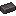
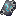
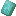
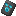
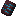
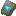

# Броня

### Тримы

Тримы - это кузнечные шаблоны которые можно применить к ванильной (железной и медной) майнкрафтовской броне.
На Стаки СМП мы сделали самописный мод который добавляет бонусы при применении тримов к броне.

Тримы состоят из шаблона и материала.

- Шаблон определяет текстуру (внешний вид) брони
- Материал определяет её цвет

В нашем случае разные комбинации дают разные эффекты/бонусы. То есть, вы их можете комбинировать, таким образом создав
свой уникальный сет брони.

По большей части бонус скейлятся в зависимости от того сколько элементов брони того или иного материала/шаблона надето.
Если бонус указан НЕ эффект, то бонус скейлится за каждую единицу брони если не сказано обратное.

#### Материалы

| Материал                                                                                                                                                                               | Бонус                                                                                                               | Примечание                                         |
|----------------------------------------------------------------------------------------------------------------------------------------------------------------------------------------|---------------------------------------------------------------------------------------------------------------------|----------------------------------------------------|
| {: style="height:24px;width:24px;margin-bottom:5px;vertical-align:middle"} Алмаз                                                 | +1 к защите, +0.5 к твердости брони                                                                                 |                                                    |
| {: style="height:24px;width:24px;margin-bottom:5px;vertical-align:middle"} Андезит (Create)                        | Эффект "Спешка" 1 уровня при 1-2 частях брони, 2 уровень при 3-4 частях брони                                       |                                                    |
| {: style="height:24px;width:24px;margin-bottom:5px;vertical-align:middle"}  Аметист                                | +1 к макс. здоровью                                                                                                 |                                                    |
| {: style="height:24px;width:24px;margin-bottom:5px;vertical-align:middle"} Железный слиток                                 | + к урону                                                                                                           |                                                    |
| {: style="height:24px;width:24px;margin-bottom:5px;vertical-align:middle"} Золотой слиток                                  | + 1 блок к максимальной досягамости блоков                                                                          | Может описано неясно, короче рукой достаёшь дальше |
| {: style="height:24px;width:24px;margin-bottom:5px;vertical-align:middle"} Изумруд                                               | + 0.5 к уровню эффекта "Удача", эффект "Герой деревни"                                                              |                                                    |
| {: style="height:24px;width:24px;margin-bottom:5px;vertical-align:middle"} Кварц                                                   | +1.5 блока к максимальной высоте падения без урона + двойной прыжок при 4-х частях брони                            |                                                    |
| {: style="height:24px;width:24px;margin-bottom:5px;vertical-align:middle"} Лазурит                                     | Эффект "Прыгучесть" 1 уровня при 1-2 частях брони 2 уровень при 3+ частях брони                                 |                                                    |
| {: style="height:24px;width:24px;margin-bottom:5px;vertical-align:middle"} Латунь (Create)                               | + защита от оглушения (Epic Fight)                                                                                  |                                                    |
| {: style="height:24px;width:24px;margin-bottom:5px;vertical-align:middle"} Медный слиток                               | + к максимальной стамине и + к регенерации стамине (Epic Fight)                                                     |                                                    |
| {: style="height:24px;width:24px;margin-bottom:5px;vertical-align:middle"} Незеритовый слиток                    | Эффект "Сопротивление огню", +20% к скорости плавания в лаве, Эффект "Лавовое видение" при 4-х частях брони |                                                    |
| {: style="height:24px;width:24px;margin-bottom:5px;vertical-align:middle"} Осколок опыта (Create)            | +10% к получаемому опыту                                                                                            |                                                    |
| {: style="height:24px;width:24px;margin-bottom:5px;vertical-align:middle"} Полированный кварц (Create) | + к скорости атаки                                                                                                  |                                                    |
| {: style="height:24px;width:24px;margin-bottom:5px;vertical-align:middle"} Редстоун                                            | + к скорости передвижения                                                                                           |                                                    |
| {: style="height:24px;width:24px;margin-bottom:5px;vertical-align:middle"} Цинк (Create)                                   | + к отдаче при атаке                                                                                                |                                                    |

#### Шаблоны

| Шаблон                                                                                                                                                                                                               | Бонус                                                                                       | Примечание                             |
|----------------------------------------------------------------------------------------------------------------------------------------------------------------------------------------------------------------------|---------------------------------------------------------------------------------------------|----------------------------------------|
| {: style="height:24px;width:24px;margin-bottom:5px;vertical-align:middle"} Берег / Coast                 | + к скорости плавания, эффект дельфинарий, подводное дыхание при 3+ частях брони            |                                        |
| {: style="height:24px;width:24px;margin-bottom:5px;vertical-align:middle"} Прилив / Tide                   | + к скорости плавания, эффект дельфинарий, подводное дыхание при 3+ частях брони            |                                        |
| {: style="height:24px;width:24px;margin-bottom:5px;vertical-align:middle"} Дюна / Dune                     | Эффект "Скорость" _I уровень за 1-2 части брони_ _II уровень за 3-4 части брони_    |                                        |
| {: style="height:24px;width:24px;margin-bottom:5px;vertical-align:middle"} Страж / Sentry              | Эффект "Сопротивление" _I уровень за 1-3 части брони_ _II уровень за 4 части брони_ |                                        |
| {: style="height:24px;width:24px;margin-bottom:5px;vertical-align:middle"} Тишина / Silence          | -30% к радиусу обнаружения мобами                                                           |                                        |
| {: style="height:24px;width:24px;margin-bottom:5px;vertical-align:middle"} Рыло / Snout                  | +1 блок к максимальной досягаемости блоков                                                  | Такой же бонус как и у золотого слитка |
| {: style="height:24px;width:24px;margin-bottom:5px;vertical-align:middle"} Хранитель / Ward                | Эффект ночное видение I уровень за 1 часть брони                                        |                                        |
| {: style="height:24px;width:24px;margin-bottom:5px;vertical-align:middle"} Ребро / Rib                       | +20% к скорости копания киркой {: rowspan=2}                                                |                                        |
| {: style="height:24px;width:24px;margin-bottom:5px;vertical-align:middle"} Вредина / Vex                     | +20% к скорости копания киркой                                                              |                                        |
| {: style="height:24px;width:24px;margin-bottom:5px;vertical-align:middle"} Дебри / Wild                    | +20% к скорости рубки топором                                                               |                                        |
| {: style="height:24px;width:24px;margin-bottom:5px;vertical-align:middle"} Вождь / Host                    | +20% к скорости копания лопатой {: rowspan=4}                                               |                                        |
| {: style="height:24px;width:24px;margin-bottom:5px;vertical-align:middle"} Собиратель / Raiser         | +20% к скорости копания лопатой                                                             |                                        |
| {: style="height:24px;width:24px;margin-bottom:5px;vertical-align:middle"} Искатель / Wayfinder  | +20% к скорости копания лопатой                                                             |                                        |
| {: style="height:24px;width:24px;margin-bottom:5px;vertical-align:middle"} Скульптор / Shaper          | +20% к скорости копания лопатой                                                             |                                        |