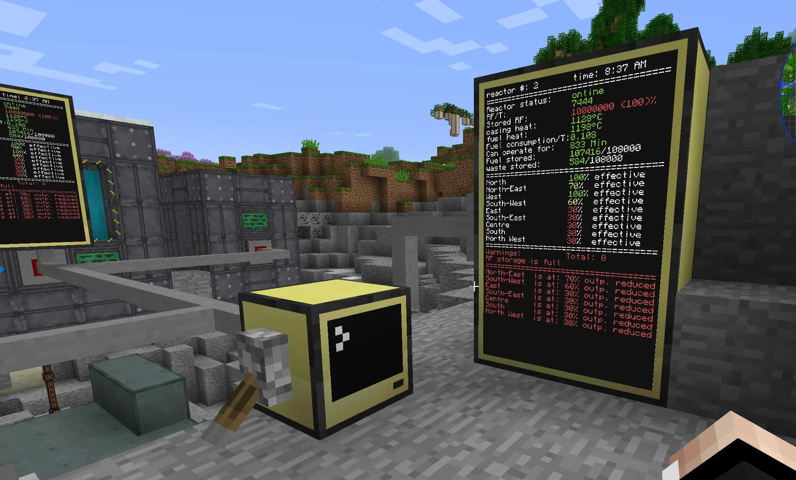

# ComputerCraft (CC:Tweaked)

Компьютеры, черепахи и немного магии Lua. Пишешь скрипты, автоматизируешь всё подряд, рисуешь панели на мониторах и управляешь фермами, шахтами и базой без лишних движений.

## Что добавляет мод

В первую очередь, полноценные компьютеры которые могут выполнять программы. То есть в теории даже биткоины можно майнить на них.

По мелочи: 

- **Черепахи**: мобильные роботы с инструментами — копают, строят, фермерят.
- **Периферия**: мониторы, модемы (проводные/беспроводные), дисководы, принтеры, динамики, датчики красного камня.
- **Сеть**: проводная шина и радиосеть для общения устройств между собой.

Насчет гайдов смотри в интернете, их много. Я добавил этот мод чтобы просто рандомно генерировать числа для казино.
Но может ещё для чего сгодится

!!! warning "Важная хуйня!"
    
    Если я увижу что кто-то сделал комп специально чтобы грузить сервак я его снесу нахуй

