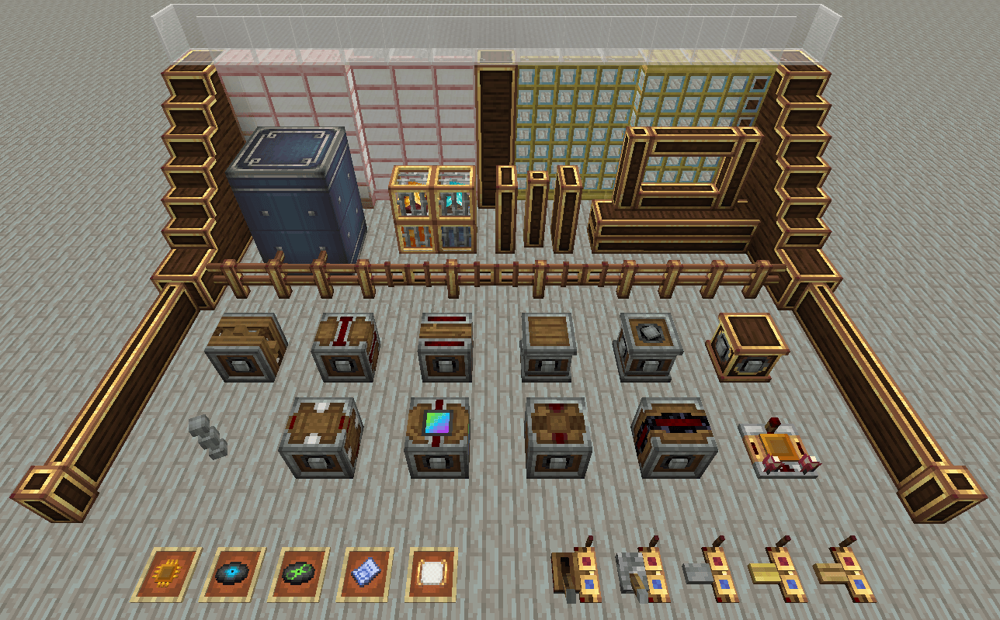

# Create: Connected

Маленький умный аддон: добавляет блоки и удобства которых не хватало в базовом Create.

### Главные фишки

- Kinetic Bridge - мостит стресс-ёмкость между двумя независимыми сетьми. Получатель получает мощность, а источник не страдает, если на том конце всё перегрузят.
- Kinetic Battery - аккум кинетической энергии. Заряжаешь, забираешь в предметном виде и везёшь куда надо.
- Cross Connector - передаёт вращение независимо в двух направлениях. Удобно для развязок без цирка с шестернями.
- Redstone Link Wildcard - вайлдкард для частоты беспроводного редстоуна. Матчит любой предмет в слоте. Полезно для универсальных каналов если ты слишком продвинутый чел.
- Fan Catalysts - компактный варик для обработки ресов вентилятором
