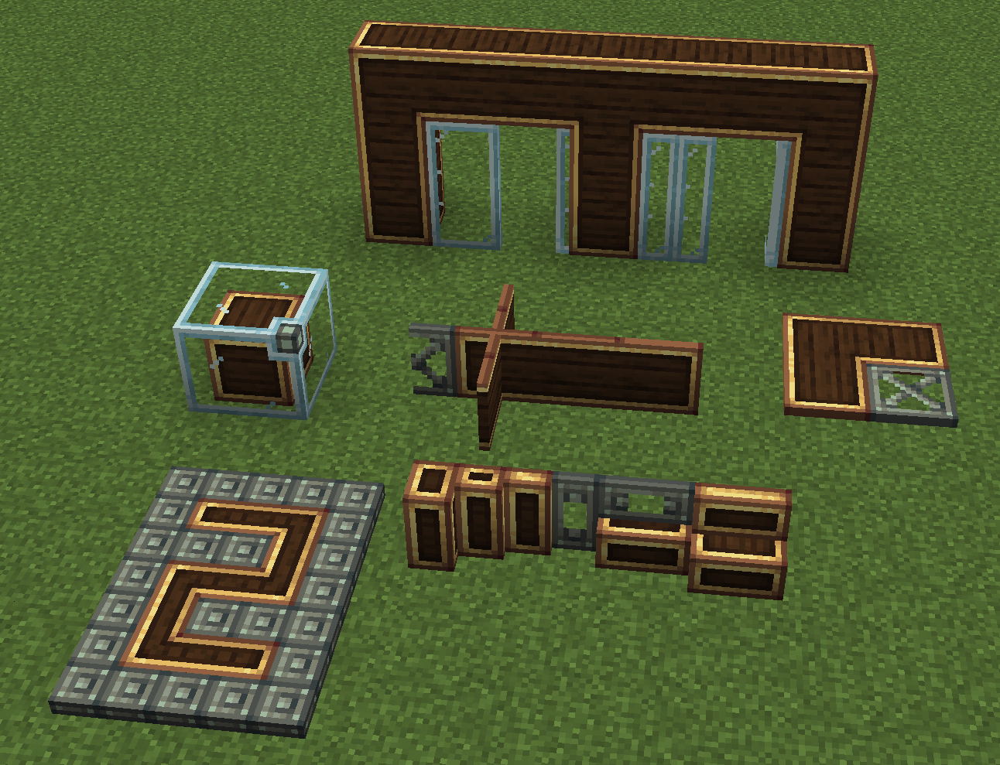
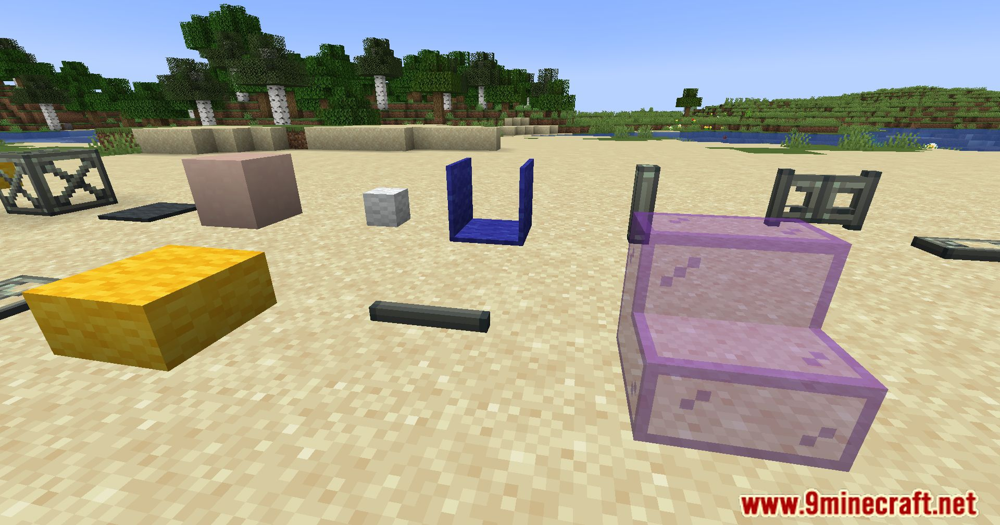

# {: style="height:40px;width:40px;margin-bottom:5px;vertical-align:middle"} Create: Copycats+

Это аддон к Create, который даёт тебе копикэт-блоки. Это особые заготовки, которые могут принимать облик практически любого блока.
Ты можешь слепить кирпич в виде вертикального полублока, или железо в виде трубы или сделать шестеренку из соломы.

## В чём фишка

По сути, Create в базовой версии уже добавляет парочку копикэтсов. Но этот аддон добавляет кучу форм такие как
вертикальные полублоки, лестницы, панели, заборы, кнопки, таблички и даже странные угловые куски, 
а так же самое прикольное - функциональные блоки из самого Create, т.е. шестеренки, валы и трубы.

По сути — это как 3D-принтер в рамках Create: у тебя есть форма, и ты выбираешь, как она будет выглядеть.

## Где может пригодиться?

Да на самом деле везде. Я его использовал на прошлой сборке для строительства лифтов. Оно позволяло делать тонкие стены 
буквально любой текстуры: железа, золота, кейсингов да вообще любых нахуй! Очень мощный аддон, советую пользоваться

Вот тут чётко видно: полублок шерсти или ступеньки из стекла лол

