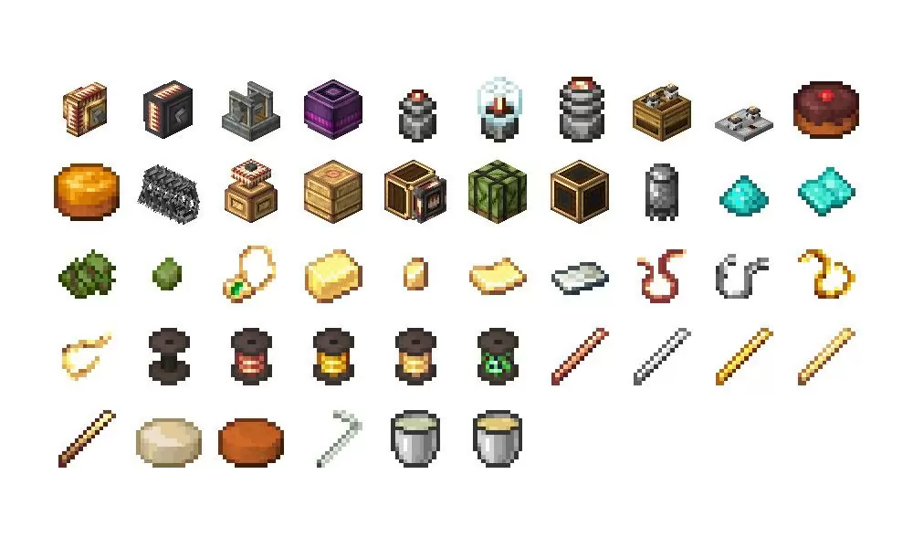

# Create: Crafts And Additions

**Это мод-аддон к Create, который добавляет электричество, батарейки и электроприблуды,** но всё в стилистике Create - никаких проводов из индастриал крафта и 500 видов микросхем. 
Тут ток идёт по кабелям, генераторы крутятся от Create-механизмов, а выглядит всё как из стимпанка.

### Что он добавляет

- Батареи — хранят энергию, можно заряжать и тратить, как хочешь.
- Электродвигатели — конвертируют электричество в кинетическую (вращающую) энергию из Create.
- Генераторы — превращают вращение Create в электричество.
- Провода.
- Какие-то мелкие утилити-приколы типо колючей проволоки.

_Перегон вращательной энергии туда и обратно сжирает 25%._

### Как это работает
**Знать не обязательно, но:**

В Create всё крутится через SU и RPM как уже было сказано. В этом аддоне они конвертируются в FE (Forge Energy, она же стандартная энергия для всех модов).

А знать это не обязательно потому что у нас нет модов которые такую энергию потребляют. **Так что по сути нам нужен этот аддон только для передачи энергии на большие расстояния с помощью проводов** (а так же её накопления с помощью батарей). 