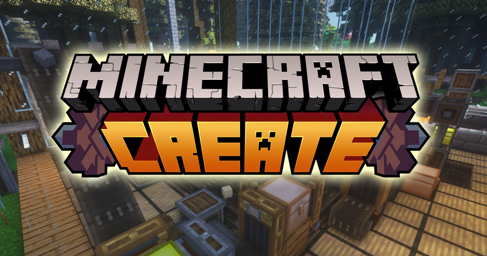
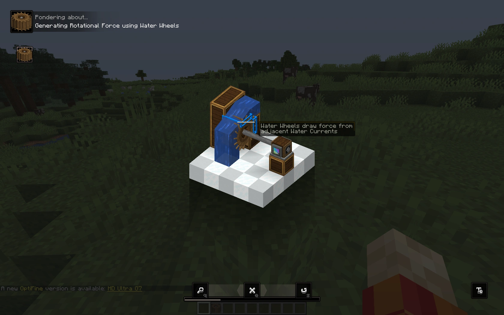

# {: style="height:40px;width:40px;margin-bottom:5px;vertical-align:middle"} Create
Это один из самых мощных модов для майнкрафта, если тебе нравится не просто копать ямки и строить коробки, а делать механизмы, которые реально что-то делают.

Create - это про шестерёнки, ремни, паровые двигатели, автоматизацию и красивые движущиеся штуки. Можно сделать мельницу, завод по переработке ресурсов или вообще гигантский поезд. И всё это в рамках выживания, хоть и имбалансно немного.

## Что можно делать

- Передвигать блоки. Не руками, а машинами. Поршни ванильные нервно курят
- Автоматизировать добычу и переработку - дробилки, сортировки, автокрафты
- Строить транспорт - конвейеры, лифты, поезда 
- Декор - шестерёнки, валы и трубы выглядят так, что даже если они ничего не делают, уже стим панк ёбнутый.

## Чем отличается от других техно-модов

Здесь нет электричества, цифр и 100500 видов проводов, как в индастриал крафте или immersive engineering. 
Всё физическое и видно глазами - шестерёнка реально крутится, ремень реально тянет, а вода реально течёт по трубе.

Ты понимаешь, что происходит. Не надо читать вики на 20 страниц, чтобы понять, как передать вращение от точки А в точку Б.

## Основы
### Кинетическая энергия

**В Create всё строится на вращении.** Тебе нужен источник движения - любой: водяное колесо, ветряк, паровой двигатель. Неважно, что именно - главное, чтобы крутилось. 
**Для старта рекомендую водяные колёса.** Ветряки дерьмо, но красивые.

Дальше важно понимать два параметра:

- **SU (Stress Units, единицы нагрузки)** - сколько "силы" твой источник может выдать. Если подключишь слишком много механизмов - они просто встанут.
- **RPM (Revolutions Per Minute, обороты в минуту)** - насколько быстро всё вращается. От RPM зависит скорость работы механизмов: выше - быстрее, но и нагрузка на SU больше.

#### Пример

У тебя водяное колесо на 256 SU и 16 RPM. Оно спокойно тянет какой-нибудь механический пресс который потребляет 64 SU при таких оборотах.

- Можешь ускорить пресс до 64 RPM - нагрузка увеличится в 4 раза, то есть до 256 SU. При этом и пресс будет хуярить в 4 раза быстрее.
- Или, можешь добавить 3 пресса дополнительно (у тебя 256 SU колесо вырабатывает, 64 потребляет пресс значит 192 осталось). Но скорость их будет медленная тип. ну ты понял.

Формула тупая: больше SU = больше механизмов, больше RPM = быстрее работа. Баланс подбираешь сам. Там как-то можно умножать но я хуй знает погугли если надо, настоящая формула расчёта посложнее будет

### Передача вращения

**Вращение бывает по часовой и против часовой стрелки.** Это нужно понимать при дизайне штук.

Менять направление можно с помощью различных утилити-штук. По ходу дела разберешься.

### Механизмы

- Шестерни - меняют направление, иногда скорость.
- Валы - просто соединяют две точки.
- Ремни - передают вращение между блоками на расстоянии.

## Что дальше?

Открой JEI, введи `@create` в поиске и ты увидишь что при наведении на практически любой блок он предлагает нажать и держать `W` (или `Ц` на русской раскладке).

Это так называемые пондеры (или по-русски - "размышления", тупой перевод). Короче говоря это по сути интерактивный гайд по тому или иному блоку. Ахуенно.

## Аддоны (дополнения)

- **Create Crafts & Additions** - добавляет электричество
- **Create Ore Excavation** - добавляет бесконечные рудные жилы
- **Create: Connected** - добавляет различные утилити-приборы
- **Create: Copycats+** - добавляет новые формы строительных блоков