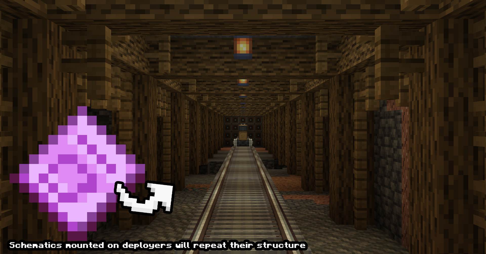
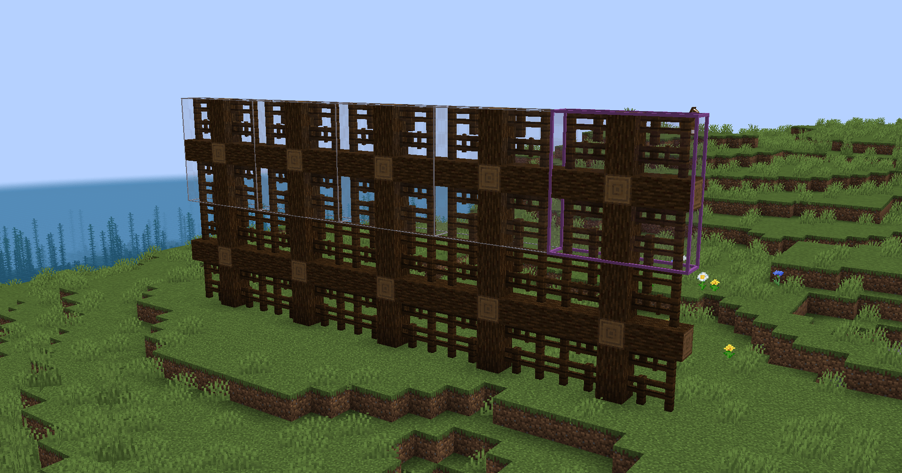

# Create: Pattern Schematic

Это аддон который добавляет одну маленькую фичу: паттерновые чертежи.

В ванильном Create у тебя есть возможность записать постройку на чертеж и с помощью механизмов установить её.
Но что если у тебя повторяющаяся постройка? Например, туннель для поездов в котором каждые 7 блоков стоит лампочка.

Как раз таки для этих целей сделаны паттерновые или повторяющиеся чертежи. Штука очень ситуативная, может будет и полезная кому-то.

Как работать с ней смотрите в интернете, я не пользовался ни разу, поставил на всякий случай.

