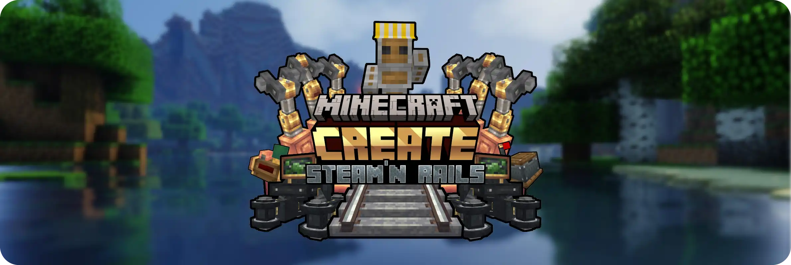

# Steam ‘n’ Rails

Это аддон к Create, который углубляет железнодорожную систему и стим-тематику. База с поездами и путями уже есть в ванильном Create, но S’n’R добавляет новые типы путей, семафоры/сигналы, элементы сцепки и декора, чтобы железка выглядела и работала богаче.

## Что добавляет

- **Новые типы рельс (≈8 вариантов)** — совместимы с ванильными путями Create. Есть стилизованные породы дерева (в т.ч. тёмный дуб), «золотые», незеровые, а также **монорельс** (кастомный вариант пути). Можно **ПКМ по рельсе положить любую полублок-плиту**, чтобы получить плавный градюейшн высоты хуй знает как объяснить, работает и на уклонах/поворотах.
- **Семафоры/сигналы** — визуальные сигнальные системы для управления движением и атмосферы.
- **Сцепки и буферы** — детали для стыковки/расстыковки составов (couplers, buffers, цепи).
- **Проводник (Conductor) как моб** — тематический функциональный NPC под железнодорожный антураж.
- **Глубже интеграция пара** — элементы парового стиля и дополнительные блоки для рельсовой инфраструктуры (эстетика + логистика).