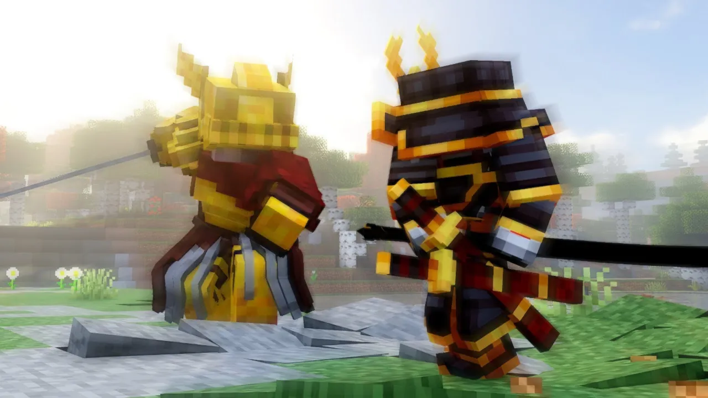
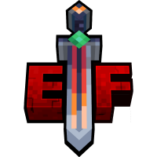

# {: style="height:80px;width:80px;margin-bottom:5px;vertical-align:middle"} Epic Fight

Epic Fight — это мод, который полностью меняет бой в майне: новые анимации, взаимодействия, стойки, атаки и стамины.
Всё выглядит как полноценная экшен-боевая система с кастомными мувсетами под каждое оружие.

### Что меняется?

- Новая анимация для всего - атаки, уклонения, прыжки, питьё, приём еды - очень динамично и живо
- Боевые механики: базовая атака, атака в спринте (dash attack), уклонение (dodge), специальная атака при заполнении шкалы.
- Новые статы оружия/доспехов: вес, урон, stun-иммунитет, количество целей за взмах и т.п.
- Навыки: есть доджи, парирования, пассивные навыки. Их нужно изучать из книжек выпадающих с мобов.

### Нахуй надо?

Вместо тупого затыкивания получаешь полноценный бой с ритмом, стаминой, временем атаки. Полные соулс-лайк бои.

Фокус был сделан на полное преображение PvP - возможность парировать, уклоняться, грузить комбо и грамотно бить по врагу.

### Как начать

Теперь у тебя есть два режима: копания и боевой. По умолчанию мод стартует в режиме копания. 
Режим автоматически переключается на боевой, когда берешь в руки оружие.

**Чтобы включить боевой режим - нажми Ctrl + R.** Так же можно и включить обратно.
Сборка будет сконфигурирована таким образом, что если ты берешь в руки какое-либо оружие, то режим автоматически переключается на боевой.

В боевом режиме работают все новые анимации, спецатаки, уклонения и системы стамины.