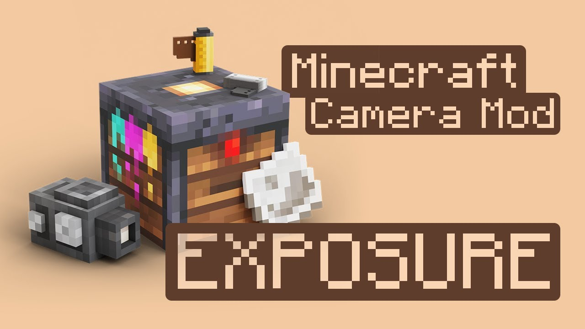
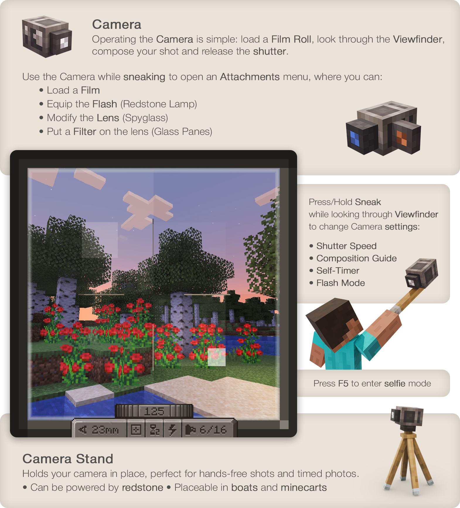
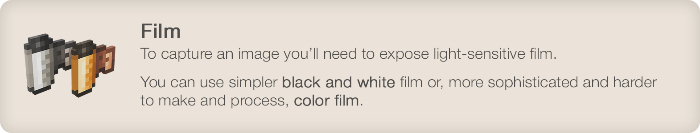
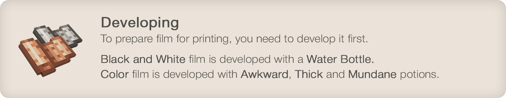
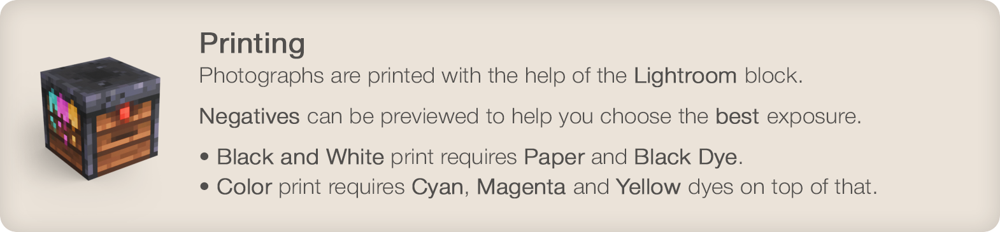
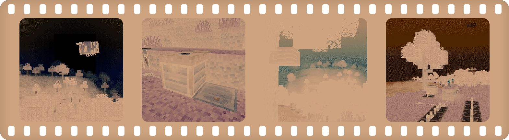
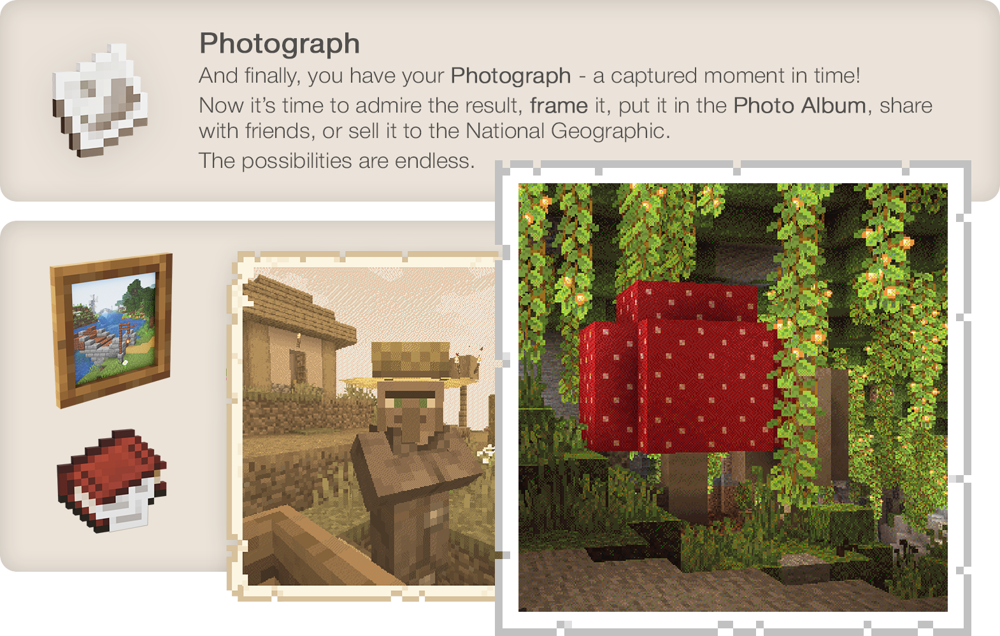

# Exposure

Как по мне, один из самых качественных и атмосферных модов. Добавляет пленочный фотоаппарат.

Можно фоткать природу, кентов, да вообще все подряд.

Мне немного лень объяснять досконально этот мод. Короче говоря ты не можешь просто скрафтить камеру и начать фоткать.
Тебе надо:

- Да, скрафтить камеру. Но вдобавок, ещё и плёнку. Я хз как там она крафтится, не смотрел рецепт.
Пленка бывает черно-белая и цветная.
- Затем, вставляешь пленку в камеру. Там немного уебищное управление, нужно как-то нажимать ПКМ короче хуй знает.
Так же в камеру можно вставить фильтр из цветного стекла, а ещё вспышку (редстоун лампочку) и модифицированную линзу (подзорную трубу). Пиздато.
- Выставляешь настройки камеры. Можно например ебануть скорость затвора (не помню как правильно по русски. типо выдержка кадра)
- Фоткаешь

- После этого на пленку записывается до 16 (по-моему) кадров. После этого тебе надо **проявить** плёнку.
Сразу скажу у проявки немного ебанутый крафт. Для черно-белых фоток достаточно бутылочки воды.
Но вот для цветной плёнки тебе понадобится три "пустых" зелья: "мутное", "заурядное", и "густое". Их достаточно легко скрафтить если есть ресы.

- И вот после проявки, тебе нужен блок называется Lightroom хз как по русски. Фотостанция. Не ебу. Ищите в JEI по `@exposure`.
- В него вставляешь проявленную плёнку и красители. Для черно белой нужен только черный краситель. А вот для цветной опять надо заебаться:
нужны бирюзовый, пурпурный, желтый и тоже черный (палитра CMYK, если кто шарит).

- Выбираешь кадр (он будет в инвертированных цветах, это не баг)

- И вот теперь можно нажимать кнопку печать и получить свою фотку.

Фотографии можно добавить в альбом или поставить в рамку.

