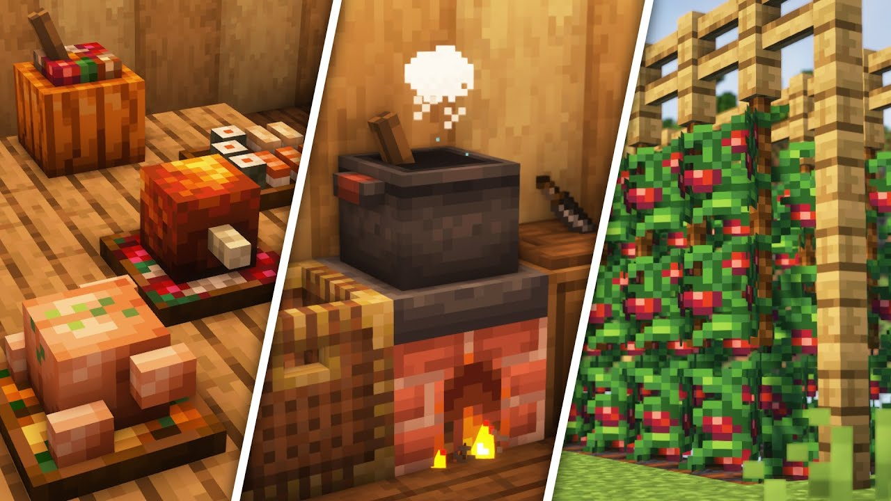

# Farmer's Delight

Этот мод расширяет ванильное фермерство и готовку: новые рецепты, инструменты, блюда и декоративные штуки 
- всё так, чтобы ты мог заниматься хуйней на кухне как настоящая женщина. Посуду мыть не надо.

## Что добавляет мод

- Блюда и рецепты: супы, салаты, десерты, фрукты — всего подряд по чуть чуть.
- Утилиты для готовки и фермы: котелки, сковородку, печку, доску для резки, ножи и прочее.
- Улучшения земли: мод вводит блоки и механики, которые улучшают плодородность почвы и рост культур.
- Декоративные и полезные блоки: корзины, мебель

## Наши особенности
### Блюда как блоки

Очень классная фича: многие блюда, созданные на тарелках, можно поставить в мир как физический блок - просто зажав **Shift** при установке.
Это даёт тебе возможность красиво разложить еду на столах, полках и придавать атмосферу дому или таверне.

### Аддоны на еду

- Delightful - мод-аддон, который добавляет мелкие шняги в Farmer's Delight.
- Corn’s Delight - один из аддонов, расширяющий ассортимент блюд с кукурузой дофига попкорна и начоса.

### Автоматизация с Create & аддонами

Ты можешь практически автоматизировать кухню:

- Create Slice & Dice — один из популярных аддонов. Он превращает все рецепты резки из Farmer’s Delight в автоматические. 
То есть машина делает то, что ты делал вручную на доске.
- Create: Central Kitchen также добавляет автоматические рецепты для Cooking Pot через механизмы Create (Heated Mixing).

С помощью этих аддонов ты можешь построить завод по производству еды: от урожая до готового блюда — без рук.

## Как начать с Farmer’s Delight

Начни с базовых ингредиентов: собирай семена из травы и диких культур в разных биомах, собирай мясо с животных, разводи их.

Скрафти инструменты: нож, каструля сковородка печка

Если хочешь автоматизировать — добавь Slice & Dice / Central Kitchen и соедини с Create-механизмами.