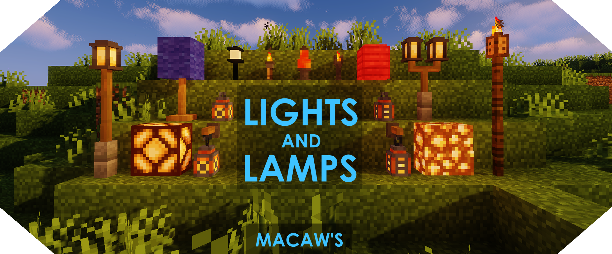

# Декорации

В этом разделе я объединил моды которые у нас стоят на разные блоки, мебель и в целом декорации.

## Handcrafted

Мод который добавляет разную функциональную мебель: стулья, полочки, диванчики, скамейки.
Из прикольного: позволяет модифицировать мебель. Например, положить подушку из какой-нибудь цветной шерсти на стул, скамейку.
Или вырезать дополнительные полки в кухонном шкафу.

Мод для тру-девочек которые хотят красивый жилой домик.

## Chipped

Это мод добавляющий КУЧУ вариаций декоративных блоков. Важно подметить, что именно вариаций!
То есть условно в ванильной игре уже есть там глоустоун, камешки, обсидиан, доски.
Так вот Chipped позволяет тебе взять твой обсидиан и получить кучу разных вариаций с узорами.

Их (вариаций) реально дохуя. Ищи в JEI по `@chipped`

Чтобы скрафтить такие блоки, тебе нужны специальные столы. Они разные для каждого вида блока.
Например, для стеклянных блоков тебе надо скрафтить стол стекольщика или хуй знает как его звать по русски.

Конкретно бес на админе часто использовал этот мод чтобы сделать разные вариации лампочек из глоустоуна чтобы заебашить в шахту лифта

!!! bug "Баг"

    Мелкий баг Chipped. Иногда рецепты не отображаются в JEI для некоторых видов блоков. Загугли онлайн или попробуй в одиночке/тестовом сервере.

## Macaw's

В целом, Macaw - это автор кучи разных модов на декоративные (и функциональные блоки).

Конкретно, у нас установлено:

### Macaw's Bridges

Один из самых популярных его модов. Добавляет мосты. Можно навесить на них факелы и делать разной высоты ширины.

### Macaw's Roofs / Doors / Trapdoors / Windows / Fences / Walls

Как понятно из названия добавляет разного рода крыши, двери, люки, окна, заборы, стены.

Заборы и стены кстати можно ставить по диагонали (не только Macaw's но и вообще все).

### Macaw's Paths and Pavings

Мод добавляющий тропинки, плитки и штуки для топания. **У нас на сборке есть фича**:
скорость передвижения на таких тропинках (и некоторых других блоках) увеличена на 35% что добавляет функциональности

### Macaw's Lights and Lamps / Paintings 

Эти два добавляют различные люстры лампочки и картины. Ничего особенного, просто красиво.

