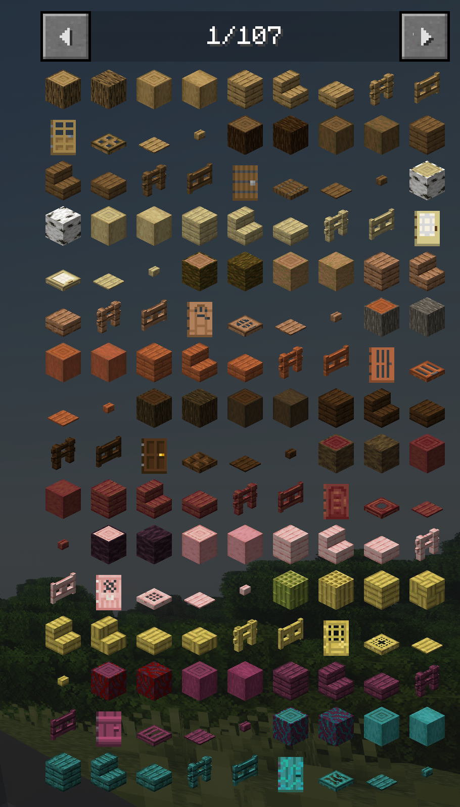

# Just Enough Items

Это самый популярный и используемый мод во всех сборках по майнкрафту.
Он добавляет панельку справа, которая отображает вообще все предметы и блоки доступные в игре.
В особенности, это помогает посмотреть:

- Рецепт предмета, как он делается, какие варианты есть. Для этого просто нажми ЛКМ по предмету, или наведись и нажми `R`.
- Использования предмета в других рецептах. Для этого нажми ПКМ по предмету или наведись и нажми `U`.
- Какие предметы есть в моде. 
  Для того чтобы искать предметы по конкретному моду, в строке поиска (снизу) вставь в начало `@` и введи название мода.
  Например, введя `@create` тебе покажет все блоки и предметы из [Create](create/index.md) и всех его аддонов, в названии которых есть слово `create`.

Разумеется искать можно не только по модам, а ещё и просто по названию предмета. Учти, что не все моды переведены 
на русскую православную летопись, поэтому иногда пытайся гуглить на буржуйском английском.