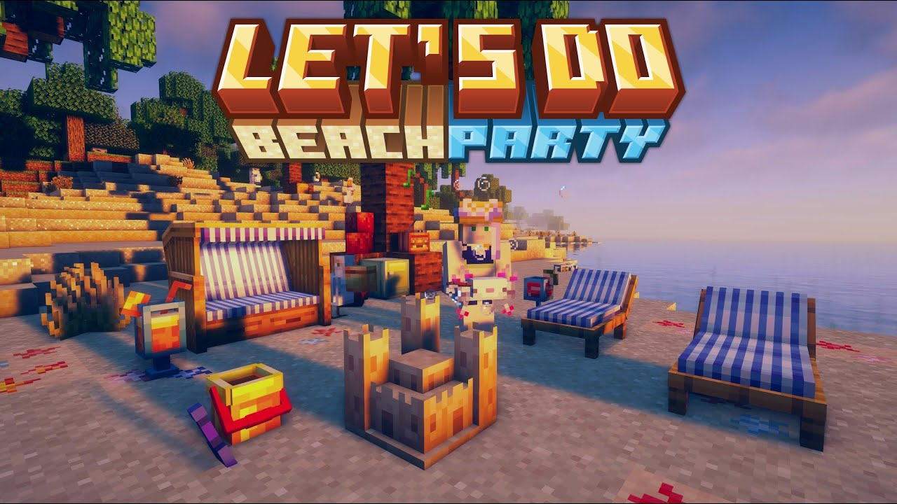

# Let's Do: Beachparty

Мод про пляжный вайб: пальмы, кокосы, коктейли, шезлонги и радио. Делаешь свой курорт, жаришься на солнце и эстетично бездельничаешь.

## Что добавляет мод

- **Пальмы и кокосы**: экзотика на побережье и полезные ингредиенты.
- **Напитки и десерты**: коктейли, смузи, мороженое — освежают и иногда дают лёгкие эффекты.
- **Радио**: музыка прямо в мире, работает и на сервере.
- **Пляжная мебель**: зонты, шезлонги, барные стойки, костры и прочий декор.
- **Атмосфера**: птицы и мелочи для живых пляжей.

## Как начать

1. **Найди пляж**: забери кокосы, бамбук и прочие ресурсы.
2. **Обустрой базу**: поставь **зонт**, **шезлонги**, **барную стойку**.
3. **Смешай напитки**: используй фрукты/лёд/бутылки — получится коктейль-освежайка.
4. **Включи радио**: поставь колонку и наслаждайся музыкой у воды.

## Механики отдыха (коротко и по делу)

- **Кокосы**: добываются с пальм; из них можно делать напитки.
- **Напитки**: дают лёгкие положительные эффекты — идеально под расслабон.
- **Радио**: крутит треки в мире; громкость и расположение решают комфорт.

## Блоки и утилиты

- **Зонты, шезлонги, гамаки** — для тени и стиля.
- **Барные стойки и ящики/кулеры** — хранить лёд и напитки.
- **Радио/магнитола** — музыкальное сопровождение для вечеринки.

## Жители и торговля

- Специальных торговцев нет — всё крафтится и добывается на месте.

## Полезные советы

- Освещай пляж — утопленники любят тусоваться ночью.
- Радио ставь подальше от кроватей, если не любишь ночные концерты.
- Комбинируй декор с другими модами — получится курорт мечты.
