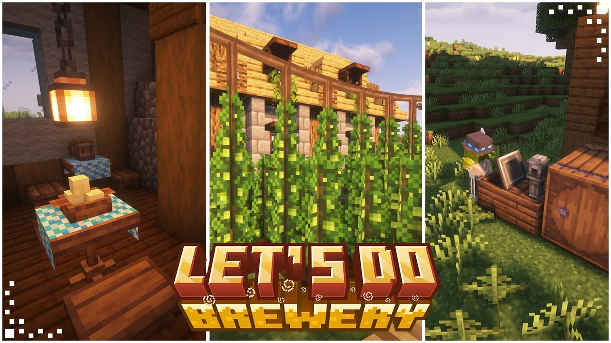

# Let's Do: Brewery

Мод про пиво и крепкие напитки. Выращиваешь зерно и хмель, сушишь урожай, варишь сусло и разливаешь всё по бутылкам и кегам. Атмосфера Октоберфеста прилагается: гирлянды, бочки, стойки и весь этот сельский шик.

## Что добавляет мод

- **Культуры**: ячмень, хмель и кукуруза для рецептов.
- **Производство**: пивоварни (деревянная/медная/незеритовая), брожение, разлив в кеги и бутылки.
- **Обработка**: силосы (деревянный/медный) для сушки зерна и кукурузы.
- **Декор и фестиваль**: лавки, флаги, стойки, тематические костюмы и прочая мишура.

## Как начать

1. **Добыть семена**: ячмень/кукуруза встречаются в деревнях или делаются через камнерез из базовых семян; хмель попадается в холодных биомах и строениях.
2. **Вырастить и высушить**: собери урожай и закинь в **силос** — сушится партиями, размер влияет на скорость.
3. **Сварить**: в **пивоварне** заливаешь воду, добавляешь топливо и ингредиенты, следишь за процессом (мини-игры, тайминги).
4. **Разлить и хранить**: разливай в бутылки или **кеги/бочки** — готово к употреблению и декору.

## Механики напитков (коротко и по делу)

- **Сушка в силосе**: крупный силос быстрее и удобнее для больших партий.
- **Время варки**: примерно 45 секунд на цикл — не отходи далеко.
- **Оборудование**: для виски нужна как минимум **медная** пивоварня.
- **Эффекты**: напитки дают подходящие бафы; качество зависит от рецепта, оборудования и аккуратности.

## Блоки и утилиты

- **Силос** — сушит зерно/кукурузу.
- **Пивоварня** — сердце процесса; несколько уровней качества.
- **Кеги и бочки** — хранение и подача.
- **Верёвки и опоры для хмеля** — чтобы рос вверх, как положено.
- **Краны/стойки** — красиво раздавать напитки и украшать таверну.

## Жители и торговля

- **Фестивальные торговцы и декор** — если устроишь праздник, затарься мишурой.
- **Деревенские** иногда приносят полезные семена — зависит от сборки.

## Полезные советы

- Делай силос крупнее — быстрее сушит и меньше возни.
- Держи рядом воду и топливо, чтобы не бегать в процессе варки.
- Сортируй бутылки и кеги по рецептам — стеллажи спасают от бардака.
