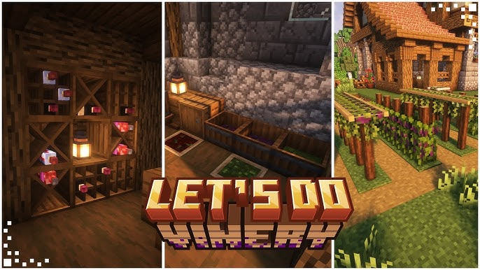

# Let's Do: Vinery

Мод про виноград и вино. Выращиваешь лозу, давишь ягоды ногами, разливаешь сок по бутылкам, выдерживаешь в бочках — и получаешь разные вина с полезными эффектами. Параллельно обставляешь винодельню красивыми стеллажами и делаешь вид, что у тебя тут семейный бизнес.

## Что добавляет мод

- **Виноград и лозы**: несколько сортов винограда с разным характером и встречаемостью в биомах.
- **Производство вина**: лохань для раздавливания, бутылки для сока, бочки для выдержки, добавки (мёд, сладкие ягоды и пр.).
- **Хранение и декор**: винные стеллажи, стойки, ящики, мебель для красивой дегустационной.
- **Жители**: свой винодел в деревне и редкий странствующий винодел, у которого можно купить семена и полезные мелочи.

## Как начать

1. **Добыть виноград**: найди дикие кусты в мире или купи семена у странствующего винодела.
2. **Посадить лозу**: сажай на землю и используй специальные колышки/шпалеры для нормального роста.
3. **Раздавить ягоды**: кидай виноград в лохань и дави — сок собирается пустыми винными бутылками.
4. **Выдержать вино**: переливай сок в бочку, при желании добавляй ингредиенты (например, мёд или сладкие ягоды), жди и получай разные сорта вина.

## Механики вина (коротко и по делу)

- **Созревание**: каждые ~16 игровых дней вино «стареет» на 1 год; каждые 5 лет повышается уровень качества (макс. 5). Созревает даже в инвентаре.
- **Сорта винограда**: встречаются в разных биомах и влияют на итоговые эффекты вина. Условно —
  - лёгкий — более массовый вариант;
  - тяжёлый — холодные биомы (типа тайги);
  - энергичный — саванна и тёплые районы;
  - живучий — тропики/джунгли.
- **Эффекты**: от исцеления и стойкости до бафов на защиту/выживание. Конкретика зависит от сорта и выдержки.

## Блоки и утилиты

- **Лохань** — кидаешь виноград и топчешься, получая сок.
- **Бочки** — здесь вино созревает. Дольше ждёшь — лучше результат.
- **Колышки/шпалеры** — для удобного выращивания лозы.
- **Стеллажи и стойки** — хранение и красота; можно устроить погреб.
- **Бутылки** — тару не забудь, без неё сок не собрать.

## Жители и торговля

- **Винодел-житель** — специализация деревни, торгует по теме.
- **Странствующий винодел** — периодически приходит с ослом и продаёт семена/припасы для старта.

## Полезные советы

- Держи бочки в одном месте - так проще отслеживать сроки выдержки.
- Подписывай партии (стеллажи помогают не превращать склад в бардак).
- Добавки меняют вкус и эффекты — экспериментируй, но помни, что старое вино обычно лучше.
