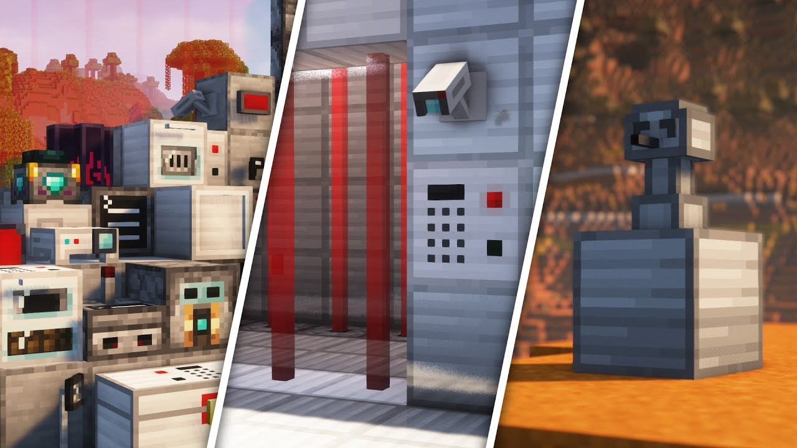

# SecurityCraft

Охрана периметра без костылей: пароли, карточки, камеры, усиленные блоки и ловушки.
Мод изначально предназначен для охраны базы но я его всеравно закинул на сборку.
Добавляет слишком уж много приколов которые можно использовать для различных ивентов.

## Что добавляет мод

- **Контроль доступа**: кейпады, кард-ридеры, сканеры, замки для дверей и контейнеров.
- **Наблюдение и сигнализация**: камеры, мониторы, сирены, лазерные решётки.
- **Ловушки**: мины, датчики, сюрпризы для незваных гостей.
- **Модули**: тонкая настройка поведения (маскировка, красный камень, белые/чёрные списки и т.д.).
- **Детекторы**: можно например чекать есть ли у чела шмотка в инвентаре при проходе через сканер.
