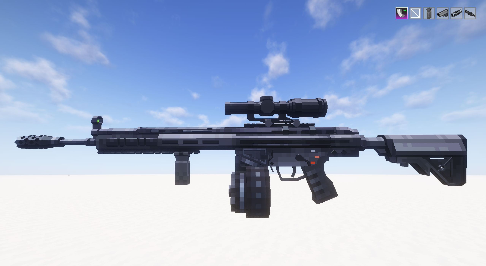

# TaCZ

Мод добавляющий полноценные оружия с обвесами и хуйней. Ищи верстаки для создания оружия в JEI по `@timeless`.

На нашем сервере:

- Создан кастомный крафт патронов с помощью сборки из Create
- Запрещено стрелять вне выделенных для стрельбы зон. Если нужно создать зону - обратись к админу на бесе.
Урон вне зон не будет засчитываться ни по кому кроме мишеням из TaCZ и по тренировочному манекену из Dummmmmyyy (не помню точно как мод называется).
- Имеется баг с Distant Horizons. См. [Баги](../../../start/help/bugs.md).