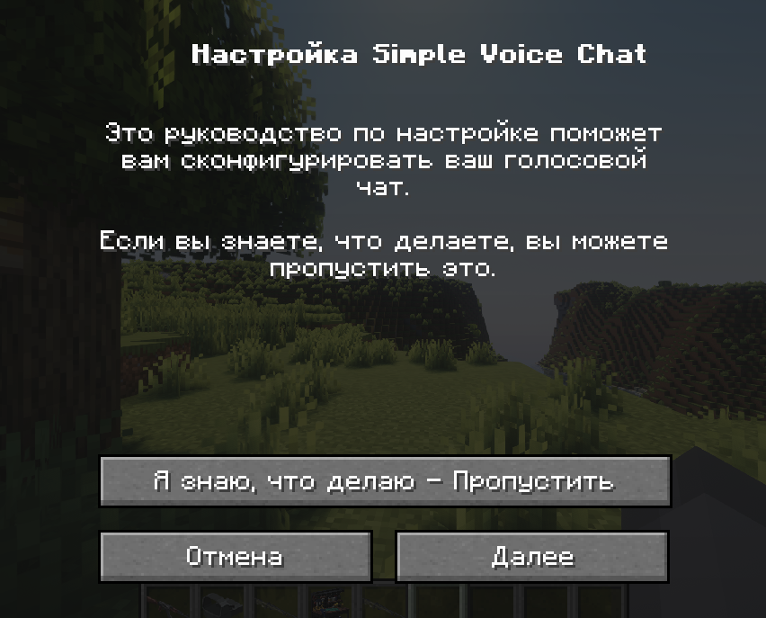
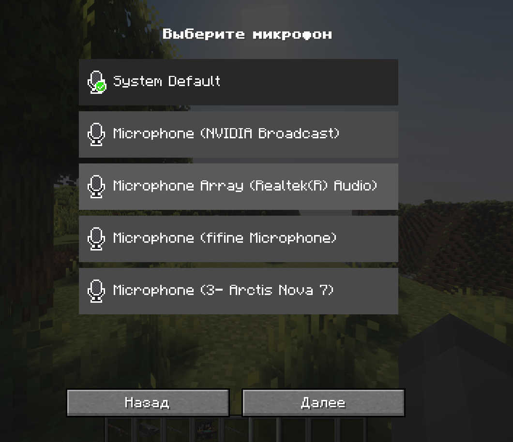
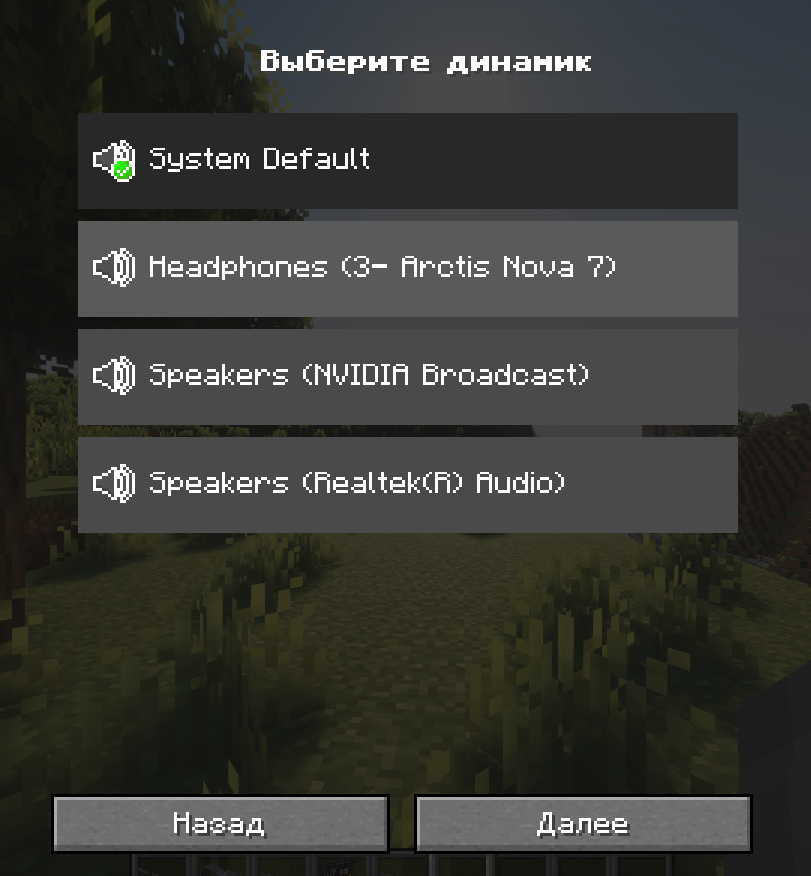
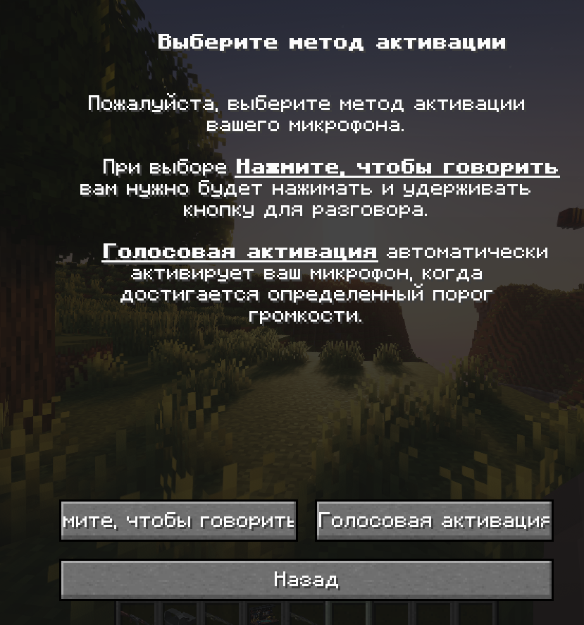
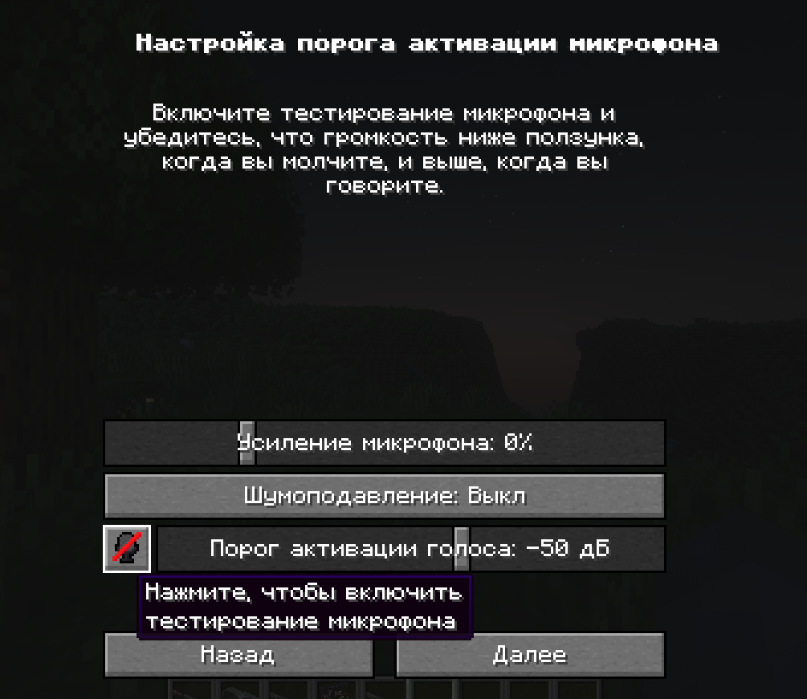
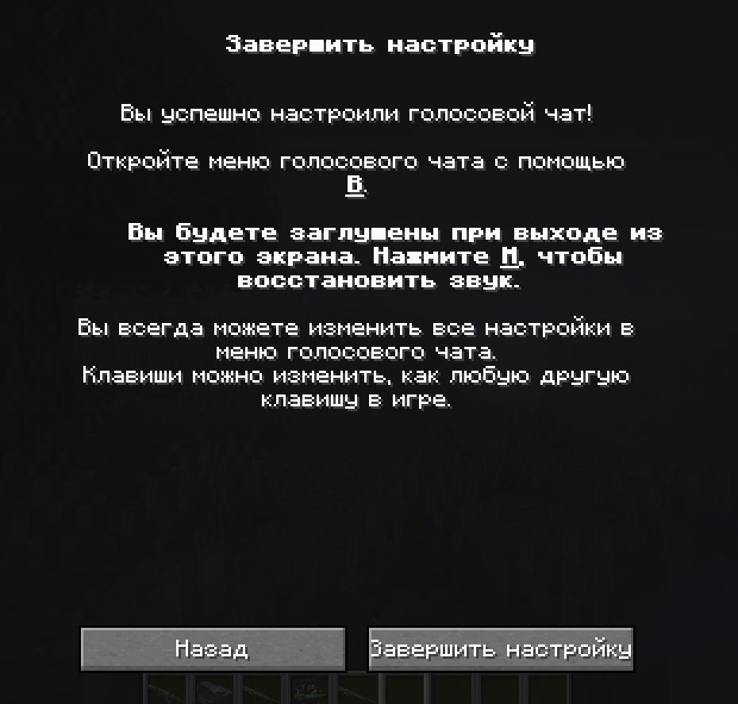
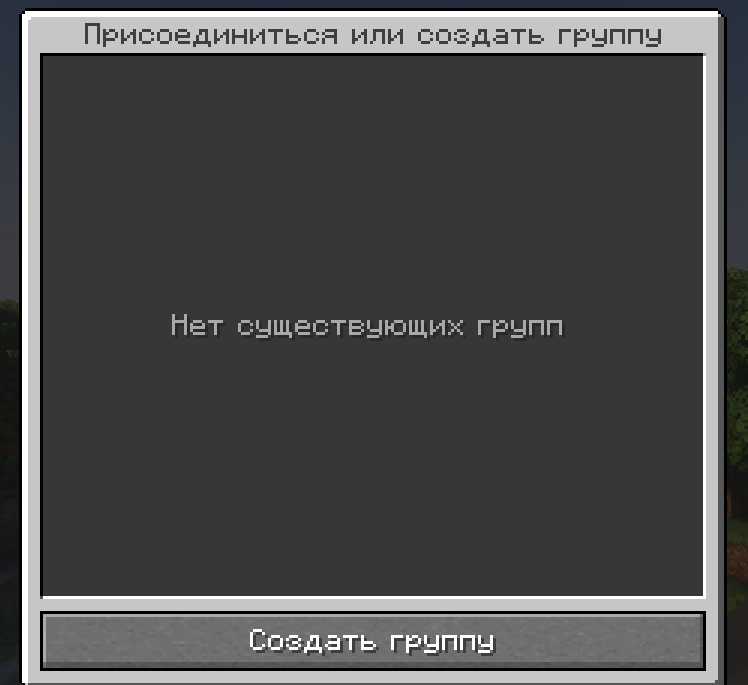
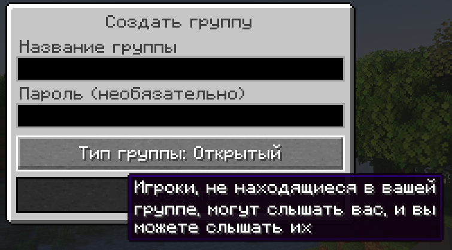

# Simple Voice Chat

На нашей сборке есть голосовой чат который должны использовать все кто играются.

### Настройка

При первом запуске игры, вам в чате выведется сообщение о настройке голосового чата.
Чтобы начать, нажми английскую `B`. Появится меню, жмякай `Далее`.

Шаги в целом достаточно примитивные и понятные. Убедись, что ты выбираешь правильный микрофон и динамик.
`System Default` означает настройку выбранную в параметрах звука Windows. В большинстве случаев, она выбрана правильно,
но я все же рекомендую выбрать микрофон ручками. Динамик лучше оставь `System Default`, чтобы звук не шёл в колонки, 
когда у тебя например подключены наушники. В этой ситуации у тебя останется рабочее авто-переключение.

Насчёт активации, я бы порекомендовал сделать так, как сделали в дискорде.
Если выбрал нажатие на клавишу, убедись чтобы клавиша не конфликтовала с майнкрафтовскими биндами.
Голосовая активация кстати работает очень неплохо.

Если ты выбрал голосовую активацию, то настрой порог активации и громкость микрофона. 
Микрофон может быть реально громкий для других, поэтому обязательно проверь как звучишь, нажав на кнопку снизу.

После настройки вылезет поздравление с днем рождением. Ещё раз:
- `B` = настройки микрофона
- `M` = замутиться

### Группы

Группы это буквально дискорд каналы только в майнкрафте. Ты можешь слышать своих кентов на любом расстоянии.

Группы имеют несколько режимов:

- Обычный: ты слышишь всех вокруг, но тебя слышат только те, кто с тобой в группе.
- Открытый: ты слышишь всех вокруг, и тебя слышат все вокруг, в том числе те кто с тобой в группе.
- Изолированный: ты не слышишь никого, кроме тех кто с тобой в группе.

!!! warning "Убедительная просьба"

    **Пожалуйста, ставьте режим группы в "Открытый", чтобы вас слышали люди вокруг и не думали что вы их игнорите.**
    
    Это реально помогает не убивать атмосферу и не чувствовать что вы изолировались в своих уютных дискорд каналах
    и общаетесь только со своими кентами.

Когда вы находитесь в группе, другие это видят по иконке у вас над головой.