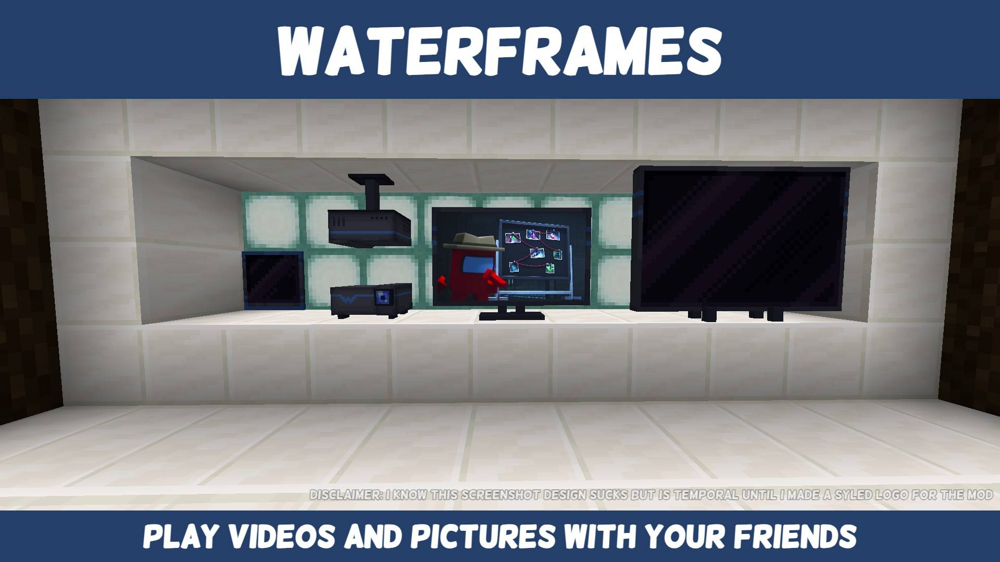

# Waterframes

Это специальный мод который позволяет отображать контент с интернета на рамках.

!!! warning "Важная хуйня"

    **Обрати внимание что ссылка доступная тебе, не всегда может быть доступна другому.**

    Например, если ты вставляешь видос на ютубе в рамку то челы не смогут его видеть потому что у них ютуб забанен навхуй в россии.
    
    Лучше всего заливай фото/видосы на файловый хостинг и вставляй оттуда ссылку доступную всем.

