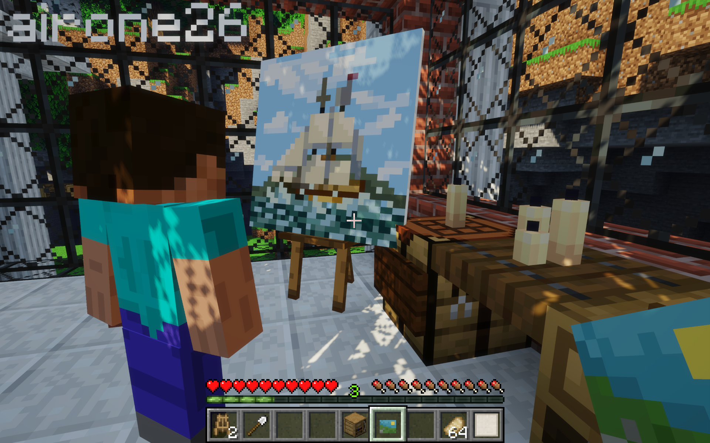
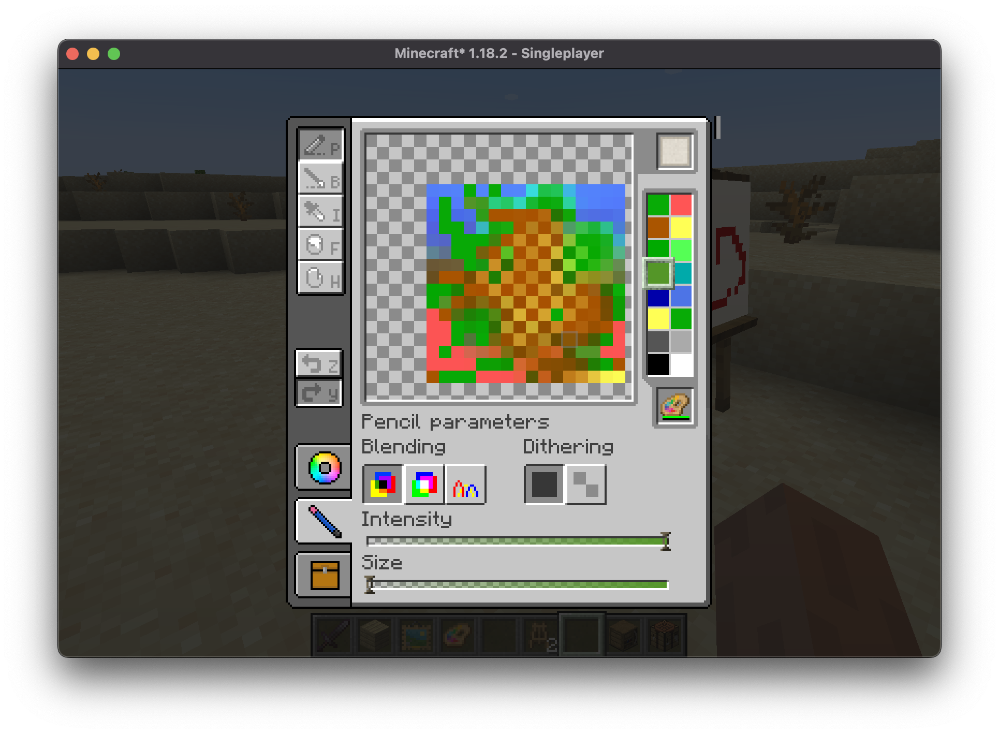

# Zetter

Добавляет полноценную механику рисования картин.

Кратко:

- Крафтишь мольберт
- Туда суёшь краску и бумагу
- Рисуешь
- Подписываешь, ставишь в рамку

Холсты можно совмещать на специальном верстаке чтобы получать большие холсты типо 2 на 3 блока и т.п. Ищи в JEI по `@zetter`

