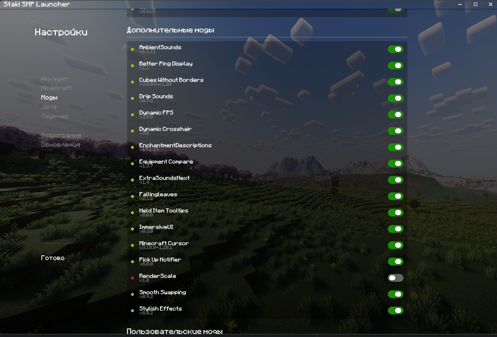

# Необязательные моды

В этом списке перечислены моды которые можно выключить для оптимизации майна или просто потому что тебе чето не нравится.

Для того чтобы просмотреть список необязательных модов, нужно открыть лаунчер, перейти в настройки -> Моды и проскроллить вниз.

Список модов:

- AmbientSounds: добавляет различные фоновые атмосферные звуки, такие как шум ветра, воды, пение птиц и т.п.
- Better Ping Display: показывает пинг в табе в миллисекундах а не просто палочками
- Cubes Without Borders: делает borderless fullscreen (полноэкранный в окне) режим в майнкрафте
- Drip Sounds: добавляет атмосферные звуки капель жидкости
- Dynamic FPS: замедляет майнкрафт если он свернут
- Dynamic Crosshair: динамически адаптирует прицел. Например, если навелся на блок, то показывает можешь ли ты его срубить.
- EnchantmentDescriptions: показывает описания зачарований.
- Equipment Compare: при зажатом шифте сравнивает броню одетую на тебе и ту на которую навелся
- ExtraSoundsNext: добавляет различные мелкие звуки, такие как печать в чате, клики на предметы в инвентаре и другое.
- Fallingleaves: падающие листики с деревьев.
- Held Item Tooltips: когда берешь предмет в руки то показывает его статы по центру экрана.
- ImmersiveUI: добавляет разные мелкие анимашки в инвентаре
- Minecraft Cursor: меняет курсор на майнкрафт-стайл
- Pick Up Notifier: показывает что и в каком количестве попало тебе в инвентарь в правом нижнем углу
- Render Scale: описано в разделе Оптимизация, по умолчанию выключено
- Smooth Swapping: добавляет плавный эффект перетаскивания предметов
- Stylish Effects: добавляет различные частицы и эффекты в мир для атмосферы (есть ещё Subtle Effects но его нельзя выключить)

Отключи моды которые тебе не нужны по какой-то причине и перезапусти майн.

