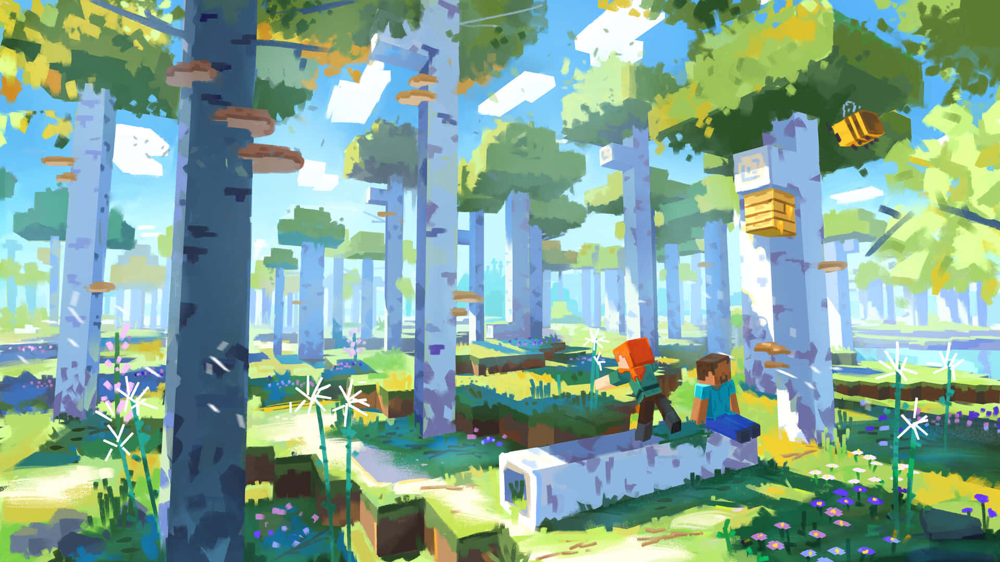
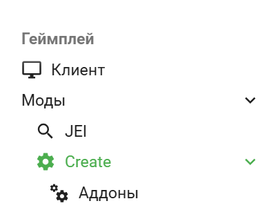

[//]: # (---)

[//]: # (icon: material/minecraft)

[//]: # (---)

# Staki SMP

**Staki SMP** _(a.k.a. стаки, ссаки, серв, сервер, сервак)_ - это приватный сезонный майнкрафт сервер с упором в
коллаборацию, проектность и атмосферу.

**Основная цель проекта - приятно провести время в майнкрафте в течение этой зимы.**

Эта вики является единой базой знаний для сервака. Для тех, кто здесь в первый раз, настоятельно рекомендую прочитать
все страницы из раздела "О сервере" и "Правила" в панельке слева.

---

## Статус

**На данный момент, сервер проводит отбор перед запуском, а так же бета-тестирование.**
Участие полностью бесплатное, доната нет.

Если интересно, [можно подать заявку здесь](https://forms.gle/jvQCTg1WBobfrjMk8).
По любым вопросам пишите в Discord `bbebb`.

## Запуск

Старт сервера запланирован на 1 ноября в 21:00 по МСК на нашем Discord сервере.

Для ребят которые уже попали на сервер: можете переходить к установке игры и тестить у себя на компе до запуска.
Переходите в раздел "_Начать_" сверху.

### Прайм-тайм сервера:

**Целимся на 22:00 - 02:00 по МСК. Основной прайм тайм в субботу. Вторичный - в пятницу и воскресенье.**

## Как читать вики?

Я устроил всё так, что если у ссылки (слева) есть иконка - значит на неё можно кликнуть. Даже у секции.
Например, [Create](game/mods/main/create/index.md).

- База: содержит основную информацию о сервере, о чем он, его правила и чего ожидать.
- Начать: инфа об установке и настройке игры, а так же о багах / лагах которые могут возникнуть.
- Геймплей: более менее детальная инфа о модах и о том что у нас на сборке.
- Полезности: мелкие вещи которые иногда нужны.

