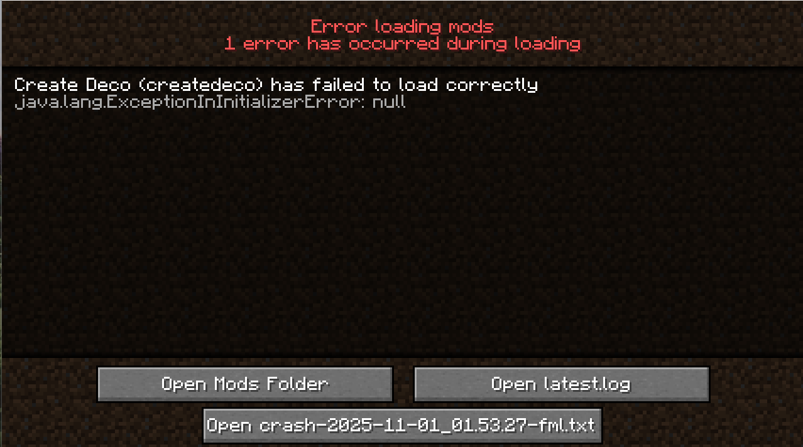
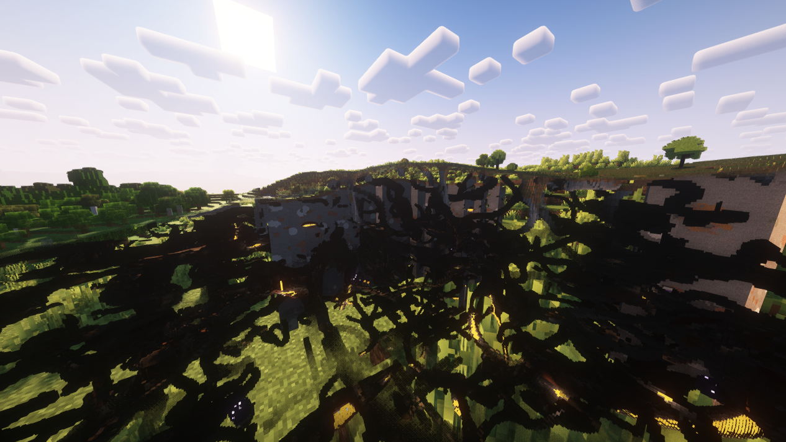
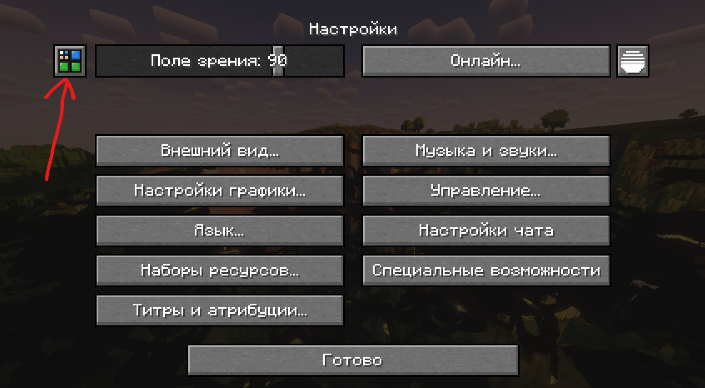
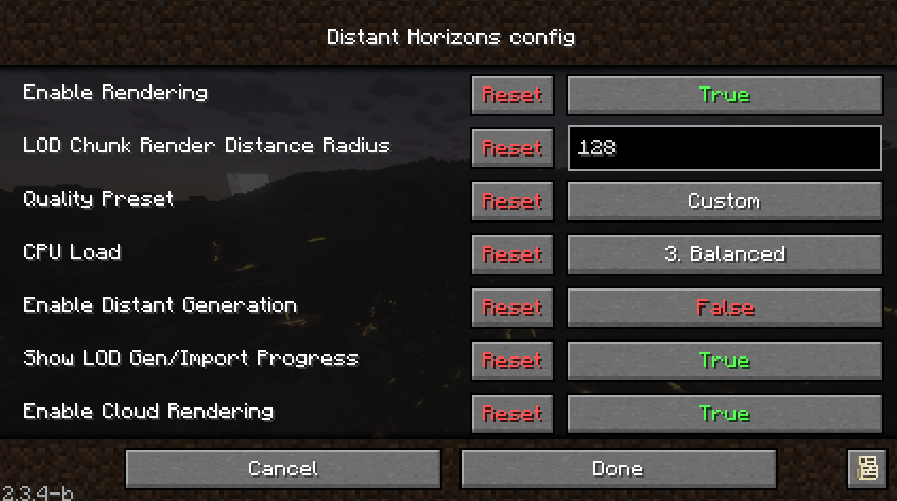

# Известные баги

### Initialization Error

Иногда, в частности после обновления, по какой-то причине может выпасть эта ошибка.

Есть два варианта решения:

1. Перезапустить майнкрафт (может не сработать с первого раза)
2. Переустановить игру (учти что сбросятся настройки)

### Distant Horizons рендерит пещеры

У тебя может случиться что-то такого рода, когда ты или кто-то другой поблизости взял в руки оружие из TaCZ, 
а у тебя включен Distant Horizons + шейдеры. Да, такая вот хуйня.

Есть 3 решения данной проблемы.

1. Переключи в оконный режим и обратно. Проще говоря, дважды нажми F11. По какой-то причине это помогает.
2. Если это не помогло, нажми Shift + F4 - это наш хоткей для перезагрузки шейдеров.
3. Если и это не помогло, перезагрузи Distant Horizons. Для этого, перейди в Esc - Настройки - Маленькая кнопка с 4 квадратиками слева сверху
    - 
    - Затем, кликни переключатель напротив `Enable Rendering` на `False` 
    - Нажми `Done`. Не выходи.
    - Кликни переключатель обратно на `True`.
    - Нажми `Done`. Выходи.

### Сломанные анимации

Из-за того, что Epic Fight полностью меняет модель персонажа и его анимации, некоторые другие моды конфликтуют.

Пока что известно о следующих конфликтах:

- TaCZ: когда держишь в руках оружие, то анимации немного поломанные. Проблема частично пофикшена кастомным набором анимаций.
- Exposure: нет никаких анимаций когда делаешь селфи.

### ПКМ на поездах

Из-за небольшого конфликта между Epic Fight и Create, клик правой кнопкой мыши по поездам работает частично.

_Под "ПКМ по поездам" я имею в виду, например, открытие дверей или перехват управления поездом. Везде где можно кликнуть ПКМ по поезду._

**Решение:** кликать немного удерживая ПКМ, таким образом, чтобы как бы персонаж тыкнул рукой дважды.

[Issue на гитхабе для отслеживания](https://github.com/Epic-Fight/epicfight/issues/1771).