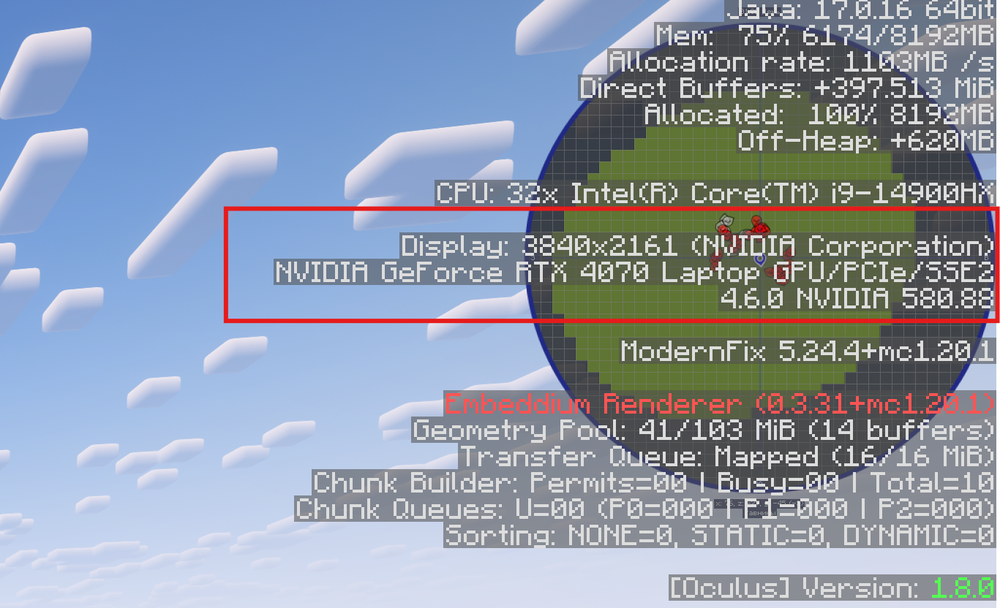
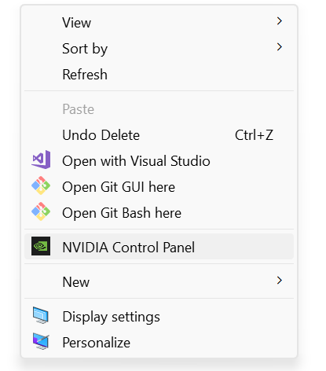
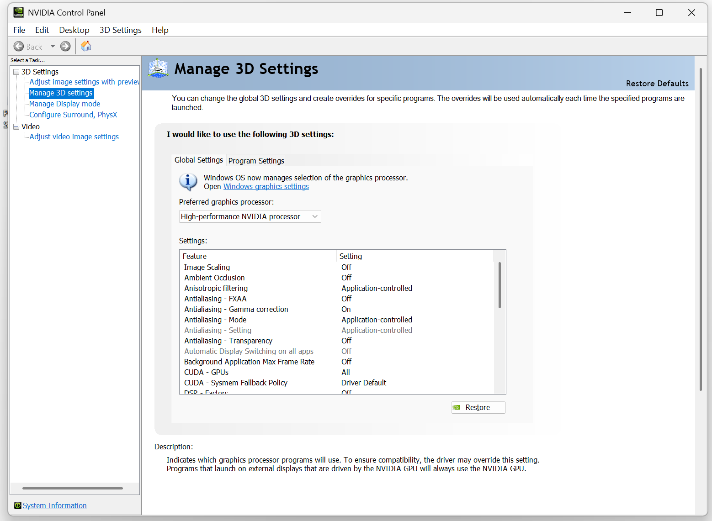
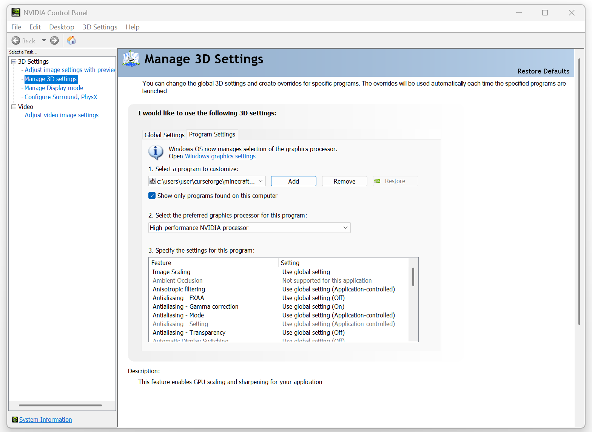

# Лаги

---

###_"Бесик, у меня лагает что делать?????"_

---

Если у тебя лагает, в первую очередь нужно определить что именно происходит. 

!!! warning "Так блять"
    Прежде чем обращаться к Бесу за помощью, убедись что ты определил вид лагов и сделал всё что я описал.

## Виды пролагов

- **Просто низкий FPS** - игра идёт как слайд-шоу. Причина в твоем компе или в настройках графики
- **Раббербендинг** - персонажа откидывает назад, телепорты, всё дергается. Это проблема с соединением, инетом, пингом. При этом картинка на экране плавная
- **Серверные лаги (TPS)** - сервак думает медленно: мобы замирают, блоки ломаются с задержкой, механизмы тупят.
- **Фризы / подвисания** - игра вроде работает плавно но раз в несколько секунд картинка дергается.

Нужно понимать с чем ты имеешь дело прежде чем решать трабл

### Низкий FPS 

Низкие кадры в секунду обычно вызваны либо тем что у тебя хуевый комп, либо просто неподходящими настройками.

Ниже самые распространенные причины низких кадров.

#### Обнови драйвера видеокарты

ДА это пиздец какой банальный шаг но поверь это может увеличить твой фэпээс на стабильные 5-10 кадров.
Чтобы это сделать для видеокарты Nvidia перейди в GeForce Experience и там кликни обновить если есть обновления.

1. Я хз как это делается на AMD.
2. _Если ты крутой челикс со специфичной версией WHQL драйверов разбирайся сам_

Так же обнови винду, если на неё пришли обновления.

#### Выбор правильной видеокарты для Java. 

Часто так бывает что у тебя две видеокарты: интегрированная и внешняя. 
Интегрированная это та что встроена в процессор, а внешняя это та что работает в сотни раз быстрее.
Может случиться так, что у тебя запустился майнкрафт на видеокарте встроенной в процессор.

Это можно проверить зайдя в майн, потом открыв диспетчер задач (вкладка "Производительность") и посмотреть нагрузку на интегрированную видюху и на дискретную.
Если у тебя интел GPU забит на 100% а нвидиа сидит отдыхает на 1-2%, то это по-любому хуйня.

Так же, нажми F3 в майнкрафте и в разделе `Display` справа сверху глянь какой там видеоадаптер.

Чтобы это пофиксить (для видеокарт Nvidia), нужно зайти в панель управления Nvidia (ПКМ по рабочему столу - больше опций - Панель управления Nvidia).

Затем перейди в управления параметрами 3D и поставь там высокопроизводительный графический процессор Nvidia (и нажми применить).

!!! warning "Предупреждение"
    Если поставить глобальную настройку, то ВСЕ программы в системе будут запускаться на выделенной видюхе.\
    Если ты хочешь немного заебаться и починить только майнкрафт не трогая всю свою систему, то открой вторую вкладку там где настройки для конкретных программ.
    Там укажи путь к джаве (именно к джаве которая от Стаки СМП: `C:\Users\user\AppData\Roaming\.stakilauncher\runtime\x64\jdk-17.0.16+8\bin`).
    Затем так же укажи процессор Нвидиа и применить.
    

Чтобы убедиться что у тебя все правильно, зайди в майнкрафт либо на сервер либо в одиночный мир похуй куда и нажми F3.
Справа в разделе `Display` ты должен видеть графический процессор Nvidia а не Intel.

Разумеется если ты открываешь диспетчер задач то там тоже видюха от нвидиа должна работать на все 100.

_(Может быть так, что у тебя и процессор и видюха от AMD. Ты ж не долбаеб, узнай модель своей видюхи и убедить что майн запустился на ней)_

**Если у тебя по каким-то причинам не получается через Панель управления Nvidia тогда попробуй вот этот видеотуториал:**

  <iframe width="1280" height="720" src="https://www.youtube.com/embed/_KSBj1jSeis" frameborder="0" allowfullscreen></iframe>

#### Базовая оптимизация

Если ничего из этого не помогло, пиздуй в раздел [Оптимизация](../optimization.md) и настраивай майн.

### Раббербендинг

В первую очередь, нужно понять, дергает только тебя или вообще всех. Если дергает всех, то это Серверные лаги (см. ниже).

Если дергает только тебя, давай решать.

1. Проверь пинг. Зажми Tab на сервере. Приемлимый пинг до 300 мс. Больше = начинает дергать.
2. Выключи VPN. Он может удлинять маршрут до сервера.
3. Подключайся по кабелю, а не по Wi-Fi. Вайфай сильно режет скорость и даёт потери пакетов. Если нет возможности, то ок.
4. Закрой фоновые загрузки (торренты, обновления, ютуб на фоне). Рекомендую оставлять только дискорд.

### Серверные лаги

Это когда игра у всех тормозит одинаково:

- мобы стоят на месте
- блоки ломаются только через 1-2 секунды
- механизмы крутятся рвыками

Проблема не у тебя, а у сервера.

- Временное решение: просто подожди пока сервак разгрузится. У нас сервак довольно мощный но какой-нибудь боттлнек все еще может образоваться
- Адекватное решение: сказать бесу чтоб посмотрел и пофиксил. Возможно у нас какая-то серьезная проблема и какой-то мод нагружает сервак шо пиздец

### Фризы 

1. Выдели больше памяти в лаунчере (см. раздел [Оптимизация](../optimization.md))
2. Закрой лишние программы - открытый хром с 50 вкладками, саундпад и куча пррочей мелкой хуйни могут спокойно жрать оперативную память.
