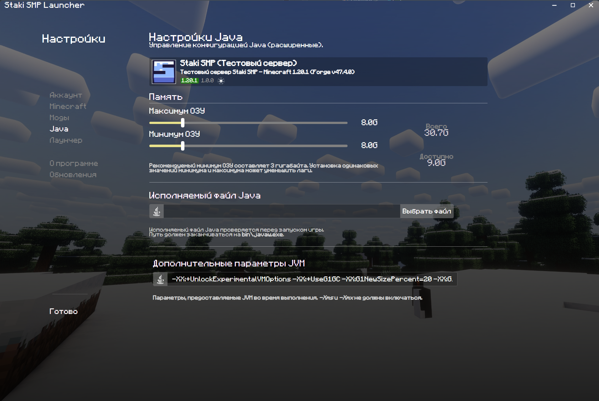

# Установка

### Шаг 1: Лаунчер

На нашем серваке величайшими умами был создан кастомный лаунчер с кастомной авторизацией и приколами.
Свой лаунчер будь то официальный / MultiMC / Prism использовать нельзя.

**Скачать лаунчер можно [по этой ссылке](https://files.staki.online/mc/Staki%20SMP%20Launcher.exe).** 

Версия для MacOS x64 (Intel): [здесь](https://files.staki.online/mc/Staki%20SMP%20Launcher-setup-1.0.0-x64.dmg)

Версия для MacOS Arm64 (Apple): [здесь](https://files.staki.online/mc/Staki%20SMP%20Launcher-setup-1.0.0-arm64.dmg)

Последующие обновления на лаунчер, если и будут, то будут опубликованы на дискорд сервере.

Лаунчер - portable программа. Это значит, что ему не нужна установка. 
Чтобы постоянно не лазить в загрузки, для того чтобы запустить игру, я рекомендую переместить .exe файл на рабочий стол.

При запуске лаунчера нас встретит приветствие, пропускаем и встречаем окно логина. 
Вводим данные которые вводили при регистрации в Drasl, [см. Регистрация](register.md).

Заранее сорри за немного ублюдский дизайн полей ввода, кликнуть нужно ниже иконки. Если будет настроение то пофикшу.

Если все успешно и круто, то мы должны увидеть главный экран лаунчера.
На скриншоте выбран тестовый сервер, но у вас должен быть выбран основной.

!!! warning "Важная хуйня"

    Если у тебя меньше или равно 8 Гб оперативной памяти на компе, это важно прочитать.
    
    По умолчанию, на всех сборках установлено 8 Гб оперативной памяти для запуска майна. Ставь 6.

    

    Минимум и максимум должны быть одинаковы, так и задумано

Нажимай кнопку "Играть". У тебя может высветиться плашка с предложением установки Java. 
Нажми установить автоматически там, потом начнет скачиваться майн и все готово.

!!! info "На будущее"

    Если Бес на админе выпускает обновление, то недостаточно выйти из игры и запустить снова.
    
    Нужно выключить игру и лаунчер, и заново открыть лаунчер. Лаунчер скачивает "структуру" майнкрафта при запуске, а не при нажатии кнопки "Играть".

### Шаг 2: Майнкрафт

После запуска майна, ты можешь сразу залететь на сервер нажав "Подключиться к серверу".

**Рекомендую прежде чем играться на основном сервере, потыкать настройки сначала на тестовом сервере.**
