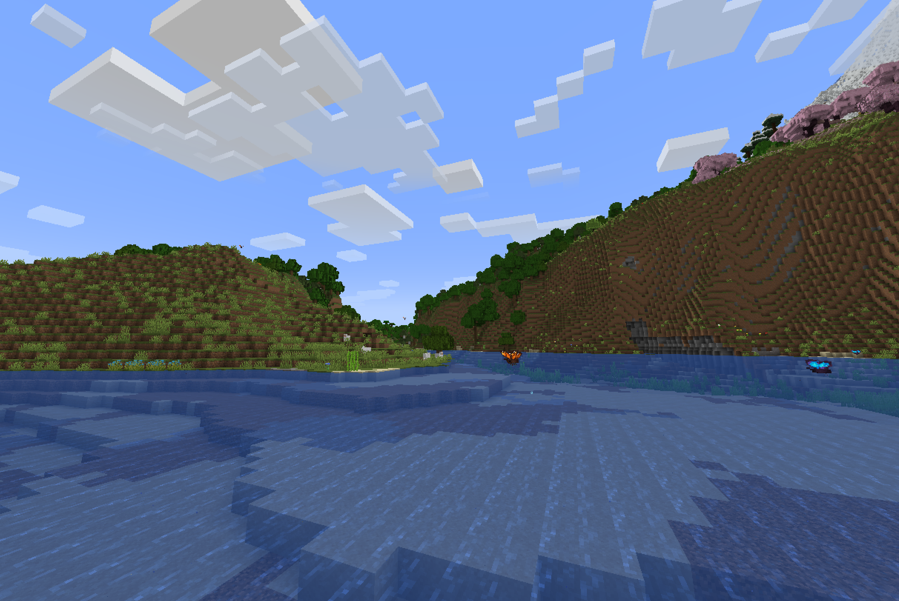
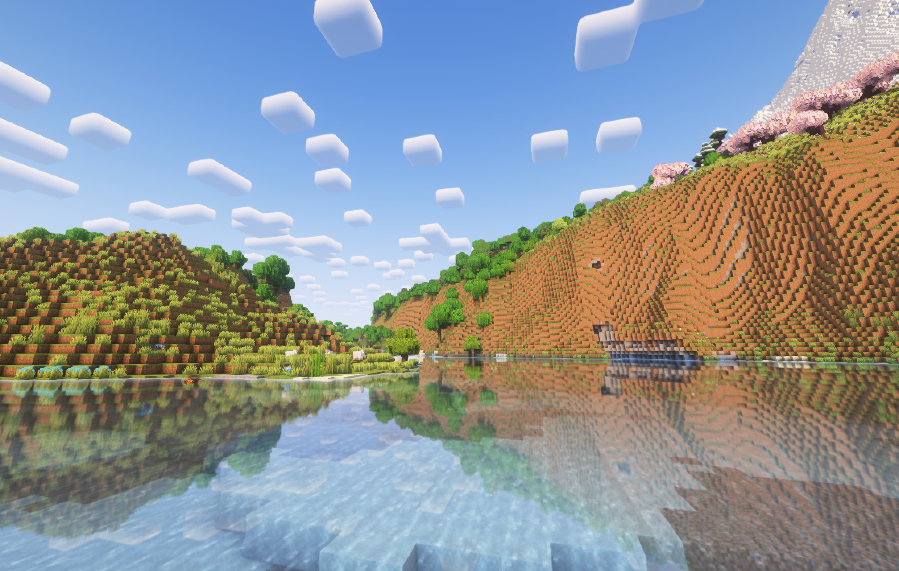
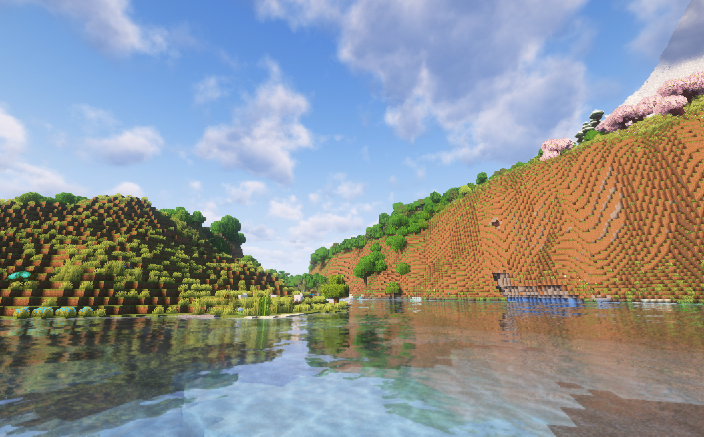
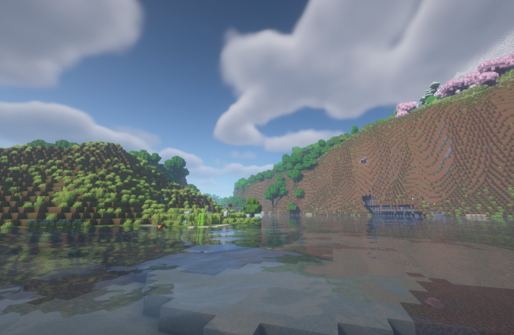
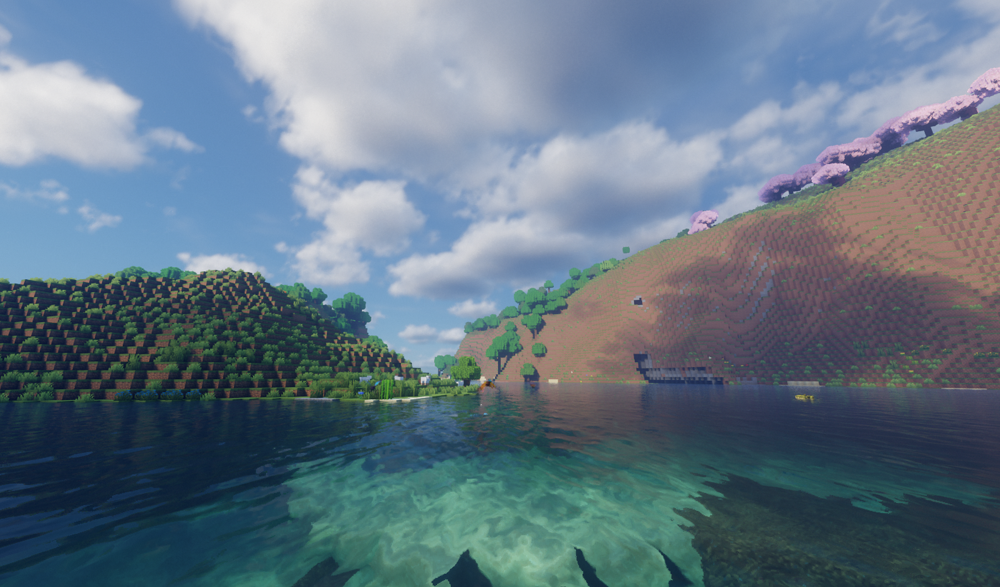

# Оптимизация

Было потрачено немало времени на оптимизацию сборки чтобы даже на среднем корыте игра шла в стабильные ФПСы.

После первого запуска игры я крайне рекомендую подобрать параметры для себя которые работают идеально именно для тебя.

По умолчанию, настройки на сборке сделаны на среднюю конфигурацию из [системных требований](specifications.md).
Поэтому теоретически, у тебя всё может работать нормально из коробки. Но если ты хочешь потыкаться и сделать графоний под себя - читай дальше.

## Не графоний

### Оперативная память

Наша сборка требует **минимум 6 ГБ оперативной памяти** для хоть какой-то стабильной работы.

По умолчанию в лаунчере выставлено X TODO ГБ. Выстави количество, которое работает для тебя.
Рекомендуемые значения:

- При 16 ГБ на компе, ставь 8 для майнкрафта
- При 8 ГБ на компе, ставь 6 для майнкрафта
- При 32 ГБ на компе, ставь 10-16 для майнкрафта

Ставить больше 16 не рекомендую из-за специфики работы Java.

### Необязательные моды

---

## Графоний

Переходим к тому, что даёт самые значимые результаты.

### Шейдеры

На сборке стоит 4 разных шейдера пропатченных Euphoria + Colowheel + Distant Horizons. Вам это ни о чем не говорит поэтому вот сравнение

| Без шейдеров             |                              |
|--------------------------|--------------------------------------------------------------------------------------|
| Complementary Reimagined |  |
| Complementary Unbound    |       |
| BSL                      |                                            |
| Bliss                    |                                        |

**От себя рекомендую классический вариант - Complementary в стилистике Reimagined**. Это vanilla-like шейдеры которые просто делают майнкрафт красивее, а не реалистичнее.

!!! info "Для крутых челов"
    Ты разумеется можешь установить какие пожелаешь шейдеры из интернета. 
    Но учти, что они не пропатчены Colorwheel (выключи этот мод в списке необязательных) и у тебя будет меньше ФПС в местах где много механизмов из Create.
    
    Так же я не гарантирую что какие-либо шейдеры которые ты установишь будут работать с Distant Horizons поэтому ебись сам

#### Настройки шейдеров

Чтобы изменить шейдеры, нажми ESC -> Настройки графики -> Наборы шейдеров (слева снизу).

Прежде чем выбрать какие-либо шейдеры, кликни на переключатель вот здесь. Затем можешь выбирать какие хочешь шейдеры и нажми `Применить`. Будет небольшой пролаг.

Чтобы настроить шейдеры, выбери нужные тебе шейдеры в списке, а затем снизу кликни на `Настройки набора шейдеров`.

Для Complementary, например, можешь переключать настройку `Profile`. Рекомендую поставить на Medium или High.

#### Как менять стилистику Complementary

Чтобы изменить Reimagined на Unbound, зайди в настройки шейдеров и кликни на переключатель `Visual Style`.

---

### Distant Horizons

**Distant Horizons - это один из самых ёбнутых графических модов**, который пиздецки увеличивает дальность прорисовки мира
за счёт ебнутых алгоритмов LOD, при этом не жрёт твою видеокарту как это делает ванильный майнкрафт.

| Distant Horizons - ВЫКЛ    |  |
|----------------------------|--------------------------------------------------------------|
| **Distant Horizons - ВКЛ** |     |

### Ресурс паки

---

### Разрешение игры

Майнкрафт, как и многие игры, начинает давать более низкие ФПСы если у тебя большое разрешение экрана. У тебя может всё работать адекватно в 2К, но сильно лагать в 4К.

Компьютер можно понять - ему приходится рендерить аж в 4 раза больше пикселей.

**Если у тебя 4К монитор** как у беса, или просто у тебя компьютер который не вывозит майнкрафт на высоком разрешении,
то специально для этого у нас есть два варианта.

#### Embeddium Full Screen Resolution

Этот вариант рекомендуется для всех кто хочет изменить разрешение экрана. Единственное: он работает только в полном экране (F11).

Для этого нажимаем Esc -> Настройки -> Настройки графики и перетягиваем ползунок `Полноэкранное разрешение`. Заметь, этот ползунок
очень дерганный и ебанутый. Нужно его двигать аккуратно. Выбирай разрешение где на конце @240, @144, @60, @59 (в зависимости от того, сколько Гц) у тебя монитор.

#### RenderScale

Альтернативный вариант если для тебя не работает тот что выше.

Я добавил в сборку необязательный мод "RenderScale". По умолчанию он выключен, и ты можешь врубить его в настройках лаунчера.

Чтобы настроить мод, нажми ESC -> Моды -> в поиске напиши `RenderScale` -> клик на название мода -> кнопка `Config`. 
Здесь установи Scale Factor какой-нибудь меньше `1.0`, но больше чем `0.0`. Если поставишь `0.5` - у тебя картинка сожмётся в два раза. 
Меньше цифра = меньше пикселей на экране = больше ФПС.

Для юзеров 4К мониторов можно ставить `0.5`-`0.65`.

!!! bug "Баг"
    Есть небольшой момент. Когда запускаешь игру с этим модом, тебе может выдать небольшое назойливое окошко с ошибкой.
    Оно ни на что не влияет просто закрой его.
