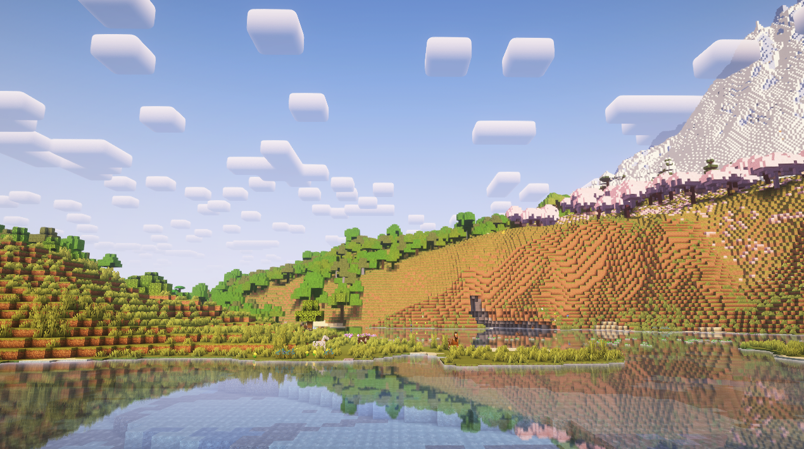
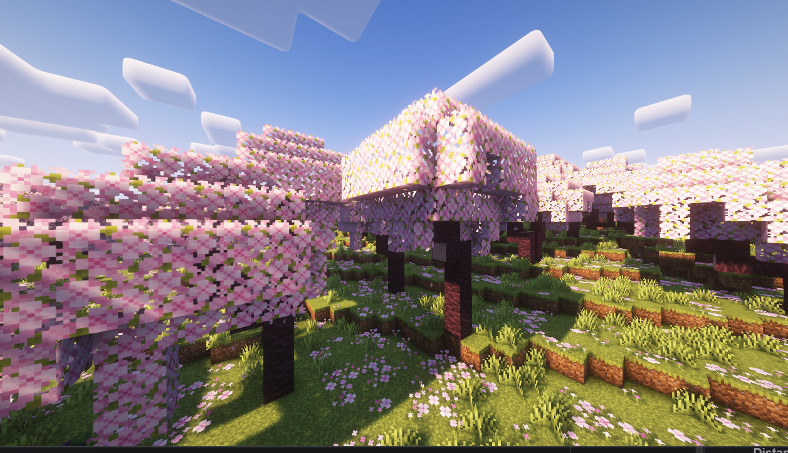

# Оптимизация

Было потрачено немало времени на оптимизацию сборки чтобы даже на среднем корыте игра шла в стабильные ФПСы.

После первого запуска игры я крайне рекомендую подобрать параметры для себя которые работают идеально именно для тебя.

По умолчанию, настройки на сборке сделаны на среднюю конфигурацию из [системных требований](specifications.md).
Поэтому теоретически, у тебя всё может работать нормально из коробки. Но если ты хочешь потыкаться и сделать графоний под себя - читай дальше.

## Не графоний

### Оперативная память

Наша сборка требует **минимум 6 ГБ оперативной памяти** для хоть какой-то стабильной работы.

По умолчанию в лаунчере выставлено 8 ГБ. Выстави количество, которое работает для тебя.
Рекомендуемые значения:

- При 16 ГБ на компе, ставь 8 для майнкрафта
- При 8 ГБ на компе, ставь 6 для майнкрафта
- При 32 ГБ на компе, ставь 10-16 для майнкрафта

Ставить больше 16 не рекомендую из-за специфики работы Java.

Установить оперативную память в лаунчере можно кликнув на иконку настроек и перейдя во вкладку "Java".

### Необязательные моды

---

## Графоний

Переходим к тому, что даёт самые значимые результаты.

### Шейдеры

На сборке стоит 4 разных шейдера пропатченных Euphoria + Colowheel + Distant Horizons. Вам это ни о чем не говорит поэтому вот сравнение

|  Без шейдеров          | 
Обычный майнкрафт лук
                                                                                                                                                                                                               |
|------------------------------------------------------------------------------|-------------------------------------------------------------------------------------------------------------------------------------------------------------------------------------------------------------------------------------------------------------------|
|   Complementary Reimagined | **Рекомендую**. Шейдеры в ванильной стилистике. Отличный вариант для базовой игры. Для компов по-слабее ставь версию **без Euphoria Patches**. Если поставил версию с эйфорией, поройся в настройках эйфории и поставь "Много звёзд". Ночью будет красиво ахуеешь |
|  Complementary Unbound | Другая стилистика Complementary шейдеров. Как поменять читай ниже. Реалистичнее вода и облака. В остальном то же самое что и шейдеры выше                                                                                                                         |
|  BSL                   | Прикольные шейдеры с более мрачным, тёмным сетапом в духе фэнтези. Рекомендую настроить под себя                                                                                                                                                                  |
|  Bliss                 | Похожи на BSL внешне, но вообще другие внутри. Так же рекомендую порыться в настройках                                                                                                                                                                            |
|  Photon                | Красивые оптимизированные шейдеры с очень крутыми облаками. Рекомендую для тех кто любит фотореалистичность. Очень красиво под водой.                                                                                                                             |
|  Eclipse Unstable      | Улучшенная версия Bliss с красивой водой и облаками. Красивые, работают плавно, но не гарантирую отсутствие ошибок. Настраивай под себя если захотелось                                                                                                           |
|  Glimmer               | Шейдеры для компов по-слабее. Как по мне выглядят немного вырвиглазно, но играбельно. Нужно как-то настроить под себя. Хоть я бы наверное на слабом компе на крайняк включил Complementary с низкими или очень низкими настройками.                               |
|  Rethinking Voxels     | Улучшенная версия Complementary с RTX-like освещением. Требует сильного компа. Советую отключить динамическое освещение Lucent в списке необязательных модов. Добавил для тех, кто прям очень верит в свой компьютер.                                             |

**От себя рекомендую классический вариант - Complementary в стилистике Reimagined**. Это vanilla-like шейдеры которые просто делают майнкрафт красивее, а не реалистичнее.

!!! info "Для крутых челов"
    Ты разумеется можешь установить какие пожелаешь шейдеры из интернета. 
    Но учти, что они не пропатчены Colorwheel (выключи этот мод в списке необязательных) и у тебя будет меньше ФПС в местах где много механизмов из Create.
    
    Так же я не гарантирую что какие-либо шейдеры которые ты установишь будут работать с Distant Horizons поэтому ебись сам

#### Настройки шейдеров

Чтобы изменить шейдеры, нажми ESC -> Настройки графики -> Наборы шейдеров (слева снизу).

Прежде чем выбрать какие-либо шейдеры, кликни на переключатель вот здесь. Затем можешь выбирать какие хочешь шейдеры и нажми `Применить`. Будет небольшой пролаг.

Чтобы настроить шейдеры, выбери нужные тебе шейдеры в списке, а затем снизу кликни на `Настройки набора шейдеров`.

Для Complementary, например, можешь переключать настройку `Profile`. Рекомендую поставить на Medium (Средний). Если комп по-слабее, то Low (низкий) или Very low (очень низкий)

#### Как менять стилистику Complementary

Чтобы изменить Reimagined на Unbound, зайди в настройки шейдеров и кликни на переключатель `Visual Style`.

---

### Distant Horizons

**Distant Horizons - это один из самых ёбнутых графических модов**, который пиздецки увеличивает дальность прорисовки мира
за счёт ебнутых алгоритмов LOD, при этом не жрёт твою видеокарту как это делает ванильный майнкрафт.

|  Distant Horizons - ВЫКЛ |   
|--------------------------------------------------------------------------------------|
|  **Distant Horizons - ВКЛ** |   

Если ты хочешь играть с большой прорисовкой, оставь его включенным, но его нужно настроить.

Для оптимизации перейди в его настройки (Esc -> Настройки -> Четыре квадратика слева сверху). Тут есть несколько пунктов.

- Quality preset: рекомендую поставить `3. Medium`. Он потом изменится на `Custom`. Это норм.
- Chunk Radius (или как-то так): я **очень** не рекомендую ставить Distant Horizons на большую дистанцию прорисовки. 
Есть несколько значений которые могут работать для тебя нормально:
    - 64: отлично если у тебя не слишком сильный комп но далеко видеть хочется
    - 128: позволяет увидеть края нашей карты находясь на спавне
    - 256: позволяет увидеть карту полностью, находясь в любой её точке

После первого включения у тебя будут прогружаться дальние чанки, поэтому ФПС может быть низкий. Подожди минут 10-20 и всё пройдет.

### Ресурс паки

На нашей сборке есть ресурс паки. Крутые и не очень. Ты можешь их включить / выключить если хочется.

Один из самых прожорливых это ресурс пак на листья. По умолчанию выключен. Делает листву объемнее и красивее. Если хочется красоты - включи. Но будет минус 5-10 фпс.

|  **Объемные листья - ВЫКЛ** | 
|-----------------------------------------------------------------------------------------------|
|  **Объемные листья - ВКЛ**    |  

Всего их 3. Важно: CullLeaves SmartLeaves делает листву красивее если ты используешь мод CullLeaves.
Мод CullLeaves по умолчанию выключен, находится в списке [необязательных](../game/mods/secondary/optional.md)
и нужен для оптимизации листвы. 

**Я его рекомендую включить если ты используешь Better Leaves**. Перейди в Настройки Графики -
Performance - Включен Cull Leaves

---

### Разрешение игры

Майнкрафт, как и многие игры, начинает давать более низкие ФПСы если у тебя большое разрешение экрана. У тебя может всё работать адекватно в 2К, но сильно лагать в 4К.

Компьютер можно понять - ему приходится рендерить аж в 4 раза больше пикселей.

**Если у тебя 4К монитор** как у беса, или просто у тебя компьютер который не вывозит майнкрафт на высоком разрешении,
то специально для этого у нас есть два варианта.

#### Embeddium Full Screen Resolution

Этот вариант рекомендуется для всех кто хочет изменить разрешение экрана. Единственное: он работает только в полном экране (F11).

Для этого нажимаем Esc -> Настройки -> Настройки графики и перетягиваем ползунок `Полноэкранное разрешение`. Заметь, этот ползунок
очень дерганный и ебанутый. Нужно его двигать аккуратно. Выбирай разрешение где на конце @240, @144, @60, @59 (в зависимости от того, сколько Гц) у тебя монитор.

#### RenderScale

Альтернативный вариант если для тебя не работает тот что выше.

Я добавил в сборку необязательный мод "RenderScale". По умолчанию он выключен, и ты можешь врубить его в настройках лаунчера. 
См. [Необязательные моды](../game/mods/secondary/optional.md).

Чтобы настроить мод, нажми ESC -> Моды -> в поиске напиши `RenderScale` -> клик на название мода -> кнопка `Config`. 
Здесь установи Scale Factor какой-нибудь меньше `1.0`, но больше чем `0.0`. Если поставишь `0.5` - у тебя картинка сожмётся в два раза. 
Меньше цифра = меньше пикселей на экране = больше ФПС.

Для юзеров 4К мониторов можно ставить `0.5`-`0.65`.

!!! bug "Баг"
    Есть небольшой момент. Когда запускаешь игру с этим модом, тебе может выдать небольшое назойливое окошко с ошибкой.
    Оно ни на что не влияет просто закрой его.
