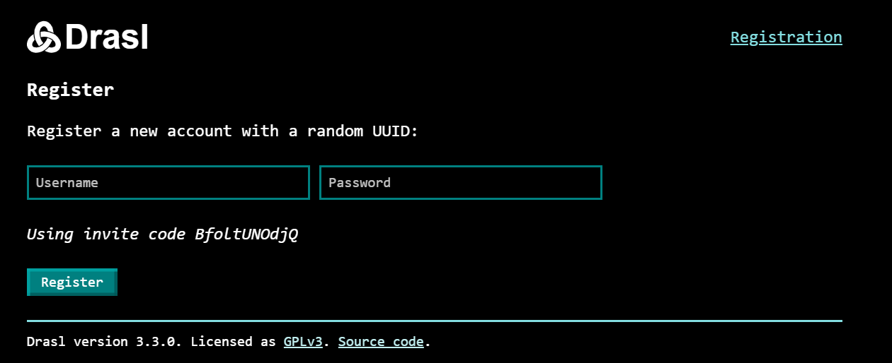
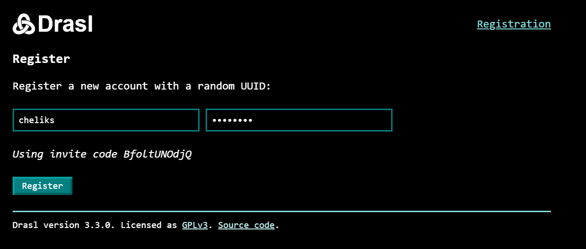
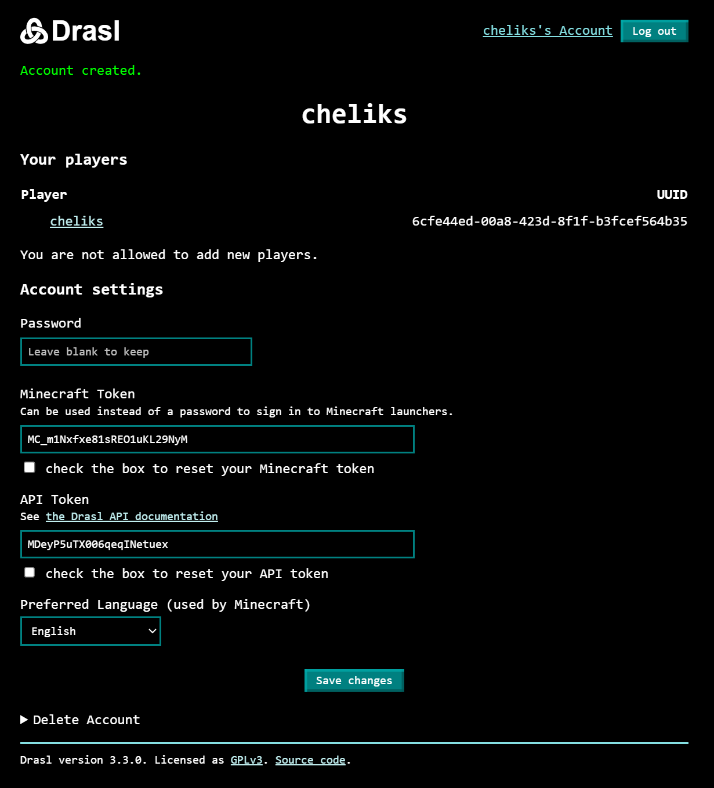

# Регистрация

Регистрация на сервере происходит **только по инвайтам.** Это значит, что если вам нужно создать аккаунт, надо сначала обратиться к админу на бесе. Он скидывает ссылку, вы по ней переходите и регистрируетесь.

Так выглядит окно регистрации. Мрачновато. Drasl это наш сервер аккаунтов, авторизации и аутенфикации. 

Вводим никнейм и пароль. В нике можно только английские буквы, цифры и нижняя палка `_`. **Ник в будущем изменить нельзя.**

!!! quote "..."

    Пароли хранятся на сервере аккаунтов в зашифрованном виде. Честно, мне похуй на них, но даже если я захочу их достать - я не смогу.
    Просто чтобы не переживали если вдруг укажете реальный пароль который используете от сбербанка.

    )

После того как ты зарегаешься, ты попадешь на страницу со своим аккаунтом. Здесь ты можешь изменить пароль, скин и т.п. 

**Не нужно кликать на поля/чекбоксы Minecraft Token / API Token.** Если накликал обнови страницу.

На будущее: если тебе нужно попасть в аккаунт из главной страницы, то кликни вот сюда.

