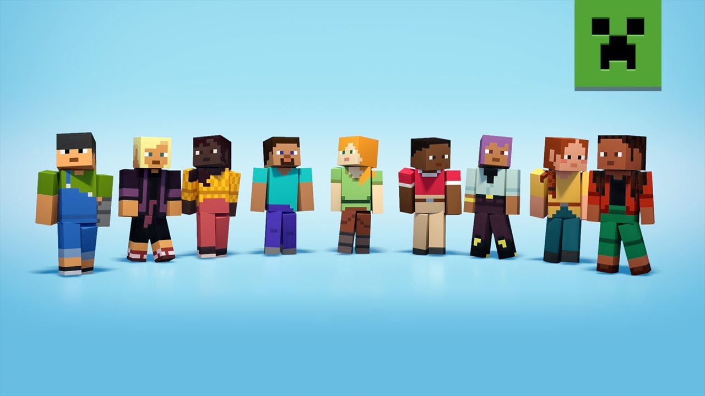
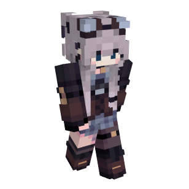
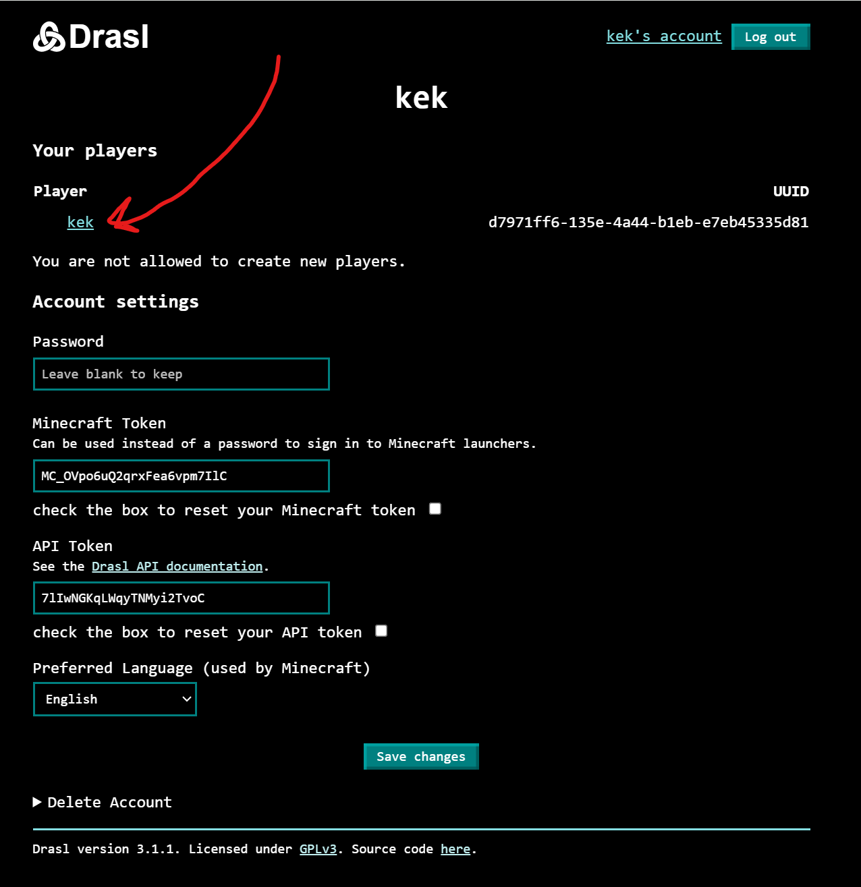
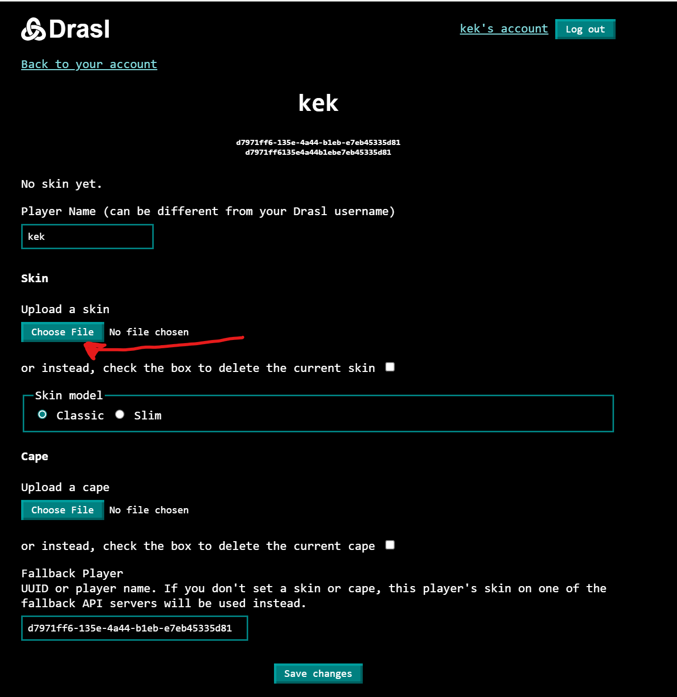
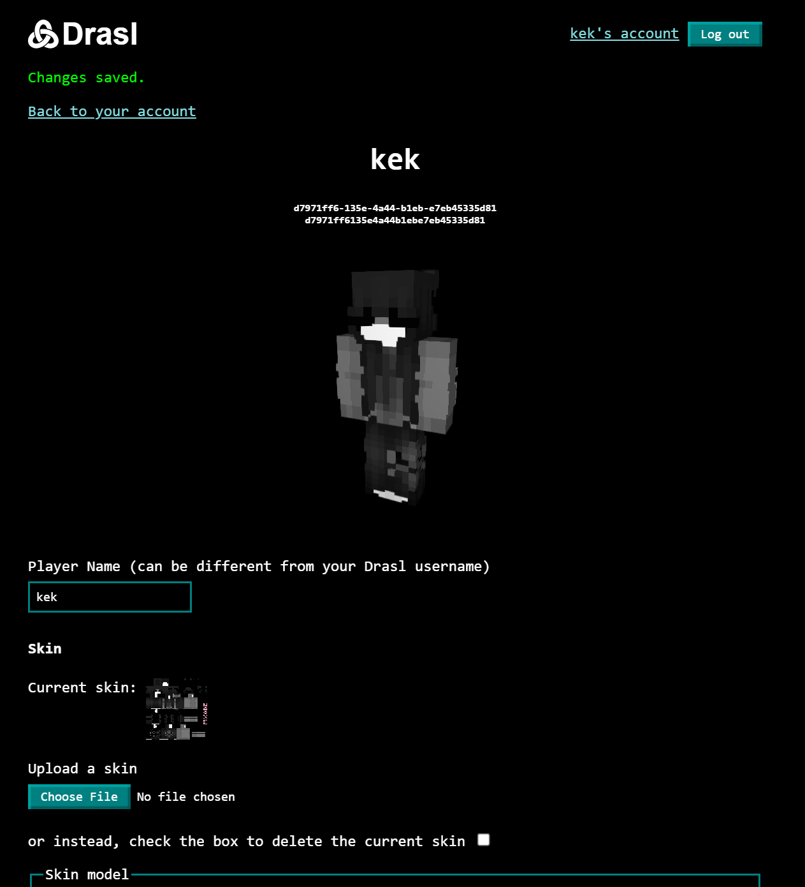

# Изменение скина

Не обязательный шаг. Если пропустить, то у тебя будет каждый раз один рандомный скин из дефолтных майнкрафтовских (уебищных).

## Шаг 1. Найди скин

Есть много разных сайтов для поисков майнкрафт скинов. 
Можешь банально написать в гугле "майнкрафт скины скачать онлайн" и тебе даст туеву хучу разных девочек в чулочках.

Что нужно знать перед скачиванием:

- **Скачивать скины нужно именно нового формата,** не старого и не легаси. Иногда могут называть "1.8+" (по версии майнкрафта в которой ввели новый формат)
- Наш сервер аутенфикации поддерживает только обычные пиксельные скины. **Он не поддерживает HD скины (см. ниже).** Скачиваем только обычные пиксельные.
- Скины бывают мужские и женские (называют Steve / Alex или Classic / Slim). У женского скина рука на 1 пиксель тоньше.

Так же можно скачать и поставить плащ. Правило "не скачивать HD" применимо к ним тоже.

| Обычный скин                                               | HD Скин (не скачивать)                                     |
|------------------------------------------------------------|------------------------------------------------------------|
| {:style="height: 360px"} | {:style="height: 360px"} |

### Сайты со скинами

- [NameMC](https://ru.namemc.com/minecraft-skins)
- [Laby.net](https://laby.net/)
- [MinecraftSkins](https://www.minecraftskins.com/#google_vignette)
- [NovaSkin](https://minecraft.novaskin.me/gallery)

## Шаг 2. Поставь скин

Перейди в Drasl, войди в свой аккаунт. Перейди в своего плеера.

Здесь ты увидишь свой майнкрафт профиль (технически он просто чуть отличается от твоего логина, поэтому он в отдельной вкладке).
Ниже можно найти кнопки `Upload skin` и `Upload cape`. Первая для скина вторая для плаща. Загрузи что тебе надо, затем нажми `Save changes`.

Не забудь выбрать тип скина (Classic - мужской, Slim - женский).

Страница обновится, ты увидишь превьюшку как скин будет выглядеть в игре.

## Шаг 3. Перезайди в игру

Я не знаю надо ли полностью выйти из майнкрафта или просто переподключиться к серву.

