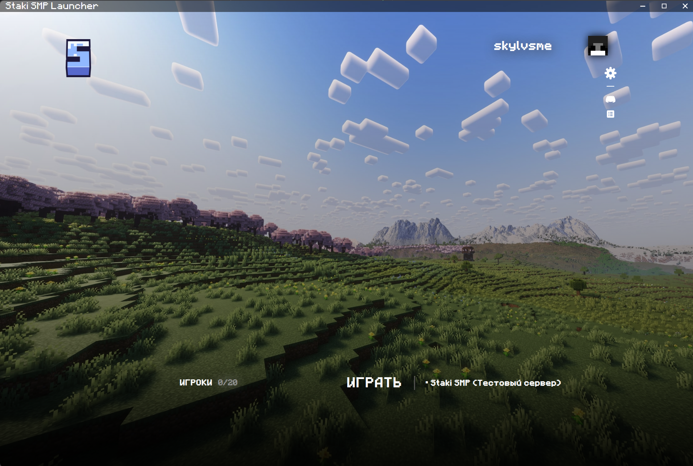

# Тестовый сервер

Я не пожалел денег на эту хуйню и ебанул отдельный тестовый сервер на котором можно проверять штуки.

Хочешь узнать ли работает то, что ты задумал до того как построить на основном сервере? 
Или может просто в креативе посмотреть что есть на нашей сборке?

В целом, ты конечно можешь просто зайти в одиночную игру, но учти что из-за настроек/конфигов/мелких технических моментов 
которые есть на сервере, у тебя не получится полностью повторить поведение сервера в одиночке. 
Проще говоря, я не даю гарантий что если у тебя что-то сработало в одиночке то и сработает на сервере.

!!! info "Важно"

    **Тестовый сервер можно, и даже нужно, использовать для того чтобы потестить настройки своего клиента до запуска сервера.**
    
    Например, проверить шейдеры, Distant Horizons, управление, да что угодно. Рекомендую это сделать всем чтобы быть готовым к запуску сервака.

Вдобавок к этому, на тестовом сервере:

  - Бес может тестить работоспособность новых модов или обновлений на существующие для дальнейшего апдейта основного сервера
  - Каждый игрок имеет доступ к командам:
      - Переключение режима (выживание/творческий) с помощью команды `/gamemode creative`
      - Телепортация с помощью команды `/tp`
      - Переключение времени с помощью команды `/time set`

### Как зайти?

Открываешь лаунчер, и справа от кнопки "Играть" кликаешь на название сервера. У тебя откроется переключатель.
Выбирай тестовый сервер, нажимаешь "Играть". Процесс такой же как и на основном сервере.

